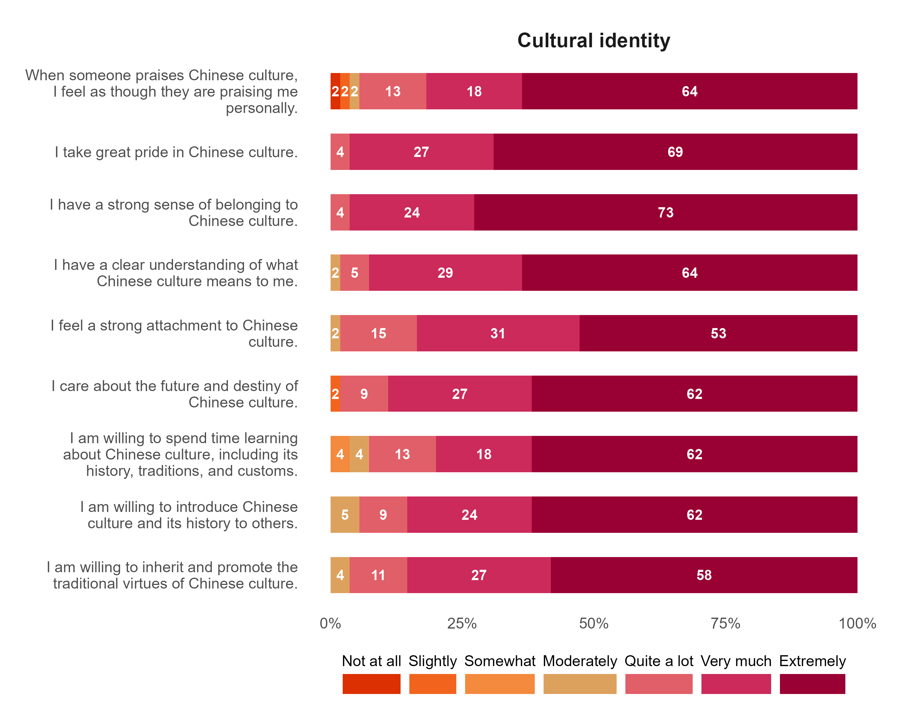
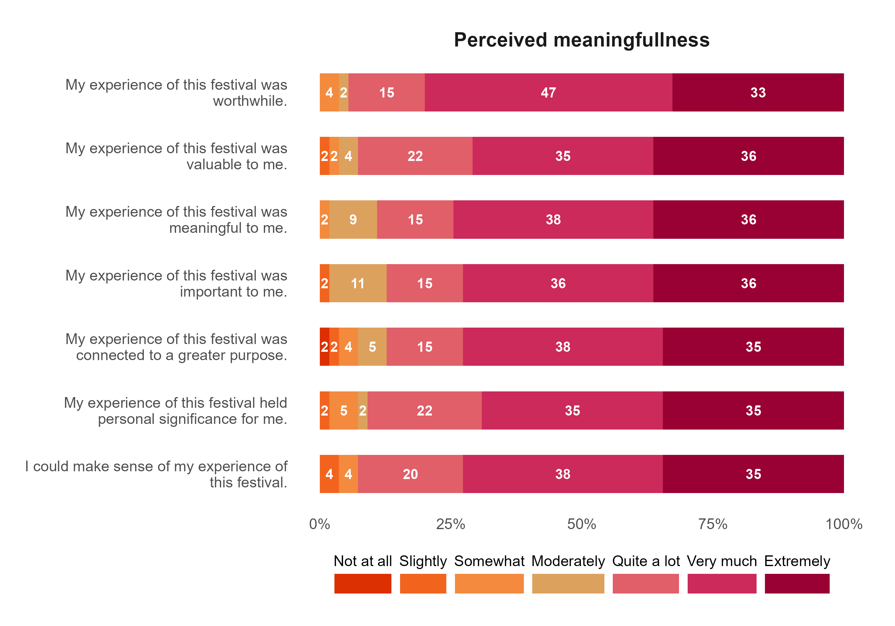
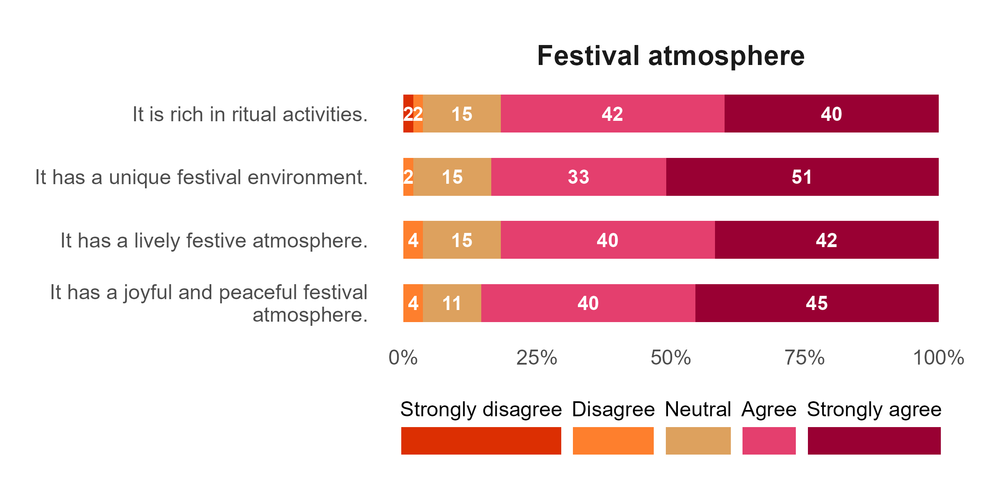
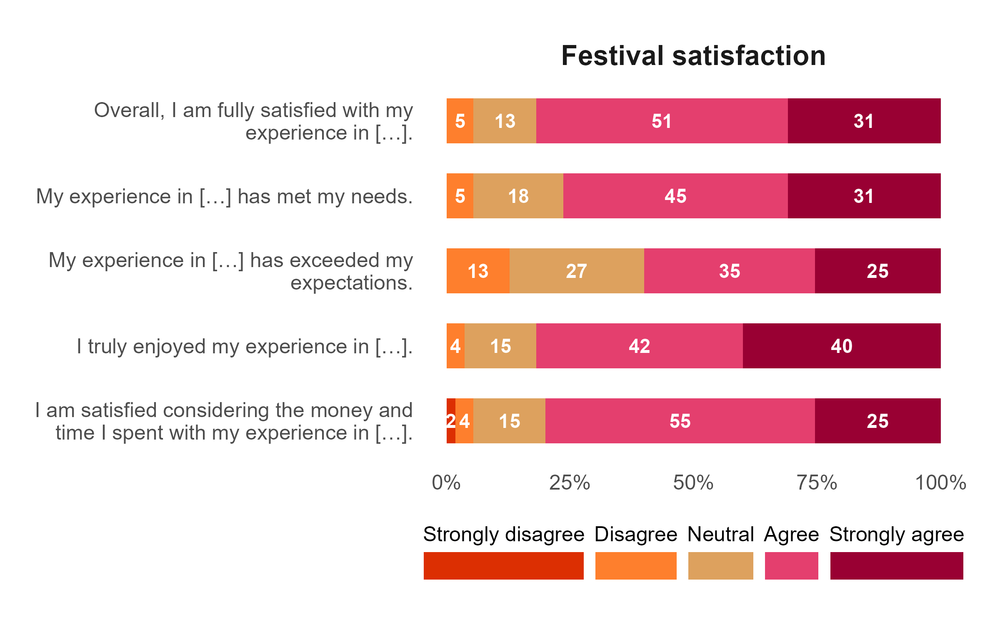
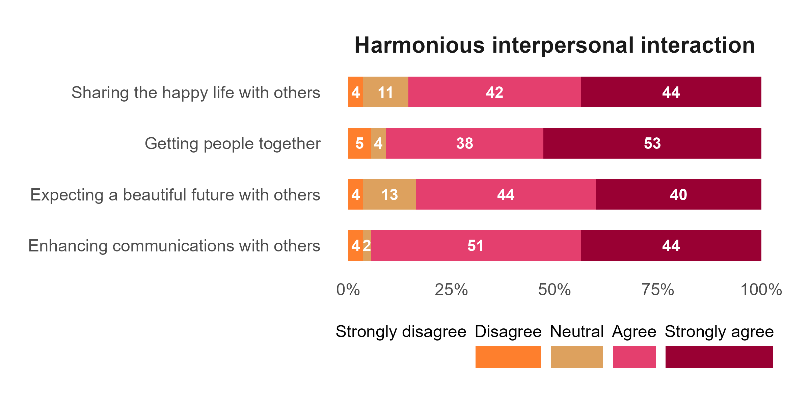
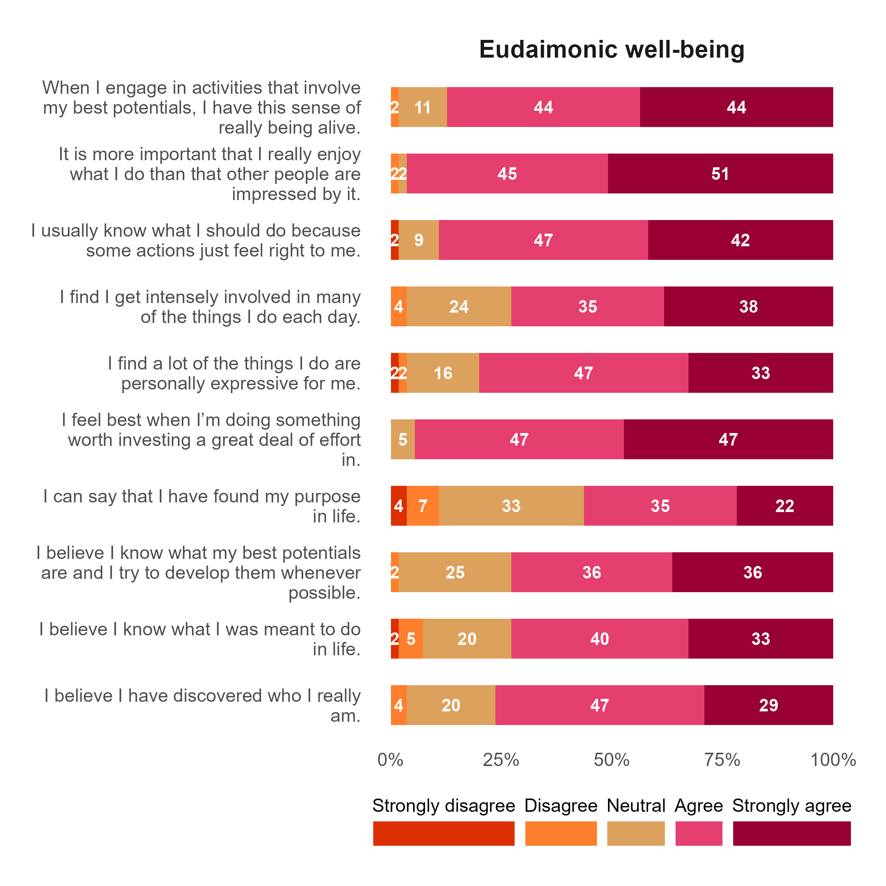

```{r}
#| echo: false
#| message: false
#| warning: false
# set working directory
setwd(here::here("didi-festival"))

# libraries
library(tidyverse)
library(readxl)
library(janitor)
library(scales)
library(EFAtools)
library(psych)
library(seminr)
library(gtsummary)
library(kableExtra)
library(correlation)
library(reshape2)


# data management source
source("data-management.R")
```

# Attachments

::: callout-note
Copies of the Figures presented in this report are available using the links below. All the files can be accessed in the Google drive folder.
:::

<ol>

<li><a href="" target="_blank" style="text-decoration: none">Plots</a></li>

<li><a href="" target="_blank" style="text-decoration: none">Google Drive</a></li>

</ol>

# Sociodemographic variables

# Factors

## Cultural identity
```{r}
## plotting factor
p_cultural_identity <- plot_factor("Cultural identity")

## saving plot
ggsave(
    plot = p_cultural_identity,
    filename = "cultural_identity.png",
    path = "plot",
    width = 10,
    height = 8,
    units = "in"
)

## display plot


```


## Perceived meaningfulness of festival experiences

```{r}
## plotting factor
p_perceived_meaningfulness <- plot_factor("Perceived meaningfullness")

## saving plot
ggsave(
    plot = p_perceived_meaningfulness,
    filename = "perceived_meaningfulness.png",
    path = "plot",
    width = 10,
    height = 7,
    units = "in"
)

## display plot

```

## Festival atmosphere

```{r}
## plotting factor
p_festival_atmospher <- plot_factor("Festival atmos")

## saving plot
ggsave(
    plot = p_festival_atmospher,
    filename = "festival_atmospher.png",
    path = "plot",
    width = 8,
    height = 4,
    units = "in"
)

## display plot

```

## Festival satisfaction

```{r}
## plotting factor
p_festival_satisfaction <- plot_factor("Festival satisfaction")

## saving plot
ggsave(
    plot = p_festival_satisfaction,
    filename = "festival_satisfaction.png",
    path = "plot",
    width = 8,
    height = 5,
    units = "in"
)

## display plot

```


## Harmonious interpesonal interaction
```{r}
## plotting factor
p_harmonious_interpersonal <- plot_factor("Harmonious interpersonal")

## saving plot
ggsave(
    plot = p_harmonious_interpersonal,
    filename = "harmonious_interpersonal.png",
    path = "plot",
    width = 8,
    height = 4,
    units = "in"
)

## display plot

```

## Eudaimonic well-being

```{r}
## plotting factor
p_eudaimonic_well_being <- plot_factor("Eudaimonic well-being")

## saving plot
ggsave(
    plot = p_eudaimonic_well_being,
    filename = "eudaimonic_well_being.png",
    path = "plot",
    width = 8,
    height = 8,
    units = "in"
)

## display plot

```


# PLS-SEM

```{r}
library(seminr)

## measurement model
measurement_model <- constructs(
  composite("CI",   multi_items("ci_", 1:9)),
  composite("PMFE", multi_items("pmfe_", 1:7)),
  composite("FA",   multi_items("fa_", 1:4)),
  composite("FS",   multi_items("fs_", 1:5)),
  composite("HII",  multi_items("hii_", 1:4)),
  composite("EWB",  multi_items("ewb_", 1:10))
)

## structural model
structural_model <- relationships(
  paths(from = c("CI", "FA", "FS", "HII"), to = "PMFE"),
  paths(from = "PMFE", to = "EWB"),
  paths(from = c("CI", "FA", "FS", "HII"), to = "EWB")
)

## estimate PLS-SEM
pls_model <- estimate_pls(
  data = fct_dta,
  measurement_model = measurement_model,
  structural_model = structural_model,
  missing = mean_replacement,
  missing_value = NA
)

summary_pls <- summary(pls_model)
```

## Measurement model

### Reliability tests

```{r}
## reliability and convergent validity
summary_pls$reliability
```

### Validity tests
```{r}
## discriminant validity (Fornell-Larcker criterion)
summary_pls$validity$fl_criteria
```

### Multicollinearity tests
```{r}
## collinearity (VIF)
summary_pls$vif_antecedents
```


## Structural model

```{r}
## bootstrap for significance testing
set.seed(4827)
boot_pls <- bootstrap_model(
  seminr_model = pls_model,
  nboot = 5000,
  cores = parallel::detectCores() - 1
)

summary_boot <- summary(boot_pls, alpha = 0.05)
plot(boot_pls)
```

```{r}
DT::datatable(summary_boot$bootstrapped_paths |> round(3))
```

```{r}
## R-squared
DT::datatable(summary_pls$paths |> round(3))
```

