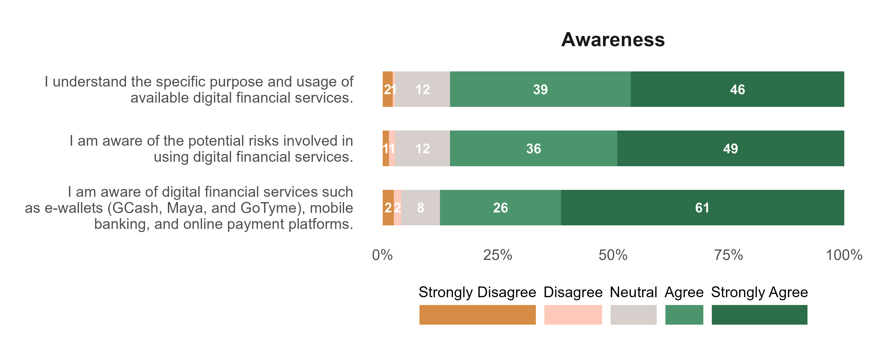
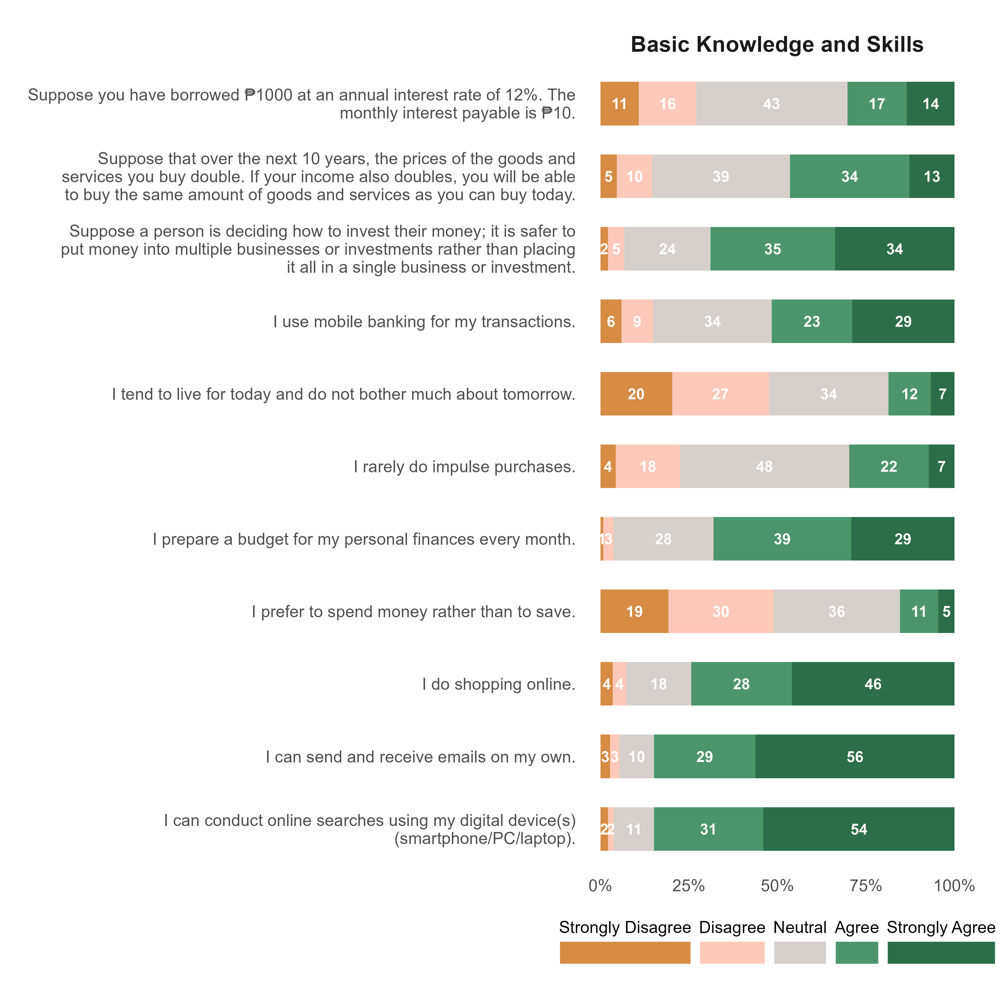
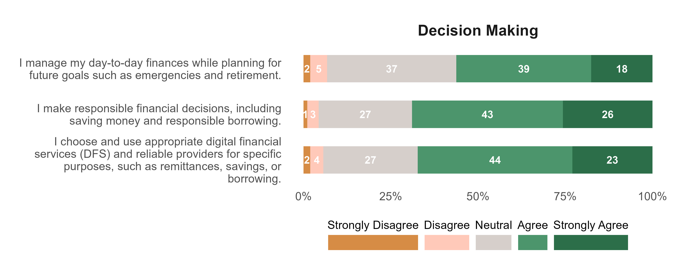
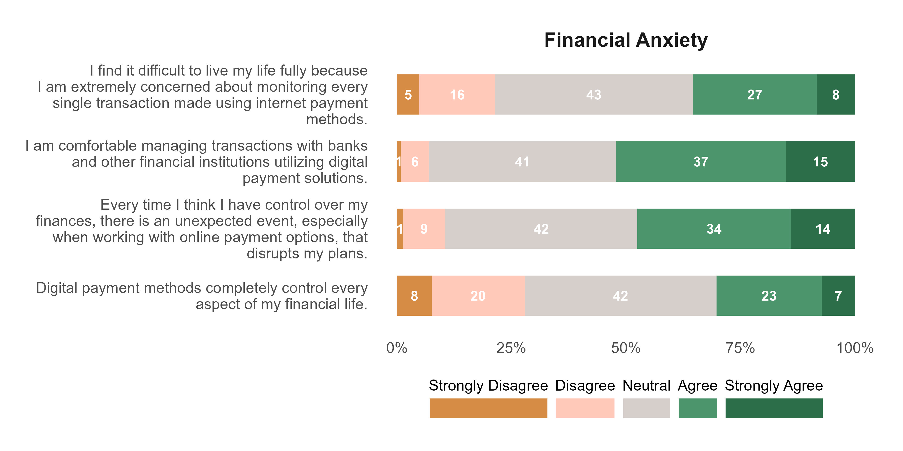
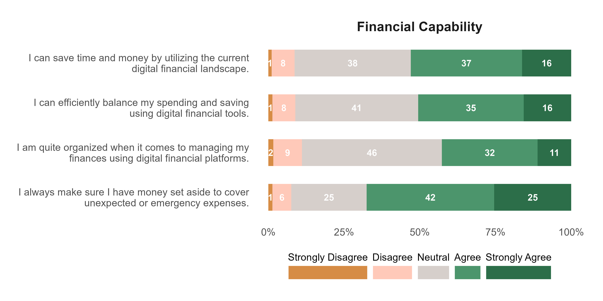
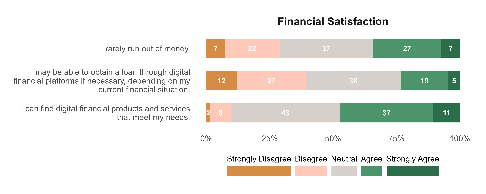
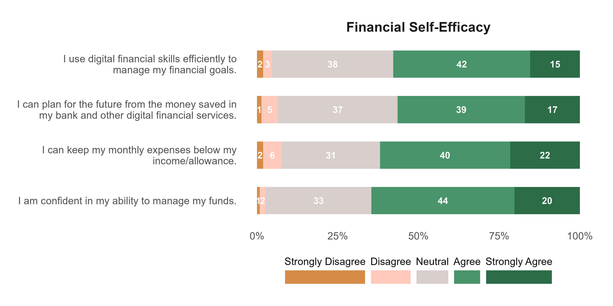
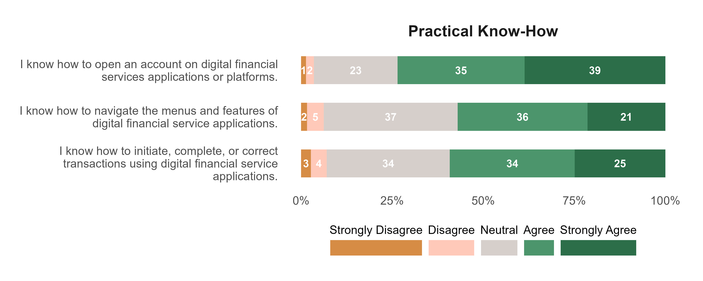
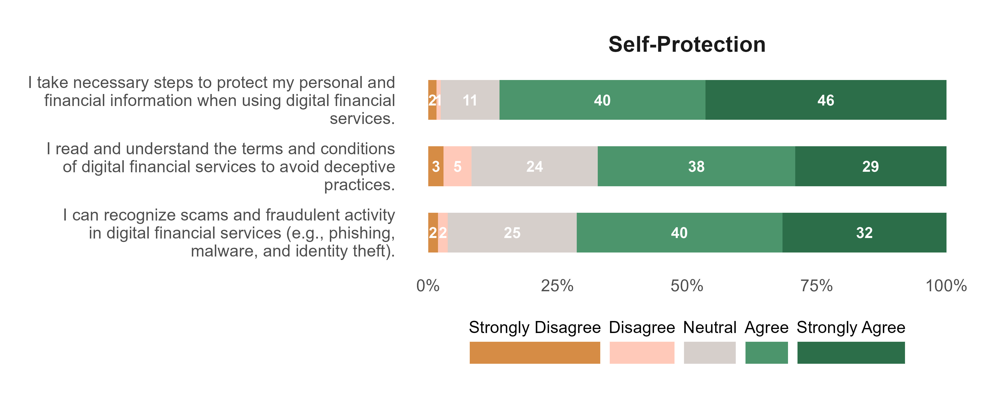

```{r}
#| echo: false
#| message: false
#| warning: false
# set working directory
setwd(here::here("digi-finance"))

# libraries
library(tidyverse)
library(readxl)
library(janitor)
library(scales)
library(EFAtools)
library(psych)
library(seminr)
library(gtsummary)
library(kableExtra)
library(correlation)
library(reshape2)


# data management source
source("data-management.R")
```

# Attachments

::: callout-note
Copies of the Figures presented in this report are available using the links below. All the files can be accessed in the Google drive folder.
:::

<ol>

<li><a href="https://drive.google.com/drive/folders/19CCug3KhxbFnaAqMjwSfKMinFN9ZMHWd?usp=sharing" target="_blank" style="text-decoration: none">Plots</a></li>

<li><a href="https://drive.google.com/drive/folders/11C7ZeBVGgxZ_KQs1v6cQBP6qDIi4_toc?usp=sharing" target="_blank" style="text-decoration: none">Google Drive</a></li>

</ol>

# Objective 1: Present the socio-demographic profile of the respondents.

## Sociodemographic variables

```{r}
## create a gt summary table
df |>
  select(age:residence_type) |>
  tbl_summary(
    statistic = list(all_categorical() ~ "{n} ({p}%)"),
    missing = "no",
    label = list(
      age ~ "Age",
      sex ~ "Sex",
      degree_program ~ "Degree Program",
      year_level ~ "Year level",
      monthly_income_allowance ~ "Monthly Income/Allowance",
      primary_source_of_financial_support = "Source of financial support",
      residence_type = "Type of residence"
    )
  ) |>
  bold_labels() %>%
  as_kable_extra(linesep = "") %>%
  kable_minimal() %>%
  kable_styling(
    full_width = F,
    fixed_thead = T,
    bootstrap_options = c("striped", "hover", "condensed", "responsive")
  )
```

## Factors

### Awareness {.unnumbered}

- 61% strongly agree and 26% agree that they are aware of services like e-wallets, mobile banking, and online payment platforms. Only 2% strongly disagree and 2% disagree, showing very few respondents lack awareness.

- 46% strongly agree and 39% agree that they understand the specific purpose and usage of digital financial services However, 12% remain neutral, and about 3% disagree/strongly disagree, suggesting some uncertainty in deeper comprehension.

- 49% strongly agree and 36% agree that they are aware of potential risks. 12% are neutral, and 3% disagree/strongly disagree, indicating that while most recognize risks, a notable minority are unsure.

- Awareness of existence of services (adfs1) is the strongest (nearly 9 in 10 respondents agree/strongly agree). Awareness of purpose/usage (adfs2) is slightly lower, with more respondents neutral.

```{r}
p_awareness <- plot_factor("Awareness")

## saving plot
ggsave(
  plot = p_awareness,
  filename = "plot/fct_awareness.jpeg",
  width = 10,
  height = 4,
  dpi = 400,
  unit = "in"
)

## display plot

```

### Basic Knowledge and Skills {.unnumbered}

- Majority agree/strongly agree (68%) that they prepare a personal budget. However, 28% are neutral, suggesting that while budgeting is common, consistency may be lacking.

- 74% agree/strongly agree they shop online. Only 8% disagree, showing that digital consumption is widely practiced.

- 52% agree/strongly agree, but 34% are neutral and 9% disagree. While mobile banking is used, a significant portion remains hesitant or undecided.

- Nearly half (48%) are neutral about rarely making impulse purchases. Results indicate uncertainty or inconsistency in self-control over spending.

- There is a moderate understanding of financial numeracy concepts among respondents. For loan interest, 43% remained neutral while only 31% agreed or strongly agreed. Similarly, when asked about the future value of money, 39% were neutral and 47% agreed or strongly agreed. 

- In contrast, investment decision-making showed stronger comprehension, with 69% agreeing or strongly agreeing. Highlighting that students feel more capable when evaluating investment choices compared to technical calculations of interest or future value.

- There is a very high level of digital literacy competence among respondents. For online search, 85% agreed or strongly agreed that they can effectively conduct searches using their devices, while only a small minority expressed disagreement or uncertainty.

- Similarly, email use (bks9) showed equally strong results, with 85% agreeing or strongly agreeing that they can send and receive emails independently.

```{r}
p_basic_know_skill <- plot_factor("Basic Knowledge and Skills", stwidth = 70)

## saving plot
ggsave(
  plot = p_basic_know_skill,
  filename = "plot/fct_basic_know_skill.jpeg",
  width = 10,
  height = 10,
  dpi = 400,
  unit = "in"
)

## display plot

```


### Decision Making {.unnumbered}

- 39% agree and 18% strongly agree, showing more than half of respondents actively plan while managing daily finances. However, 37% are neutral and 7% disagree/strongly disagree, indicating that a significant group may not consistently integrate long-term planning into their financial routines.

- 43% agree and 26% strongly agree, meaning nearly 7 in 10 respondents report responsible behaviors like saving and borrowing wisely. Neutral responses (27%) suggest some uncertainty or inconsistency in applying these practices.

- 44% agree and 23% strongly agree, showing that two-thirds of respondents feel confident in selecting reliable providers for remittances, savings, or borrowing. Still, 27% are neutral and 6% disagree/strongly disagree, reflecting that not all students are fully confident in navigating digital financial platforms.

```{r}
p_decision_making <- plot_factor("Decision Making")

## saving plot
ggsave(
  plot = p_decision_making,
  filename = "plot/fct_decision_making.jpeg",
  width = 10,
  height = 4,
  dpi = 400,
  unit = "in"
)

## display plot

```


### Financial Anxiety {.unnumbered}

- 37% agree and 15% strongly agree they are comfortable managing transactions with banks and financial institutions using digital payment solutions. However, 41% are neutral and 7% disagree/strongly disagree, showing that while many feel confident, a large group remains uncertain.

- 34% agree and 14% strongly agree that unexpected events disrupt their financial control when using online payment options. 42% are neutral, suggesting that many students experience occasional disruptions but may not perceive them as constant or severe.

- 27% agree and 8% strongly agree they find it difficult to live fully because of extreme concern over monitoring digital transactions. Yet, 43% are neutral and 21% disagree/strongly disagree, indicating that financial anxiety is present but not dominant across the group.

- 23% agree and 7% strongly agree that digital payment methods completely control their financial life. The largest group (42%) is neutral, while 28% disagree/strongly disagree, showing mixed perceptions of control, with many undecided.

```{r}
p_finance_anxiety <- plot_factor("Financial Anxiety")

## saving plot
ggsave(
  plot = p_finance_anxiety,
  filename = "plot/fct_finance_anxiety.jpeg",
  width = 10,
  height = 5,
  dpi = 400,
  unit = "in"
)

## display plot

```


### Financial Capability {.unnumbered}

- 37% agree and 16% strongly agree they can save time and money using the digital financial landscape. However, 38% are neutral and 9% disagree, showing that while many recognize efficiency, a large group remains undecided.

- 32% agree and 11% strongly agree they are organized when using digital platforms. Yet, nearly half (46%) are neutral and 11% disagree, suggesting that confidence in organization is weaker compared to other capability items.

- Stronger consensus here: 42% agree and 25% strongly agree they set aside money for emergencies. Only 7% disagree, making this the most consistently positive capability indicator.

- 35% agree and 16% strongly agree they can balance spending and saving with digital tools. Still, 41% are neutral and 9% disagree, indicating mixed confidence in applying digital tools for financial discipline.

```{r}
p_finance_capability <- plot_factor("Financial Capability")

## saving plot
ggsave(
  plot = p_finance_capability,
  filename = "plot/fct_finance_capability.jpeg",
  width = 10,
  height = 5,
  dpi = 400,
  unit = "in"
)

## display plot

```

### Financial Satisfaction {.unnumbered}

- 27% agree and 7% strongly agree that they rarely run out of money, but 37% are neutral and 29% disagree/strongly disagree. This shows that while some students feel financially stable, a large portion experience uncertainty or frequent shortfalls.


- Only 24% agree/strongly agree they could obtain a loan if needed, while 38% are neutral and 39% disagree/strongly disagree. Indicates limited confidence in digital borrowing options, reflecting either lack of access or skepticism about eligibility.


- 37% agree and 11% strongly agree they can find products that meet their needs. However, 43% are neutral and 10% disagree/strongly disagree, suggesting that while many recognize available options, a significant group remains undecided about their suitability.

```{r}
p_finance_sat <- plot_factor("Financial Satisfaction")

## saving plot
ggsave(
  plot = p_finance_sat,
  filename = "plot/fct_finance_sat.jpeg",
  width = 10,
  height = 4,
  dpi = 400,
  unit = "in"
)

## display plot

```

### Financial Self-Efficacy {.unnumbered}

```{r}
p_fiance_self_efficacy <- plot_factor("Financial Self-Efficacy")

## saving plot
ggsave(
  plot = p_fiance_self_efficacy,
  filename = "plot/fct_fiance_self_efficacy.jpeg",
  width = 10,
  height = 5,
  dpi = 400,
  unit = "in"
)

## display plot

```

### Practical Know-How {.unnumbered}

```{r}
p_practical_know_how <- plot_factor("Practical Know-How")

## saving plot
ggsave(
  plot = p_practical_know_how,
  filename = "plot/fct_practical_know_how.jpeg",
  width = 10,
  height = 4,
  dpi = 400,
  unit = "in"
)

## display plot

```

### Self-Protection {.unnumbered}

```{r}
p_self_protection <- plot_factor("Self-Protection")

## saving plot
ggsave(
  plot = p_self_protection,
  filename = "plot/fct_self_protection.jpeg",
  width = 10,
  height = 4,
  dpi = 400,
  unit = "in"
)

## display plot

```

# Objective 2-4: Examine whether digital financial literacy and self-efficacy is positively associated with financial well-being.

## Correlation table

```{r}
#| echo: false
fct_digi_fin_dta <-
  df |>
  select(bks1:fa4) %>%
  mutate(
    sum_bks = rowSums(select(., bks1:bks11), na.rm = TRUE),
    sum_adfs = rowSums(select(., adfs1:adfs3), na.rm = TRUE),
    sum_pkh = rowSums(select(., pkh1:pkh3), na.rm = TRUE),
    sum_dm = rowSums(select(., dm1:dm3), na.rm = TRUE),
    sum_sp = rowSums(select(., sp1:sp3), na.rm = TRUE),
    sum_fse = rowSums(select(., fse1:fse4), na.rm = TRUE),
    sum_fs = rowSums(select(., fs1:fs3), na.rm = TRUE),
    sum_fc = rowSums(select(., fc1:fc4), na.rm = TRUE),
    sum_fa = rowSums(select(., fa1:fa4), na.rm = TRUE)
  ) |>
  select(starts_with("sum_")) |>
  rename(
    "Basic Knowledge and Skills" = sum_bks,
    "Awareness" = sum_adfs,
    "Practical Know-How" = sum_pkh,
    "Decision-making" = sum_dm,
    "Self-protection" = sum_sp,
    "Financial Self-Efficacy" = sum_fse,
    "Financial Satisfaction" = sum_fs,
    "Financial Capability" = sum_fc,
    "Financial Anxiety" = sum_fa
  )
```

```{r}
## function for significance
fun_corr = function(x) {
  out = correlation(x, method = "pearson")
  stars = c("*" = .10, "**" = .05, "***" = .01)
  p = modelsummary:::make_stars(out$p, stars)
  out$r = sprintf("%.3f%s", out$r, p)
  out = as.matrix(out)
  return(out)
}

note_pvalue <- "Significance level: * p < 0.10, ** p < 0.05, *** p < 0.01"

## correlation
modelsummary::datasummary_correlation(
  data = fct_digi_fin_dta,
  output = "kableExtra",
  method = fun_corr,
  notes = note_pvalue
)
```

```{r}
cor_mat <- round(cor(fct_digi_fin_dta, method = "pearson"), 3)
cor_mat[lower.tri(cor_mat)] <- NA
melted_cormat <- melt(cor_mat)

str_wrap_factor <- function(x, ...) {
  levels(x) <- str_wrap(levels(x), ...)
  x
}

melted_cormat_heatmap <-
  melted_cormat %>%
  mutate(
    Var2 = fct_rev(Var2),
    Var1 = factor(Var1),
    Var1 = str_wrap_factor(Var1, width = 32)
  ) %>%
  na.omit()

label_data <-
  melted_cormat_heatmap %>%
  count(Var1) %>%
  mutate(
    Var1 = as.character(Var1),
    Var2 = unique(melted_cormat_heatmap$Var2)
  ) %>%
  mutate(
    x_labs = c("BKS", "ADFS", "PKH", "DM", "SP", "FSE", "FS", "FC", "FA") %>%
      rev()
  )

p_corr_items <- melted_cormat_heatmap %>%
  ggplot(aes(x = Var2, y = Var1, fill = value)) +
  geom_tile() +
  geom_text(aes(label = value), color = "white", fontface = "bold") +
  geom_text(
    data = label_data,
    aes(label = Var1, y = Var1, x = -0.1),
    inherit.aes = F,
    size = 4,
    fontface = "bold",
    vjust = 0.5,
    hjust = 1
  ) +
  geom_text(
    data = label_data,
    aes(label = x_labs, y = 0, x = Var2),
    inherit.aes = F,
    vjust = 0,
    fontface = "bold",
    color = "grey20"
  ) +
  geom_text(
    data = label_data,
    aes(label = x_labs, y = Var1, x = 0.1),
    inherit.aes = F,
    angle = 90,
    vjust = 1,
    fontface = "bold",
    color = "grey20"
  ) +
  scale_fill_gradient(
    low = "#eaf4f4",
    high = "#264653",
    limit = c(0, 1),
    space = "Lab"
  ) +
  scale_x_discrete(position = "top") +
  guides(fill = guide_colorbar(title.position = "bottom", title.hjust = 0.5)) +
  coord_cartesian(clip = "off") +
  theme_minimal() +
  theme(
    plot.margin = margin(20, 20, 20, 180),
    plot.caption.position = "panel",
    plot.caption = element_text(
      hjust = 1,
      margin = margin(t = 20),
      size = 12,
      color = "grey20",
      lineheight = 1.1
    ),
    panel.grid = element_blank(),
    axis.text = element_blank(),
    legend.position = "bottom",
    legend.key.width = unit(10, "mm"),
    legend.direction = "horizontal",
    legend.title = element_text(size = 14),
    legend.text = element_text(size = 10)
  ) +
  labs(fill = "Spearman correlation", x = element_blank(), y = element_blank())

ggsave(
  plot = p_corr_items,
  filename = "plot/corr_items.jpeg",
  dpi = 300,
  width = 10,
  height = 6
)
knitr::include_graphics("plot/corr_items.jpeg")
```

# Objective 5: Determine whether financial self-efficacy mediates the relationship between digital financial literacy and financial well-being.

## Exploratory factor analysis

```{r}
efa_lkrt_dta <-
  df |>
  select(bks1:fa4)
```

### Parallel analysis

```{r}
fa.parallel(efa_lkrt_dta, fa = "fa")
```

### Factor extraction

```{r}
sem_digi_finance_dta <-
  df |>
  select(bks1:fa4) |> 
  select(
    -dm1, -dm2, -sp1, -dm3, -fs1, -fs2, -fs3, -fc1, -fc3,
    -fa1, -pkh2, -pkh3,
    -fc2, -bks1, -bks2, -bks3, -bks4, -bks5, -bks6, -bks7,
    -bks11, -sp2, -fse4, -fc4
  )

```


```{r}
efa_extract <- fa(sem_digi_finance_dta, nfactors = 3, rotate = "varimax", fm = "ml")

print(efa_extract$loadings, cutoff = 0.3, sort = TRUE)
```


## PLS-SEM

### Bootstrapped PLS-SEM model 
```{r}
#| eval: false

# Define measurement model
measurement_model <- constructs(
  composite("Digital financial literacy",
            multi_items(c(rep("bks", 3), rep("adfs", 3), "pkh", "sp"), c(8:10, 1:3, 1, 3))),  
  composite("Financial self-efficacy",
            multi_items("fse", 1:3)),
  composite("Financial well-being",
            multi_items("fa", 2:4))
)

# Define structural model
structural_model <- relationships(
  paths(from = "Digital financial literacy",
        to   = c("Financial self-efficacy", "Financial well-being")),
  paths(from = "Financial self-efficacy",
        to   = "Financial well-being")
)

# Estimate the PLS model
pls_model <- estimate_pls(
  data = sem_digi_finance_dta,
  measurement_model = measurement_model,
  structural_model  = structural_model
)

## summary of pls model
summ_pls_model <- summary(pls_model)

# Run bootstrapping (e.g., 5000 resamples, 4 cores for speed)
boot_pls <- bootstrap_model(
  seminr_model = pls_model,
  nboot = 5000,
  seed = 202604,
  cores = 4
)

## plot model
plot(boot_pls)

```

#### Direct effects
```{r}
#| eval: false

## summary table
summ_boot_pls_model <- summary(boot_pls)

DT::datatable(summ_boot_pls_model$bootstrapped_paths |> round(3))
```

#### Indirect effects
```{r}
#| eval: false

DT::datatable(round(summ_boot_pls_model$bootstrapped_total_indirect_paths, 3))
```


### Reliability test

```{r}
#| eval: false

DT::datatable(round(summ_pls_model$reliability, 3))
```


### Validity test

```{r}
#| eval: false

DT::datatable(round(summ_pls_model$validity$fl_criteria, 3))
```

