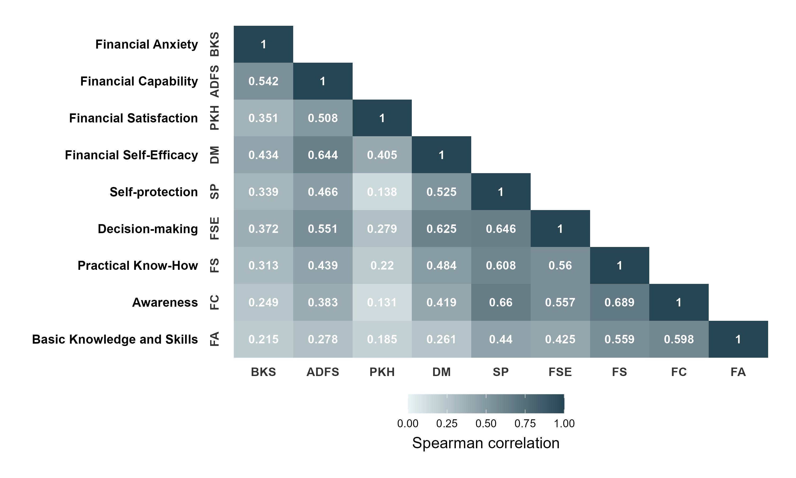

```{r}
#| echo: false
#| message: false
#| warning: false

# set working directory
setwd(here::here("digi-finance"))

# libraries
library(tidyverse)
library(readxl)
library(janitor)
library(scales)
library(EFAtools)
library(psych)
library(seminr)
library(gtsummary)
library(kableExtra)
library(correlation)
library(reshape2)


# data management source
source("data-management.R")
```

# Attachments

::: callout-note
Copies of the Figures presented in this report are available using the links below. All the files can be accessed in the Google drive folder.
:::

<ol>

<li><a href="https://drive.google.com/drive/folders/1WZS7e1pDCnrR8M5w-Y0TEFc1NCixgWcn?usp=sharing" target="_blank" style="text-decoration: none">Plots</a></li>

<li><a href="https://drive.google.com/drive/folders/1K3PC9n8ARzyiKILLZ-RH-c0-6GcO5IkV?usp=sharing" target="_blank" style="text-decoration: none">Google Drive</a></li>

</ol>

# Objective 1: Present the socio-demographic profile of the respondents.

```{r}
## create a gt summary table
df |> 
    select(age:residence_type) |> 
    tbl_summary(
        statistic = list(all_categorical() ~ "{n} ({p}%)"),
        missing = "no",
        label = list(
            age ~ "Age",
            sex ~ "Sex",
            degree_program ~ "Degree Program",
            year_level ~ "Year level",
            monthly_income_allowance ~ "Monthly Income/Allowance",
            primary_source_of_financial_support = "Source of financial support",
            residence_type = "Type of residence"
        )
    ) |> 
        bold_labels() %>% 
        as_kable_extra(linesep = "") %>% 
        kable_minimal() %>% 
        kable_styling(full_width = F, fixed_thead = T,
                    bootstrap_options = c("striped", "hover", "condensed", "responsive"))

    
```


# Objective 2: Examine whether digital financial literacy is positively associated with financial well-being.

```{r}
fct_digi_fin_dta <- 
    df |> 
    select(bks1:fa4) %>% 
    mutate(
        sum_bks = rowSums(select(., bks1:bks11), na.rm = TRUE),
        sum_adfs = rowSums(select(., adfs1:adfs3), na.rm = TRUE),
        sum_pkh = rowSums(select(., pkh1:pkh3), na.rm = TRUE),
        sum_dm = rowSums(select(., dm1:dm3), na.rm = TRUE),
        sum_sp = rowSums(select(., sp1:sp3), na.rm = TRUE),
        sum_fse = rowSums(select(., fse1:fse4), na.rm = TRUE),
        sum_fs = rowSums(select(., fs1:fs3), na.rm = TRUE),
        sum_fc = rowSums(select(., fc1:fc4), na.rm = TRUE),
        sum_fa = rowSums(select(., fa1:fa4), na.rm = TRUE)
    ) |> 
    select(starts_with("sum_")) |> 
    rename(
        "Basic Knowledge and Skills" = sum_bks,
        "Awareness" = sum_adfs,
        "Practical Know-How" = sum_pkh,
        "Decision-making" = sum_dm,
        "Self-protection" = sum_sp,
        "Financial Self-Efficacy" = sum_fse,
        "Financial Satisfaction" = sum_fs,
        "Financial Capability" = sum_fc,
        "Financial Anxiety" = sum_fa
    )
```

```{r}
## function for significance
fun_corr = function(x) {
    out = correlation(x, method = "pearson")
    stars = c("*" = .10, "**" = .05, "***" = .01)
    p = modelsummary:::make_stars(out$p, stars)
    out$r = sprintf("%.3f%s", out$r, p)
    out = as.matrix(out)
    return(out)
}

note_pvalue <- "Significance level: * p < 0.10, ** p < 0.05, *** p < 0.01"

## correlation
modelsummary::datasummary_correlation(
  data = fct_digi_fin_dta,
  output = "kableExtra",
  method = fun_corr,
  notes = note_pvalue
)
```


## correlation table

```{r}
correlation::correlation(fct_digi_fin_dta) |>
  as_tibble() |> 
  select(Parameter1, Parameter2, r, p) |> 
  mutate(stars = case_when(
    p < 0.01 ~ "***",
    p < 0.05 ~ "**",
    p < 0.1 ~ "*",
    TRUE ~ ""
  )) |> 
  mutate(p = round(p, 3)) |> 
  mutate(r = paste0(round(r, 3), stars)) |> 
  rename("Parameter 1" = Parameter1,
         "Parameter 2" = Parameter2,
         "Correlation (r)" = r,
         "p-value" = p) |> 
  select(-stars) |>
  kable() |> 
  kable_minimal() |> 
  kable_styling(full_width = F, fixed_thead = T,
                bootstrap_options = c("striped", "hover", "condensed", "responsive")) |> 
  add_footnote("Significance level: * p < 0.10, ** p < 0.05, *** p < 0.01", notation = "none")
```


```{r}

cor_mat <- round(cor(fct_digi_fin_dta, method = "pearson"), 3)
cor_mat[lower.tri(cor_mat)] <- NA
melted_cormat <- melt(cor_mat)

str_wrap_factor <- function(x, ...) {
  levels(x) <- str_wrap(levels(x), ...)
  x
}

melted_cormat_heatmap <- 
     melted_cormat %>% 
     mutate(Var2 = fct_rev(Var2),
            Var1 = factor(Var1),
            Var1 = str_wrap_factor(Var1, width = 32)
            ) %>% 
     na.omit()

label_data <-  
     melted_cormat_heatmap %>% 
     count(Var1) %>% 
     mutate(Var1 = as.character(Var1),
            Var2 = unique(melted_cormat_heatmap$Var2))%>% 
     mutate(x_labs = c("BKS", "ADFS", "PKH", "DM", "SP", "FSE", "FS", "FC", "FA") %>% rev())
     
p_corr_items <- melted_cormat_heatmap %>%      
     ggplot(aes(x = Var2, y = Var1, fill = value)) +
     geom_tile() +
     geom_text(aes(label = value), color = "white", fontface = "bold") +
     geom_text(data = label_data, aes(label = Var1, y = Var1, x = -0.1), 
               inherit.aes = F,
               size = 4,
               fontface = "bold",
               vjust = 0.5,
               hjust = 1) +
     geom_text(data = label_data, aes(label = x_labs, y = 0, x = Var2), 
               inherit.aes = F,
               vjust = 0,
               fontface = "bold",
               color = "grey20") +
     geom_text(data = label_data, aes(label = x_labs, y = Var1, x = 0.1), 
               inherit.aes = F,
               angle = 90,
               vjust = 1,
               fontface = "bold",
               color = "grey20") +
     scale_fill_gradient(low = "#eaf4f4", high = "#264653", 
                          limit = c(0, 1), space = "Lab") +
     scale_x_discrete(position = "top") +
     guides(fill = guide_colorbar(title.position = "bottom",
                                  title.hjust = 0.5
                                  )) +
     coord_cartesian(clip = "off") +
     theme_minimal() +
     theme(plot.margin = margin(20, 20, 20, 180),
           plot.caption.position = "panel",
           plot.caption = element_text(hjust = 1, margin = margin(t=20), size = 12, color = "grey20", lineheight = 1.1),
           panel.grid = element_blank(),
           axis.text = element_blank(),
           legend.position = "bottom",
           legend.key.width = unit(10, "mm"),
           legend.direction = "horizontal",
           legend.title = element_text(size = 14),
           legend.text = element_text(size = 10)
           ) +
     labs(fill = "Spearman correlation",
          x = element_blank(),
          y = element_blank())

# ggsave(plot = p_corr_items, filename = "plot/corr_items.jpeg", dpi = 300, width = 10, height = 6)
# 
```

# Objective 3: Examine whether digital financial literacy is positively associated with financial self-efficacy.

# Objective 4: Examine whether financial self-efficacy is positively associated with financial well-being.

## Exploratory factor analysis

```{r}
efa_lkrt_dta <- 
    df |> 
    select(bks1:fa4)
```

### Parallel analysis
```{r}
fa.parallel(efa_lkrt_dta, fa = "fa")
```


### Factor extraction

```{r}
efa_trial_dta <- 
    df |> 
    select(bks1:fa4) |> 
    select(-c(bks1:bks7))
```


```{r}
efa_extract <- fa(efa_trial_dta, nfactors = 6, rotate = "varimax", fm = "ml")

print(efa_extract$loadings, cutoff = 0.3, sort = TRUE)
```

# Objective 5: Determine whether financial self-efficacy mediates the relationship between digital financial literacy and financial well-being.

