```{r}
#| echo: false
#| message: false
#| warning: false
# set working directory
setwd(here::here("gender-farm-tech"))

# libraries
library(tidyverse)
library(readxl)
library(janitor)
library(scales)
library(EFAtools)
library(gtsummary)
library(kableExtra)
library(correlation)
library(reshape2)
library(tidyr)
library(tidytext)

# data management source
source("data-management.R")
```

# Attachments

::: callout-note
Copies of the Figures presented in this report are available using the links below. All the files can be accessed in the Google drive folder.
:::

<ol>

<li><a href="https://drive.google.com/drive/folders/1I2PFRfb5vYPw0jx2PcIQYMpe1DO943EU?usp=sharing" target="_blank" style="text-decoration: none">Plots</a></li>

<li><a href="https://drive.google.com/drive/folders/1cyLa0hL07qb-IDCc-xvLGZaxpfWk_dtS?usp=sharing" target="_blank" style="text-decoration: none">Google Drive</a></li>

</ol>

# Objective 1: Identify and describe the farm technologies currently used by smallholder vegetable farmers in Ormoc City over the past ten years from 2014 to 2024

### Sociodemographic profile {.unnumbered}

::: callout-note
## Interpretations

- **Age**
  - Female median age: 41 (IQR: 35–50)
  - Male median age: 40 (IQR: 30–50)
  - Both groups are middle‑aged, with women slightly older on average. This suggests similar generational exposure to technology, but women may face age‑related constraints earlier.
- **Civil Status**
  - Majority of both groups are married (64% of women, 82% of men). Women show more diversity: 15% live‑in, 5% separated, 5% widowed.
  - Men are almost exclusively married or single.
  - Women’s broader civil status distribution may affect decision‑making power and resource access, especially for widowed or separated women.
- **Ethnicity**
  - Predominantly Bisaya (90% women, 97% men). Women have more representation from Waray (10%).
  - Ethnic composition is largely homogeneous, but women’s slightly more diverse background may influence cultural norms in adoption.
- **Education**
  - Elementary education dominates (49% women, 56% men). High school is the second most common (38% women, 33% men).
  - Women show slightly higher attainment at college (7.7% vs 4.9%) and graduate level (5.1% vs 0%). Men have more vocational/ALS representation.
  - Overall, both groups have modest educational attainment, but women show a small edge in higher education, which could support adoption if resource barriers are addressed.
- **Household headship**
  - 100% of men are household heads. Only 33% of women are household heads; 67% are not.
  - This is a major gender disparity: men hold formal decision‑making authority, while most women lack it, limiting their autonomy in adopting technologies.
- **Household size**
  - Women: median 5 (IQR: 3–6). Men: median 4 (IQR: 3–5).
  - Women’s households are slightly larger, implying greater domestic responsibilities that may compete with technology adoption.
- **Income**
  - Non‑farm income: Women report higher medians (₱24,000 vs ₱8,000).
  - On‑farm income: Men slightly higher (₱50,000 vs ₱43,000).
  - Off‑farm income: Women higher (₱24,000 vs ₱6,000).
  - Women diversify income sources more, while men rely more on farm income. This suggests women may be more risk‑averse and constrained by time, balancing multiple income streams.
- **Land characteristics**
  - Land area: Men hold larger plots (median 0.75 ha vs 0.50 ha).
  - Land type: Both groups mostly lowland (≈60%). Women: more sloping land (36%). Men: more upland (11%).
  - Men’s larger landholdings and upland plots may give them more leverage in adopting technologies, while women’s smaller and sloping plots may limit mechanization.
:::

```{r}
df |>
  select(
    sex:hh_head,
    hh_size,
    nonfarm_income,
    onfarm_income_yr,
    offfarm_income_yr,
    area_ha,
    land_type,
    -status
  ) |>
  tbl_summary(
    by = sex,
    statistic = list(all_categorical() ~ "{p}% (n = {n})"),
    type = list(hh_head ~ "categorical"),
    missing = "no",
    label = list(
      age ~ "Age",
      civil_status ~ "Civil status",
      ethnicity ~ "Ethnicity",
      educ_attainment ~ "Educational attainment",
      hh_head ~ "Household head",
      hh_size ~ "Household size",
      nonfarm_income ~ "Non-farm income",
      onfarm_income_yr ~ "On-farm income",
      offfarm_income_yr ~ "Off-farm income",
      area_ha = "Land area (ha)",
      land_type = "Land type"
    )
  ) |>
  bold_labels() |>
  as_kable_extra(linesep = "") |>
  kable_minimal() |>
  kable_styling(
    full_width = F,
    fixed_thead = T,
    bootstrap_options = c("striped", "hover", "condensed", "responsive")
  )
```

### Crops planted {.unnumbered}

::: callout-note
## Interpretation

- Women diversify more, planting a wider range of crops, though in smaller quantities. While men specialize more, concentrating on cabbage and Chinese cabbage.

- Female farmers

  - Chinese cabbage (33%) and cabbage (22%) dominate women’s crop choices.
  - Women show greater crop diversity: aside from leafy greens, they cultivate sweet pepper, chilli, beans, coconut, tomato, radish, onion, eggplant, and other vegetables in smaller proportions.

- Male farmers

  - Chinese cabbage (42%) and cabbage (34%) are even more dominant among men, accounting for three‑quarters of their crop choices.
  - Men’s crop portfolio is less diverse: aside from leafy greens, only small shares go to sweet pepper, tomato, eggplant, chilli, coconut, and ombok.
:::

```{r}
crops_planted_dta <-
  df |>
  select(sex, crops_planted) |>
  str_separate(var_name = crops_planted) |>
  mutate(
    crops_planted = case_when(
      str_detect(crops_planted, "chinese") ~ "chinese cabbage",
      str_detect(crops_planted, "chili pepper") ~ "chilli pepper",
      str_detect(crops_planted, "sweet pepper") ~ "sweet pepper",
      str_detect(crops_planted, "pepper") ~ "chilli pepper",
      str_detect(crops_planted, "coconut") ~ "coconut",
      TRUE ~ crops_planted
    )
  )

p_crops_planted <-
  plot_pct_by_sex(
    df = crops_planted_dta,
    category_var = crops_planted,
    ncol = 2,
    x_max = 0.6
  )

## saving plot
ggsave(
  plot = p_crops_planted,
  filename = "plot/p_crops_planted.jpeg",
  width = 10,
  height = 6,
  dpi = 400,
  unit = "in"
)

## display plot
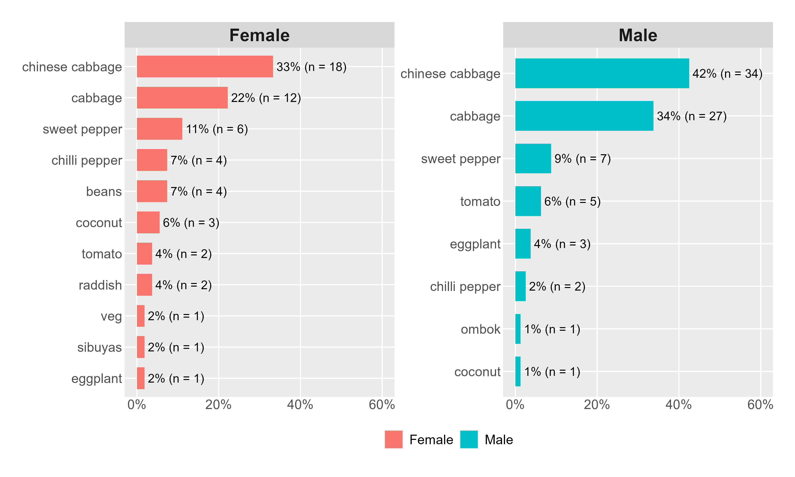
```

### Farm practices {.unnumbered}

::: callout-note
## Interpretation

- Female Farmers
  - Integrated Pest Management (IPM) is the most common training/practice area (50%).They also engage in Food Safety & Post‑Harvest (21%), Sustainable Cultural Practices (14%), and Soil & Nutrient Management (14%).
- Male Farmers
  - IPM dominates strongly (69%), showing men’s practices are heavily focused on pest control. Secondary practices include Soil & Nutrient Management (17%), Sustainable Cultural Practices (9%), and small shares in Market Literacy (3%) and Food Safety & Post‑Harvest (3%).
  - Men’s practices are more concentrated on production‑oriented topics, with limited engagement in post‑harvest and market literacy.
- Women’s engagement in post‑harvest and food safety suggests a concern for quality and household consumption, while men’s focus on IPM and soil management points to productivity and market orientation.
:::

```{r}
p_farm_practice <- plot_pct_by_sex(df = df, category_var = category1)

## saving plot
ggsave(
  plot = p_farm_practice,
  filename = "plot/p_farm_practice.jpeg",
  width = 10,
  height = 6,
  dpi = 400,
  unit = "in"
)

## display plot
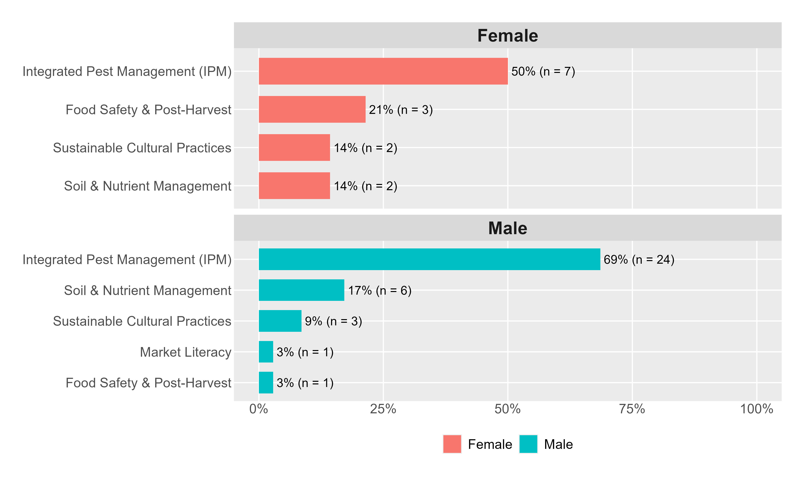
```

### Farm technologies {.unnumbered}

::: callout-note
## Interpretation

- Female Farmers

  - Crop Protection (50%) is the dominant area, showing women’s strong involvement in pest and disease management Smaller shares are spread across Soil & Water Management (12%), Protected Horticulture (12%), Plant Breeding/Propagation (12%), and Farm Mechanization (12%).

- Male Farmers

  - Crop Protection (33%) is also the largest category, but less dominant compared to women. Men show broader distribution across Protected Horticulture (19%), Plant Breeding/Propagation (19%), and Farm Mechanization (19%), with smaller shares in Soil & Water Management (5%) and Green Manuring (5%).

- Overall, women are more likely involve in crop protection, while men diversify into mechanization, breeding, and horticulture, reflecting greater access to resources, land, and decision‑making authority.

- Women’s limited presence in mechanization highlights a gender barrier in access to equipment and training, while men’s lower share in food safety/post‑harvest (from earlier results) shows a gap in quality assurance practices.

- The presence of women in multiple categories, though in small numbers, suggests interest and potential for expansion if barriers are reduced.
:::

```{r}
p_farm_tech <- plot_pct_by_sex(df = df, category_var = category2)


## saving plot
ggsave(
  plot = p_farm_tech,
  filename = "plot/p_farm_tech.jpeg",
  width = 10,
  height = 7,
  dpi = 400,
  unit = "in"
)

## display plot
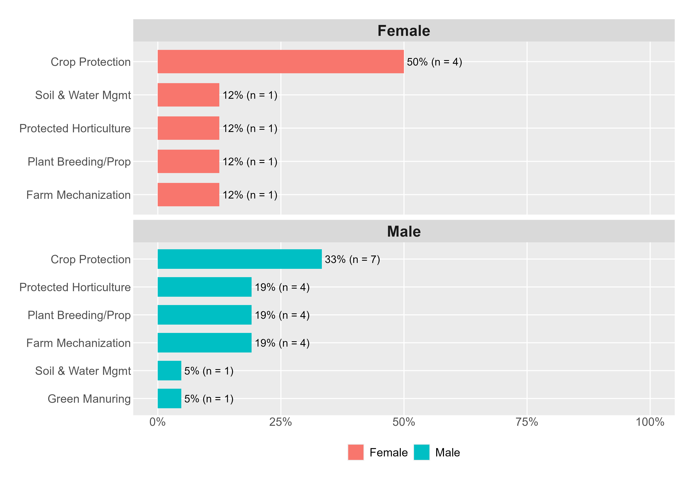
```

### Source of information {.unnumbered}

::: callout-note
## Interpretation

- Female Farmers

  - Chemical companies (21%) are the most cited source, showing women’s reliance on external suppliers for inputs and advice.
  - Other sources are evenly spread: neighbors (14%), Department of Agriculture (DA, 14%), agri‑input suppliers (14%), and other informal sources (14%). Smaller shares come from relatives, family, and local government (LGU CAO).

- Male Farmers

  - Department of Agriculture (21%) and “other” sources (21%) are the top influences. Neighbors (17%) and agri‑input suppliers (12%) also play important roles.
  - Men show broader institutional reach, citing seed companies, NGOs, internet, farmer associations, and academe (each 4%).

- Women rely more on chemical companies and personal ties (neighbors, relatives, family), reflecting limited access to formal institutions. Men rely more on DA and institutional sources, including NGOs, farmer associations, and internet, showing greater integration into formal extension systems.

- Women’s fragmented networks may limit consistent access to updated information, while men’s broader institutional ties provide more structured support.

- The absence of women citing internet or farmer associations highlights a digital and organizational participation gap.

- Women’s information sources are informal and supplier‑driven, while men’s sources are more institutional and diversified. This reflects systemic gender barriers: women’s weaker access to formal extension services and digital platforms.
:::

```{r}
info_source_dta <-
  df |>
  select(sex, starts_with("src_")) |>
  pivot_longer(
    cols = src_lgu_cao:src_other,
    names_to = "info_source"
  ) |>
  filter(value > 0) |>
  mutate(
    info_source = str_remove_all(info_source, "src_"),
    info_source = str_replace_all(info_source, "_", " ")
  ) |>
  group_by(sex, info_source) |>
  summarise(n = sum(value, na.rm = T)) |>
  ungroup() |>
  group_by(sex) |>
  pct_label(n) |>
  ungroup()

p_info_source <- plot_bar_by_sex(
  df = info_source_dta,
  category_var = info_source,
  x_max = 0.4
)


## saving plot
ggsave(
  plot = p_info_source,
  filename = "plot/p_info_source.jpeg",
  width = 10,
  height = 7,
  dpi = 400,
  unit = "in"
)

## display plot
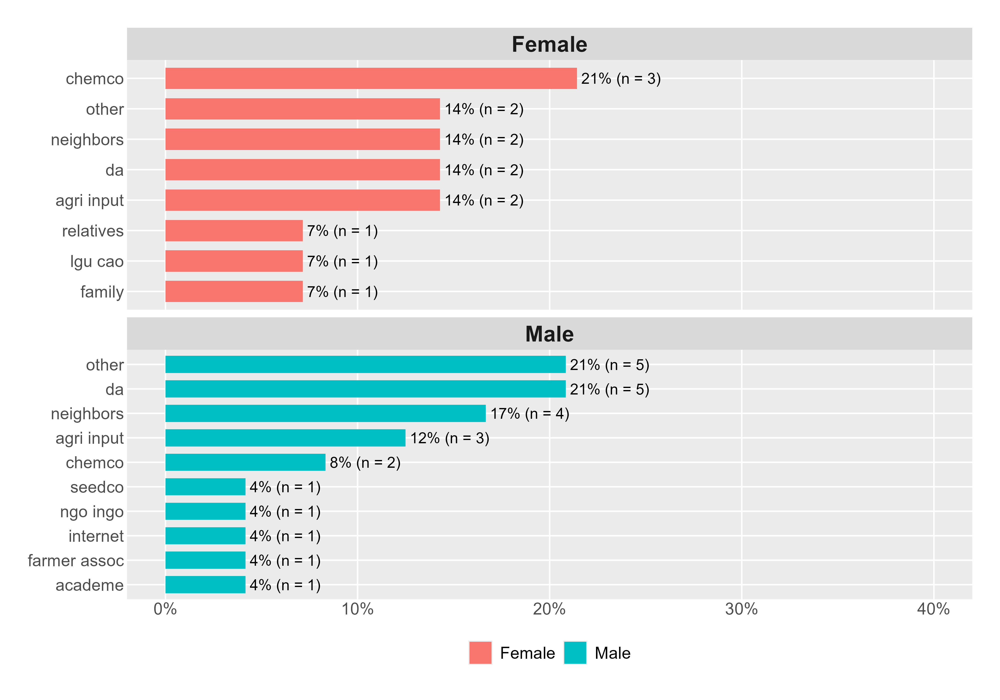
```

# Objective 2: Analyze the socioeconomic determinants influencing technology adoption among smallholder vegetable farmers.

- Logit
  - The logit is the raw output of logistic regression. It’s the “mathematical score” the model calculates before converting it into a probability.
  - Positive logit → increases likelihood of adoption.
  - Negative logit → decreases likelihood.
  - Example: Attended training has a logit of 2.161, meaning training strongly pushes adoption upward.
- Odds Ratio
  - The odds ratio translates the logit into something easier to understand: how many times more likely adoption is when the factor is present.
  - Odds ratio \> 1 → increases chance of adoption.
  - Odds ratio \< 1 → decreases chance.
  - Example: New tech awareness has an odds ratio of 437.5\*. That means farmers aware of new technology are over 400 times more likely to adopt compared to those unaware.
- Marginal Effects
  - Marginal effects show the change in probability (in percentage points) when a factor changes.
  - This is the most intuitive measure for non‑technical audiences.
  - Example: Attended training increases adoption probability by 10.6%, while New tech awareness increases it by 70.3%.
  - Think of it as: “If we train 10 farmers, about 1 extra farmer will adopt; if 10 farmers become aware of new technology, about 7 extra will adopt.”
- Model Fit Statistics (How good is the model?)
  - Number of observations (N=100) → sample size used.
  - AIC (86.8) & BIC (118.1) → technical measures of how well the model balances accuracy and simplicity. Lower is better.
  - R² Tjur (0.76) → tells us the model explains 76% of the variation in adoption. That’s very strong.
  - RMSE (0.25) → average prediction error. Smaller means more accurate.
  - Log Likelihood (-31.424) → another measure of fit; higher (less negative) is better.
  - F statistic (3.411) → shows the overall model is statistically significant.

::: callout-note
## Sinficant predictors

- **New Technology Awareness**
  - Logit: 6.081 \*\*\*
  - Odds Ratio: 437.5 \*\*\*
  - Marginal Effect: 0.703 \*\*\*
  - Awareness is the strongest predictor. Farmers who are aware of new technologies are vastly more likely to adopt, with a 70% higher probability. This aligns with the thesis framework: perceived usefulness and information access drive adoption.
- **Attended Training**
  - Logit: 2.161 \*
  - Odds Ratio: 8.677 \*
  - Marginal Effect: 0.106 \*\*
  - Training attendance increases adoption likelihood nearly ninefold. Marginal effect shows a 10% increase in probability. This highlights the critical role of extension services and training access, especially for women who often face barriers here.
- **Perception Score**
  - Logit: 0.188 \*\*
  - Odds Ratio: 1.206 \*\*
  - Marginal Effect: 0.010 \*\*
  - Positive perceptions of technology significantly increase adoption. Each unit increase in perception score raises adoption probability by about 1%. This reflects TAM’s perceived usefulness construct.
- **Practice Score**
  - Logit: 0.224 \*\*
  - Odds Ratio: 1.251 \*\*
  - Marginal Effect: 0.012 \*\*
  - Actual practice experience boosts adoption. Farmers who already apply practices are more likely to adopt new technologies, reinforcing the importance of experiential learning.
- **Knowledge Score**
  - Marginally significant (+)
  - Odds Ratio: 1.141 +
  - Marginal Effect: 0.007 +
  - Knowledge contributes positively, though less strongly than perception and practice. This suggests knowledge alone is insufficient unless paired with awareness and training.
- **Organizational Membership**
  - Logit: 1.368 +
  - Odds Ratio: 3.928 +
  - Marginal Effect: 0.074
  - Membership in farmer organizations increases adoption likelihood, though significance is marginal. Networks provide information and collective support, consistent with your literature on social learning.
:::

```{r}
library(margins)
library(modelsummary)

## formula
adop_socio_fxn <- as.formula(adopt ~ .)

## logistic regression with weights
model_adopt <- glm(
  formula = adop_socio_fxn,
  data = reg_df,
  family = binomial,
  weights = ifelse(adopt == 1, 77 / 23, 1),
  na.action = na.omit
)

## marginal effects
model_adopt_marginal_eff <- margins(model_adopt)

## model summary list
models_adopt <- list(
  "Logit" = model_adopt,
  "Odds Ratio" = model_adopt,
  "Marginal effects" = model_adopt_marginal_eff
)

## regression table
modelsummary(
  models_adopt,
  exponentiate = c(FALSE, TRUE, FALSE),
  stars = TRUE,
  title = "Logistic regression results showing the influence of socio-demographic factors, training, awareness, perceptions, knowledge, and practices on farm technology adoption among smallholder vegetable farmers in Ormoc City, Leyte.",
  fmt = 3,
  estimate = "{estimate} {stars}<br>({std.error})",
  statistic = NULL,
  gof_ma = c("nobs", "aic", "bic", "r2.tjur", "rmse", "F", "logLik"),
  notes = list(
    "Significance levels: + p < 0.10, * p < 0.05, ** p < 0.01, *** p < 0.001"
  ),
  coef_map = c(
    "(Intercept)" = "Constant",
    "sexMale" = "Sex (Male)",
    "age" = "Age",
    "civil_statussingle" = "Civil Status: Single",
    "educ_attainmentHigh school and higher" = "Education: High school",
    "hh_size" = "Household Size",
    "hh_org_memberYes" = "Org Membership",
    "attend_training5yrYes" = "Attended training",
    "aware_newtechYes" = "New tech awareness",
    "summ_percep" = "Perception Score",
    "summ_know" = "Knowledge Score",
    "summ_practice" = "Practice Score"
  )
)
```

# Objective 3: Investigate the barriers hindering the adoption of farm technologies.

Still need to find variables as barriers to adoption

```{r}
#| echo: false
#| eval: false
## formula: adopt explained by barriers
adop_barriers_fxn <- as.formula(
  adopt ~ .
)

## logistic regression
model_adopt_barriers <- glm(
  formula = adop_barriers_fxn,
  data = barrier_df,
  family = binomial,
  weights = ifelse(adopt == 1, 77 / 23, 1),
  na.action = na.omit
)

model_adopt_barriers |> summary()

## marginal effects
model_adopt_barriers_marginal <- margins(model_adopt_barriers)

## model summary list
models_adopt_barriers <- list(
  "Logit" = model_adopt_barriers,
  "Odds Ratio" = model_adopt_barriers,
  "Marginal effects" = model_adopt_barriers_marginal
)

## regression table
modelsummary(
  models_adopt_barriers,
  exponentiate = c(FALSE, TRUE, FALSE),
  stars = TRUE,
  title = "Barriers to technology adoption",
  fmt = 3,
  estimate = "{estimate}{stars}\n({std.error})",
  statistic = NULL,
  gof_ma = c("nobs", "aic", "bic", "r2.tjur", "rmse", "F", "logLik"),
  notes = list(
    "Significance levels: * p < 0.05, ** p < 0.01, *** p < 0.001"
  )
)
```

## Decision-making

### household decision-making {.unnumbered}

::: callout-note
## Key insights

- Women dominate most household tasks. Activities like tidying the house (70%), laundering clothes (66%), preparing meals (60%), and cleaning dishes (61%) are done mainly by women. Even in shopping for food and choosing the kind of food to eat, women lead (47–39%). These results reflect traditional gender roles, where women handle domestic chores and food preparation.

- Women also share decision‑making in allocating income (28% women only, 62% both equally) and overseeing household finances (43% women only, 43% both equally)—showing they are active in managing household money, not just chores.

- Men dominate physically demanding tasks. Collecting firewood (51.5% men only) and fetching water (29% men only, 32% men mostly) are largely male responsibilities.

- Men also participate in overseeing household finances (13% men mostly) and securing loans/credit (19% men only)—activities linked to mobility and external transactions. This pattern suggests men’s roles are outdoor and resource‑oriented, while women’s are indoor and household‑oriented.

- Some activities show joint decision‑making: Allocating income (62% both equally) and securing loans/credit (68% both equally) indicate cooperation in financial matters. Choosing food (49% both equally) and shopping for food (37% both equally) also show shared roles in consumption decisions.

- Overall, women carry the bulk of household labor, especially repetitive and time‑intensive tasks. Men handle physically demanding and external tasks, such as fetching water and collecting firewood. Financial decisions are increasingly shared, showing evolving household dynamics.
:::

| Household Domain | Men’s Role | Women’s Role | Shared Role |
|-----------------|-----------------|---------------------|-----------------|
| **Financial management** | Moderate (e.g., 13% men mostly in overseeing finances; 19% men only in securing loans) | Strong (43% women only in overseeing finances; 28% women only in allocating income) | High (62% both equally in income allocation; 67% both equally in securing loans) |
| **Food decisions** | Limited (7–8% men only in shopping/choosing food) | Strong (47% women only in shopping; 39% women only in choosing food) | Moderate (37–49% both equally in shopping/choosing food) |
| **Meal preparation & chores** | Minimal (5–7% men only in preparing meals, cleaning dishes, laundry) | Dominant (60–70% women only in cooking, cleaning, laundry, tidying) | Low (20–30% shared in some chores) |
| **Resource collection** | Dominant (51% men only in firewood; 28–31% men only/mostly in fetching water) | Moderate (19% women only in fetching water; 13% women only in firewood) | Low (11–17% shared) |

```{r}
p_hh_mgmt <-
  hh_mgmt_dta %>%
  group_by(activities) %>%
  mutate(pct = count / sum(count) * 100) %>%
  filter(pct != 0) %>%
  mutate(
    decision = factor(
      decision,
      levels = c(
        "Women only",
        "Women mostly",
        "Both equally",
        "Men mostly",
        "Men only"
      )
    )
  ) %>%
  ggplot(aes(y = activities, x = pct, fill = decision)) +
  geom_col() +
  # label values with percent
  geom_text(
    aes(label = round(pct, 1)),
    position = position_stack(vjust = 0.5),
    fontface = "bold",
    color = "white",
    size = 4
  ) +
  scale_fill_manual(
    values = c("#e27396", "#ff99ac", "#8d99ae", "#00b4d8", "#0077b6")
  ) +
  labs(
    x = "Percentage of decisions",
    y = "Activities",
    fill = "Decision maker/ \n Who performs"
  ) +
  theme_minimal() +
  theme(
    plot.margin = margin(1, 1, 1, 1, "cm"),
    panel.grid = element_blank(),
    legend.title = element_text(size = 12),
    legend.text = element_text(size = 12),
    axis.text.x = element_text(size = 12),
    axis.text.y = element_text(size = 12),
    axis.title.x = element_text(size = 14),
    axis.title.y = element_text(size = 14, margin = margin(r = 20)),
    legend.position = "top",
    legend.box = "horizontal"
  )

### saving plot
ggsave(
  "plot/household_management.jpeg",
  plot = p_hh_mgmt,
  width = 11,
  height = 6.5,
  dpi = 300,
  units = "in"
)

## display plot
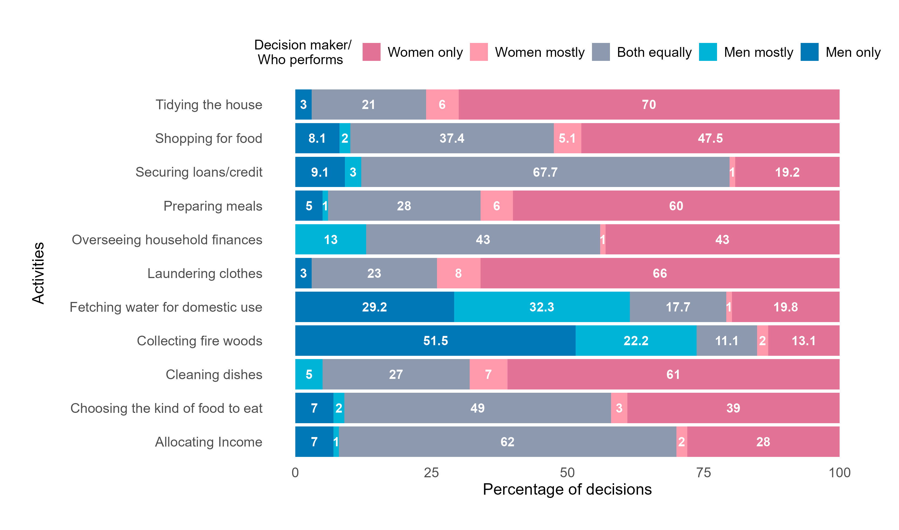
```

### Farm decision-making

::: callout-note
## Intepretation

- Men’s Dominance in Production Decisions. Men are the primary decision‑makers and performers in most production activities: Plowing (68–74%), applying fertilizer (63–67%), planting/transplanting (55–57%), and constructing trellises (49–51%) are largely male‑led. Men also dominate seedling production (63%), watering (36%), and weeding (58–61%). These tasks are physically demanding and often require control over equipment or land, reflecting men’s greater access to farm resources and decision authority.

- Women are active in financial and record‑keeping tasks: Keeping farm records (43–47%) and managing farm finances (30%) show strong female involvement. Women also contribute to feeding and caring for animals (17–18%), and teaching children how to farm (14%). In decision‑making, women’s participation is visible but limited — often secondary or shared rather than exclusive. Women’s roles lean toward supportive and management functions, consistent with their household and organizational responsibilities.

- Several activities show joint decision‑making between men and women: Types of crop to plant (30%), harvesting (27–34%), post‑harvest (29%), and teaching children how to farm (26%). These shared areas suggest collaboration in planning and family‑based farming decisions, especially where outcomes affect household welfare.
:::

| Category | Men’s Role (Decision & Tasks) | Women’s Role (Decision & Tasks) | Shared Role |
|------------------|------------------|--------------------|------------------|
| **Production (plowing, planting, fertilizer, trellises)** | Dominant (60–70% lead in decisions & tasks) | Limited (10–15%) | Low (10–30%) |
| **Farm Management (records, finances)** | Moderate (30–40%) | Strong (30–45%) | Moderate (20–25%) |
| **Animal Care & Teaching** | Active (40–50%) | Active (15–20%) | Moderate (20–25%) |
| **Decision-Making Overall** | Men lead most production decisions | Women lead management & supportive tasks | Collaboration in crop choice, harvesting, post-harvest |

```{r}
## Gender Roles in Decision-Making and Performance of Vegetable Farming Tasks

activities_levels <-
  hh_farming_tasks |>
  select(activities) |>
  distinct(activities) |>
  pull(activities)


p_farming_task <-
  hh_farming_tasks |>
  mutate(
    decision_maker_bi = case_when(
      str_detect(decision_maker, "Men") ~ "Men mostly",
      str_detect(decision_maker, "Women") ~ "Women mostly",
      str_detect(decision_maker, "Both") ~ "Both equally"
    )
  ) |>
  group_by(activities, decision_maker_bi) |>
  summarise(
    who_decide_bi = sum(who_decide),
    who_perform_bi = sum(who_perform)
  ) |>
  ungroup() |>
  group_by(activities) |>
  mutate(
    pct_decide = who_decide_bi / sum(who_decide_bi) * 100,
    pct_perform = who_perform_bi / sum(who_perform_bi) * 100
  ) |>
  ungroup() |>
  pivot_longer(
    cols = c(pct_decide, pct_perform),
    names_to = "type",
    values_to = "pct"
  ) |>
  mutate(activities = factor(activities, levels = activities_levels)) |>
  mutate(activities = fct_rev(activities)) |>
  mutate(
    type = recode(
      type,
      pct_decide = "Decision-making",
      pct_perform = "Performing tasks"
    )
  ) |>
  ggplot((aes(y = activities, x = pct, fill = decision_maker_bi))) +
  geom_col(position = "dodge") +
  geom_text(
    aes(label = round(pct, 1)),
    position = position_dodge(width = 1),
    hjust = -0.1,
    size = 3
  ) +
  scale_x_continuous(limits = c(0, 100)) +
  scale_fill_manual(values = c("gray70", "#00b4d7", "#e27296")) +
  facet_wrap(~type) +
  theme_minimal() +
  labs(
    x = "Percentage of decisions",
    y = "Activities",
    fill = element_blank()
  ) +
  theme(
    plot.margin = margin(rep(10, 4)),
    panel.grid = element_blank(),
    strip.text = element_text(size = 12, face = "bold"),
    axis.text.y = element_text(size = 12),
    axis.text.x = element_text(size = 11),
    axis.title.x = element_text(size = 14, margin = margin(t = 15)),
    axis.title.y = element_text(size = 14, margin = margin(r = 15)),
    legend.text = element_text(size = 12)
  )

## saving plot
ggsave(
  plot = p_farming_task,
  filename = "plot/farming-tasks.jpeg",
  width = 10,
  height = 10,
  dpi = 400
)

## display plot
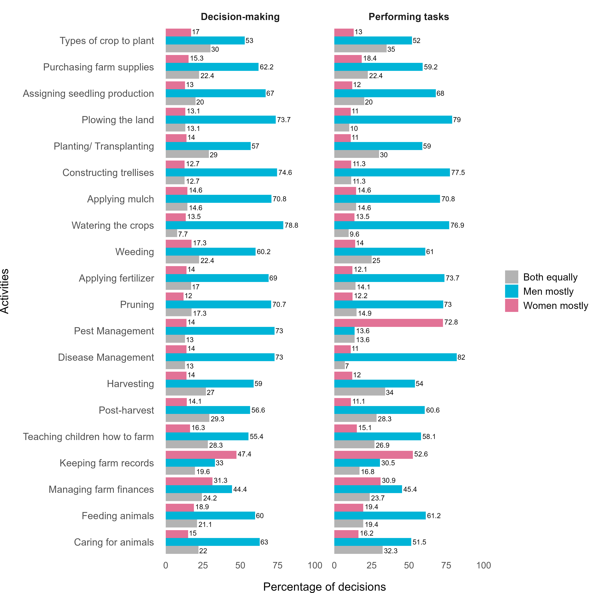
```

# Objective 4: Evaluate the differences in adoption ease of farm technologies between female and male farmers.

## Perception

| Theme                          | Female Perception                          | Male Perception                          | Key Insight |
|--------------------------------|--------------------------------------------|------------------------------------------|-------------|
| **Empowerment & leadership**   | Very high agreement (≈90–95%)               | High agreement, fewer strong agreements   | Women more emphatic about empowerment |
| **Policy awareness**           | Strong belief in equal participation policy | Agreement but more “no opinion” responses | Men less certain about policy implementation |
| **Fairness in resource access**| Mixed: ~49% agree, ~46% disagree            | More disagreement than agreement          | Women perceive discrimination more strongly |
| **Technology & machinery**     | Strong agreement (≈90%)                     | Agreement but less strong                 | Both supportive, women more enthusiastic |
| **Information & education**    | Very high agreement (≈95–97%)               | High agreement, some variation            | Women more consistent in valuing representation |


### Perception among female farmers {.unnumbered}


::: {.callout-note}
## Perception: female
- Most women consistently agree or strongly agree with statements about empowerment, equal access, and gender equality in vegetable farming.
- High agreement that women should be empowered, lead organizations, and be included in agricultural services.
- Women show strong belief that policies for equal participation already exist in the municipality.
- Nearly half agree it is unfair that women have limited access to land and resources, but a sizable portion also disagrees — showing mixed perceptions of discrimination.
- Overall, women’s responses reflect optimism and support for gender equality, but with recognition of persistent barriers.

:::

```{r}
perception_female <- plot_factor(factor_name = "Perception", stwidth = 70)

## saving plot
ggsave(
  plot = perception_female,
  filename = "plot/perception_female.jpeg",
  width = 12,
  height = 10,
  dpi = 400,
  unit = "in"
)

## display plot
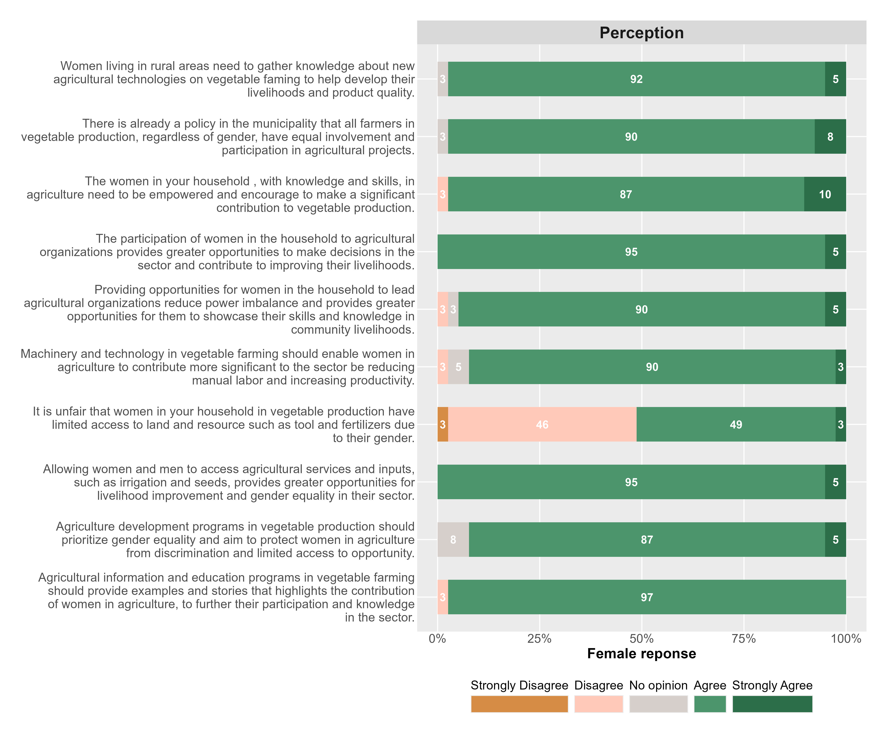
```

### Perception among male farmers {.unnumbered}

::: {.callout-note}
## Perception: male

- Agreement is also strong, but slightly more varied than women’s. Men agree that women should be empowered, lead organizations, and access agricultural services — but their levels of strong agreement are lower compared to women.
- Men also acknowledge equal participation policies, but with more “no opinion” responses, suggesting less awareness or confidence in implementation.
- Men are less likely than women to agree that women face unfair resource limitations, with more disagreement here.
- Overall, men’s responses reflect support for equality in principle, but with less intensity and more skepticism about discrimination.

:::

```{r}
perception_male <- plot_factor(
  factor_name = "Perception",
  gender = "Male",
  stwidth = 70
)

## saving plot
ggsave(
  plot = perception_male,
  filename = "plot/perception_male.jpeg",
  width = 12,
  height = 10,
  dpi = 400,
  unit = "in"
)

## display plot
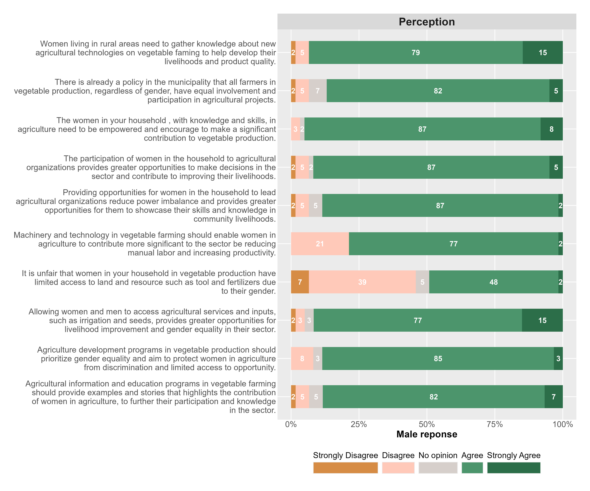
```


## Knowledge

| Theme / Statement                          | Female Responses                          | Male Responses                             | Key Insight |
|--------------------------------------------|-------------------------------------------|--------------------------------------------|-------------|
| Disease-resistant varieties                | High agreement (~72%)                     | High agreement (~75%)                      | Both genders aware of resistant varieties |
| Raised beds better                         | Strong agreement (~87%)                   | Strong agreement (~85–90%)                 | Shared recognition of raised bed benefits |
| Organic fertilizers needed                 | Very high agreement (~85%)                | Very high agreement (~85–90%)              | Consensus across genders |
| Irrigation is expensive                    | Majority agree (~85%)                     | Majority agree (~78%)                      | Both see irrigation as costly |
| Confidence in farming skills               | High agreement (~74% + 13% strongly agree)| High agreement (~85–90%)                   | Men slightly more confident |
| Hybrid vs recycled seeds                   | Majority disagree (~74%)                  | Majority disagree (~70%)                   | Both reject equivalence, men more “no opinion” |
| Skip watering is okay                      | Majority agree (~85%)                     | Majority agree (~78%), more variation       | Men slightly more tolerant of skipping watering |
| Higher-density planting always yields more | Mixed: ~69% agree, ~10% disagree          | Higher agreement, fewer disagreements       | Men more inclined to believe density = yield |


### Knowledge among female farmers {.unnumbered}

::: {.callout-note}
## Knowledge: female

- High agreement on statements about disease‑resistant varieties, raised beds, organic fertilizers, and irrigation being expensive. Majority agree they have the necessary knowledge in vegetable farming.
- Many disagree that hybrid seeds yield the same as recycled seeds, and they recognize risks of skipping watering or overusing fertilizers.
- On plowing/harrowing reducing pests and on planting materials other than seeds being difficult to manage, responses are more divided.

:::

```{r}
knowledge_female <- plot_factor(factor_name = "Knowledge")

## saving plot
ggsave(
  plot = knowledge_female,
  filename = "plot/knowledge_female.jpeg",
  width = 10,
  height = 8,
  dpi = 400,
  unit = "in"
)

## display plot
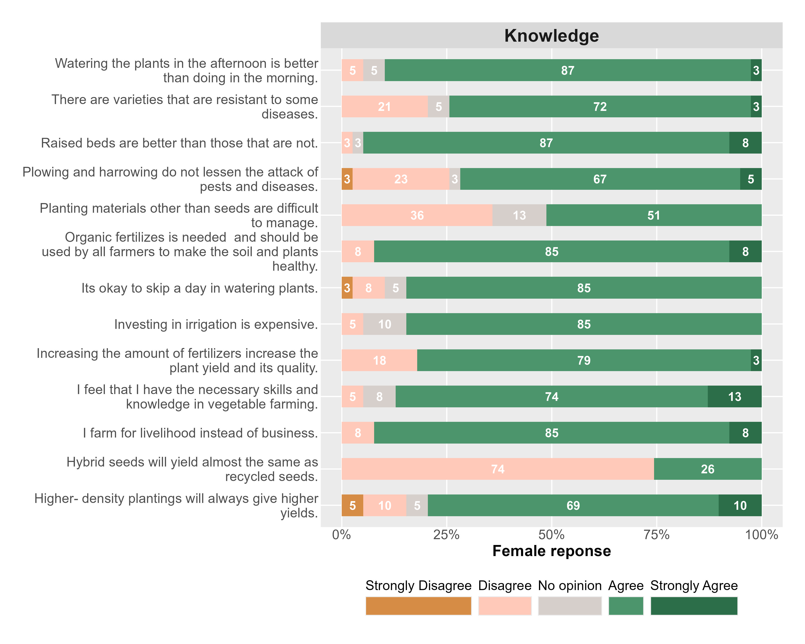
```


### Knowledge among male farmers {.unnumbered}

::: {.callout-note}
## Knowledge: male

- Similar high agreement on disease‑resistant varieties, raised beds, organic fertilizers, and irrigation costs. Men also report strong agreement that they have the necessary farming knowledge.
- Men show slightly higher agreement than women on “it’s okay to skip watering” and “higher‑density planting always gives higher yields.”
- Men, like women, largely disagree that hybrid seeds yield the same as recycled seeds, but with slightly more “no opinion” responses.

:::

```{r}
knowledge_male <- plot_factor(factor_name = "Knowledge", gender = "Male")

## saving plot
ggsave(
  plot = knowledge_male,
  filename = "plot/knowledge_male.jpeg",
  width = 10,
  height = 8,
  dpi = 400,
  unit = "in"
)

## display plot
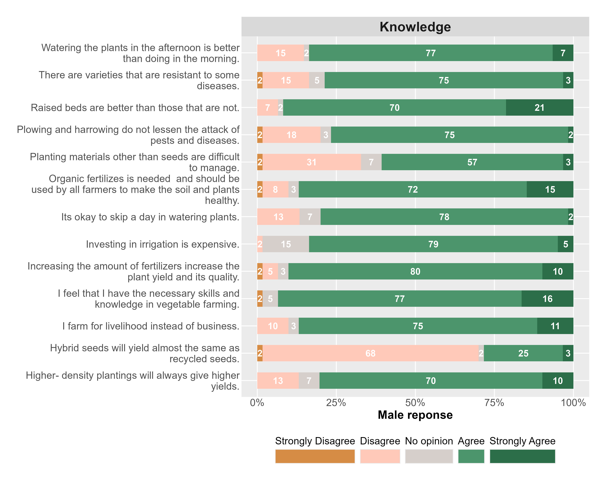
```

## Practices

| Theme / Practice Statement                  | Female Responses                          | Male Responses                             | Key Insight |
|---------------------------------------------|-------------------------------------------|--------------------------------------------|-------------|
| Pesticide spraying harms health             | Very high agreement (~90%)                | High agreement (~85%), less emphatic        | Women more cautious |
| Chemicals for disease management not harmful| Majority disagree (~80%)                  | More mixed, some agreement                  | Men less cautious |
| Recycling bottles safe                      | Majority disagree (~82%)                  | More variation, some agreement              | Women reject, men more tolerant |
| Trying new techniques improves harvest      | High agreement (~82%)                     | High agreement (~80–85%)                    | Shared openness to innovation |
| Risk-taking in farming                      | Majority disagree (~63%)                  | More agreement (~40%)                       | Men more willing to take risks |
| Doubling fertilizer to skip next week       | Majority disagree (~64%)                  | More agreement (~30–35%)                    | Men more tolerant of shortcut practices |
| Packaging material affects quality          | Majority disagree (~85%)                  | More agreement (~40%)                       | Men underestimate packaging effects |
| Organic fertilizer basal only               | Strong agreement (~77%)                   | Moderate agreement (~70%)                   | Women stricter on organic fertilizer use |
| Post-harvest contamination possible         | Strong agreement (~87%)                   | High agreement (~80%)                       | Both recognize contamination risks |


### Practices among female farmers {.unnumbered}

::: {.callout-note}
## Practices: female

- Strong agreement that pesticide spraying can harm health (≈90%) and that contamination can occur even after harvest.
- Majority disagree with statements like “using chemicals will not harm health” and “recycling bottles is safe.”
- High agreement (≈82%) that trying new techniques improves harvest.
- More cautious — majority disagree with “I do risky things” and “doubling fertilizer is okay.”
- Strong support for basal application only.

:::

```{r}
practices_female <- plot_factor(factor_name = "Practices", stwidth = 60)

## saving plot
ggsave(
  plot = practices_female,
  filename = "plot/practices_female.jpeg",
  width = 10,
  height = 10,
  dpi = 400,
  unit = "in"
)

## display plot
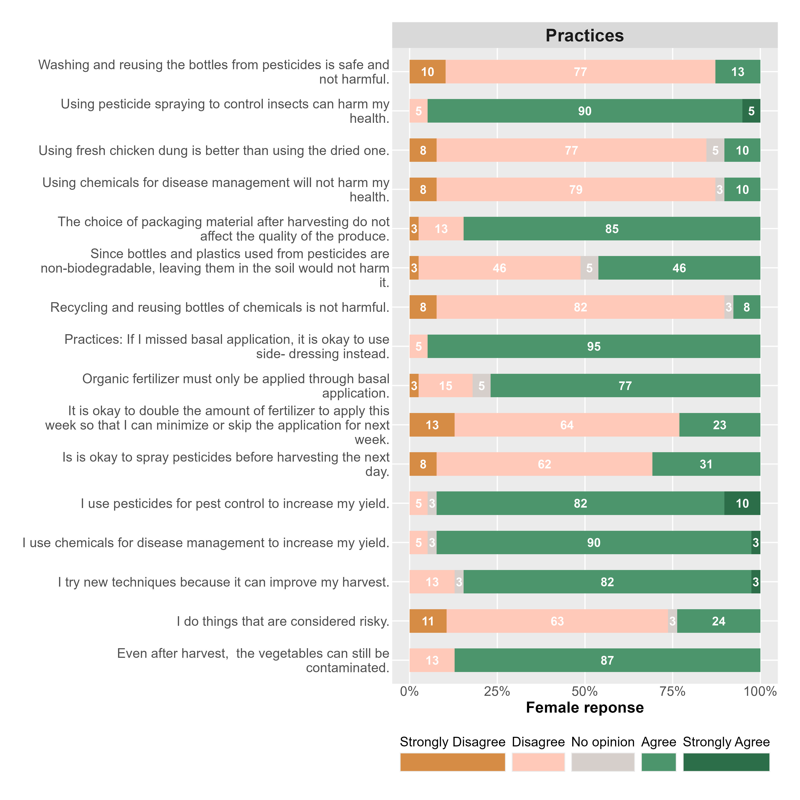
```


### Practices among male farmers {.unnumbered}

::: {.callout-note}
## Practices: male

- Also agree pesticides can harm health, but slightly less emphatic than women.
- More variation — some men agree chemicals are not harmful, showing weaker caution compared to women.
- High agreement (≈80–85%), similar to women.
- Men show higher tolerance for risky practices (more agreement with doubling fertilizer or risky behaviors).
- Men more likely than women to agree that packaging material does not affect quality.

:::

```{r}
practices_male <- plot_factor(
  factor_name = "Practices",
  gender = "Male",
  stwidth = 60
)

## saving plot
ggsave(
  plot = practices_male,
  filename = "plot/practices_male.jpeg",
  width = 10,
  height = 10,
  dpi = 400,
  unit = "in"
)

## display plot
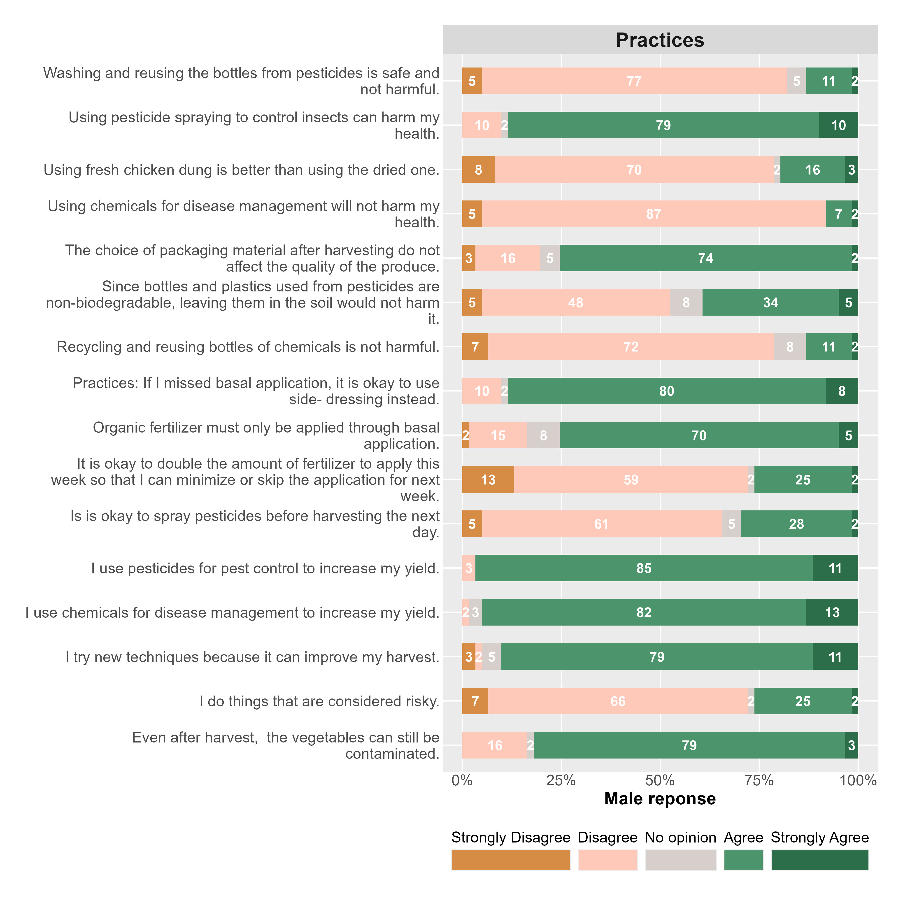
```


## Attitude

| Theme / Statement                          | Female Responses                          | Male Responses                             | Key Insight |
|--------------------------------------------|-------------------------------------------|--------------------------------------------|-------------|
| Confidence in challenges                   | Very high agreement (~90%)                | Very high agreement (~85–90%)              | Both genders confident |
| Persistence despite obstacles              | Very high agreement (~95%)                | Very high agreement (~85–90%)              | Shared persistence |
| Asking for help                            | Strong agreement (~90% + 8% strongly agree)| Strong agreement (~85% + more strongly agree)| Men slightly more emphatic |
| Safety measures reduce risks               | Near unanimous (~95–97%)                  | High agreement (~88–93%)                   | Women more emphatic |
| Pesticide drift & misuse harmful           | Strong agreement (~92–97%)                | High agreement (~85–90%), more variation   | Women more consistent |
| Studying new techniques is waste of time   | Majority disagree (~72%), 18% agree       | Majority disagree (~61%), 30% agree        | Men more skeptical of innovation |


### Attitude among female farmers {.unnumbered}

::: {.callout-note}
## Attitude: female

- Very high agreement (≈90–95%) that they can succeed in challenges and keep trying despite obstacles.
- Strong openness to asking for help (≈90% agree, 8% strongly agree).
- Nearly unanimous agreement (95–97%) that proper safety and protective measures reduce health risks.
- Strong recognition of pesticide drift and misuse as harmful (≈92–97% agree).
- Majority disagree (≈72%) that studying new techniques is a waste of time, showing positive attitudes toward innovation.


:::

```{r}
attitude_female <- plot_factor(factor_name = "Attitude")

## saving plot
ggsave(
  plot = attitude_female,
  filename = "plot/attitude_female.jpeg",
  width = 10,
  height = 7,
  dpi = 400,
  unit = "in"
)

## display plot
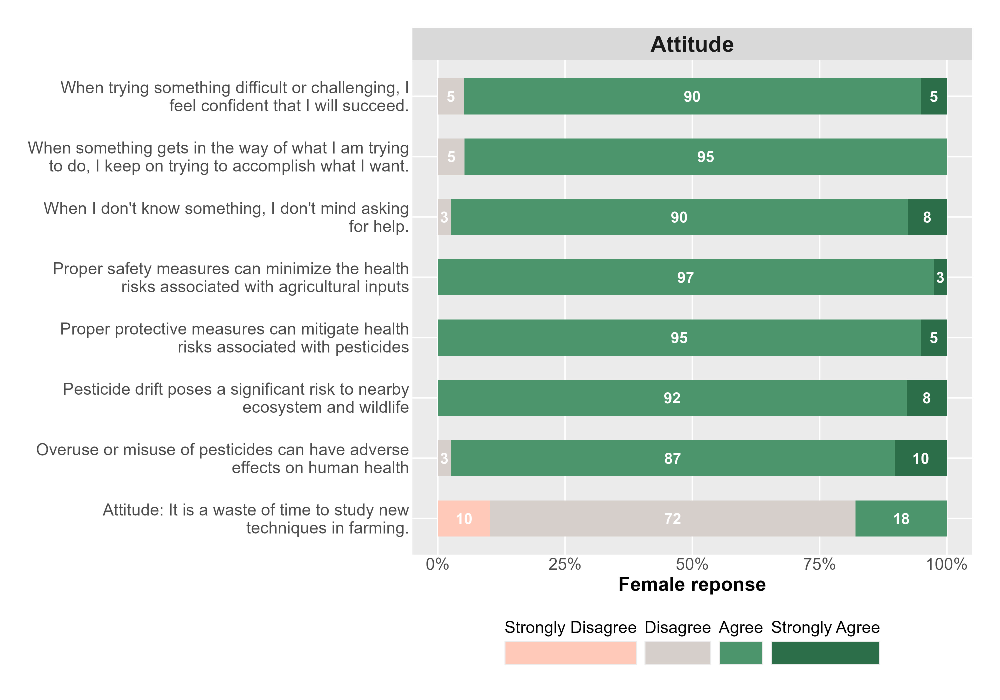
```

### Attitude among male farmers {.unnumbered}

::: {.callout-note}
## Attitude: male

- Similarly high agreement (≈85–90%) on succeeding in challenges and persisting despite obstacles.
- Strong agreement (≈85%), with slightly more “strongly agree” responses than women.
- High agreement (≈88–93%) on protective measures, though slightly less emphatic than women.
- Agreement that pesticide drift and misuse are harmful, but with more variation (some “no opinion” and small disagreement).
- Majority disagree that studying new techniques is a waste of time, but men show slightly higher agreement (≈30%) compared to women (≈18%) — suggesting more skepticism about innovation.

:::

```{r}
attitude_male <- plot_factor(factor_name = "Attitude", gender = "Male")

## saving plot
ggsave(
  plot = attitude_male,
  filename = "plot/attitude_male.jpeg",
  width = 10,
  height = 7,
  dpi = 400,
  unit = "in"
)

## display plot
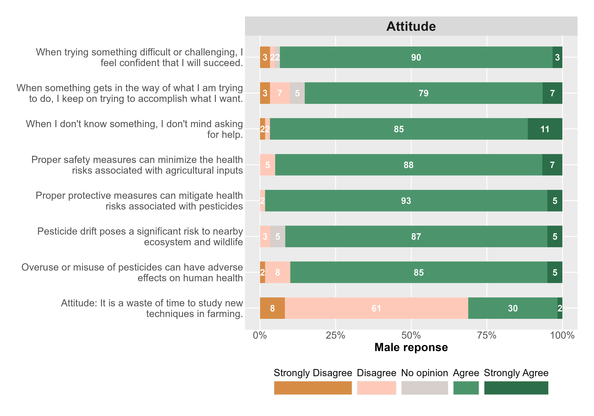
```
