```{r}
#| echo: false
#| message: false
#| warning: false

# set working directory
setwd(here::here("laurente-baybay-local-foods"))

# libraries
library(tidyverse)
library(readxl)
library(janitor)
library(scales)
library(EFAtools)
library(psych)
library(seminr)


# data management source
source("data-management.R")
```

# Attachments

::: callout-note
Copies of the Figures presented in this report are available using the links below. All the files can be accessed in the Google drive folder.
:::

<ol>

<li><a href="https://drive.google.com/drive/folders/1WZS7e1pDCnrR8M5w-Y0TEFc1NCixgWcn?usp=sharing" target="_blank" style="text-decoration: none">Plots</a></li>

<li><a href="https://drive.google.com/drive/folders/1K3PC9n8ARzyiKILLZ-RH-c0-6GcO5IkV?usp=sharing" target="_blank" style="text-decoration: none">Google Drive</a></li>

</ol>


# Objective 1: To describe the socio-demogprahic profile of the respondents

## Age

- Females: Majority are 30 years old & above (49%), showing stronger representation of older women who are likely custodians of culinary traditions.

- Males: More evenly distributed, with the largest group in 22–25 years old (30%), suggesting younger men may be more open to modernized or innovative food products.

```{r}
p_age <- 
    age_socio_dta |> 
  ggplot(aes(pct, age, fill = sex)) +
  geom_col(position = "dodge", width = 0.8) +
  geom_text(aes(label = pct_lab), position = position_dodge(width = 0.9), hjust = 0) +
  scale_x_continuous(labels = percent_format(), limits = c(0, 0.8)) +
  labs(
    fill = NULL,
    x = NULL,
    y = NULL
  ) +
  custom_theme

ggsave(
    plot = p_age,
    filename = "plot/age.jpg",
    dpi = 400,
    unit = "in",
    width = 8,
    height = 5
)

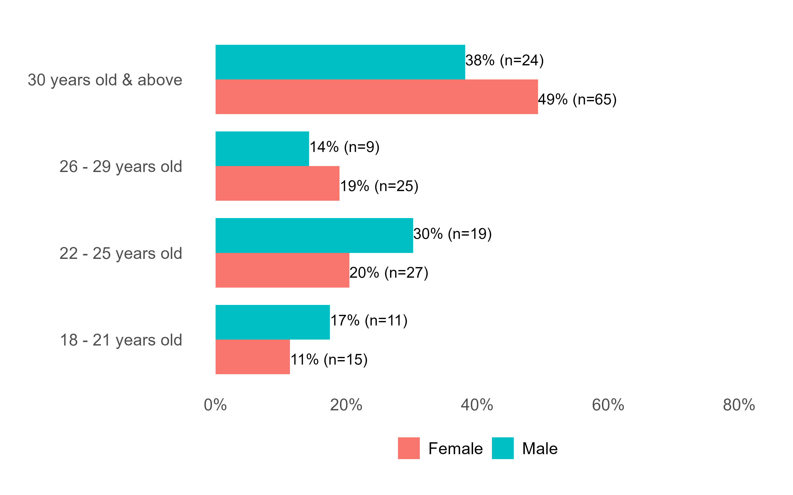
```

## Educational attainment

- Both genders are highly educated, which supports informed perspectives on food heritage, tourism, and innovation. Women slightly lead in higher education, reinforcing their role in cultural transmission and professional engagement.

- Females: Highest proportion are college graduates (42%), followed by college students (24%). A small but notable group has postgraduate education (8%).

- Males: Also dominated by college graduates (37%) and college students (32%), with smaller shares in vocational (8%) and postgraduate (6%).

```{r}
p_educ <- 
    educ_socio_dta |> 
  ggplot(aes(pct, educ, fill = sex)) +
  geom_col(position = "dodge", width = 0.8) +
  geom_text(aes(label = pct_lab), position = position_dodge(width = 0.9), hjust = 0) +
  scale_x_continuous(labels = percent_format(), limits = c(0, 0.8)) +
  labs(
    fill = NULL,
    x = NULL,
    y = NULL
  ) +
  custom_theme

ggsave(
    plot = p_educ,
    filename = "plot/educ.jpg",
    dpi = 400,
    unit = "in",
    width = 8,
    height = 5
)

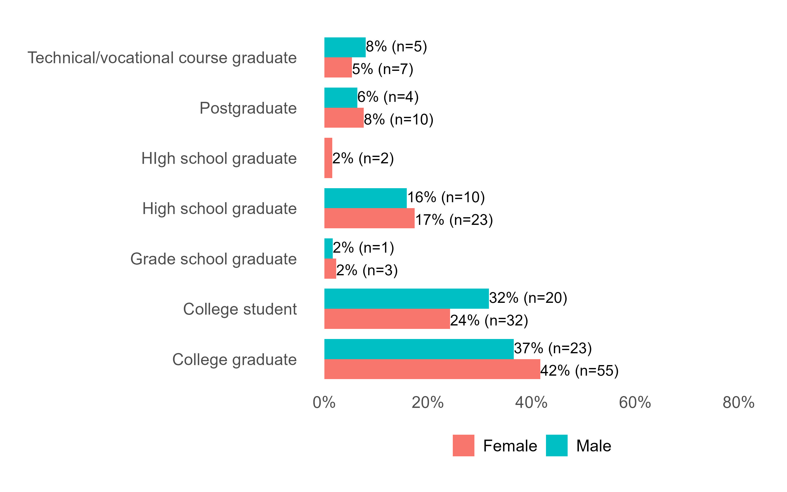
```

## Residency

- Women dominate in long-term experience, reinforcing their role in preserving culinary heritage. Men show more diversity in experience levels, which may align with openness to experimentation and adaptation.

- Females: Majority have more than 20 years of experience (60%), reflecting long-term involvement in household food preparation, community practices, or professional work.

- Males: Also strong in more than 20 years (48%), but with more spread across mid-range experience (16–20 years = 16%; 11–15 years = 10%).

```{r}
p_residency <- 
    resident_socio_dta |> 
  ggplot(aes(pct, residency, fill = sex)) +
  geom_col(position = "dodge", width = 0.8) +
  geom_text(aes(label = pct_lab), position = position_dodge(width = 0.9), hjust = 0) +
  scale_x_continuous(labels = percent_format(), limits = c(0, 0.8)) +
  labs(
    fill = NULL,
    x = NULL,
    y = NULL
  ) +
  custom_theme

ggsave(
    plot = p_residency,
    filename = "plot/residency.jpg",
    dpi = 400,
    unit = "in",
    width = 8,
    height = 5
)

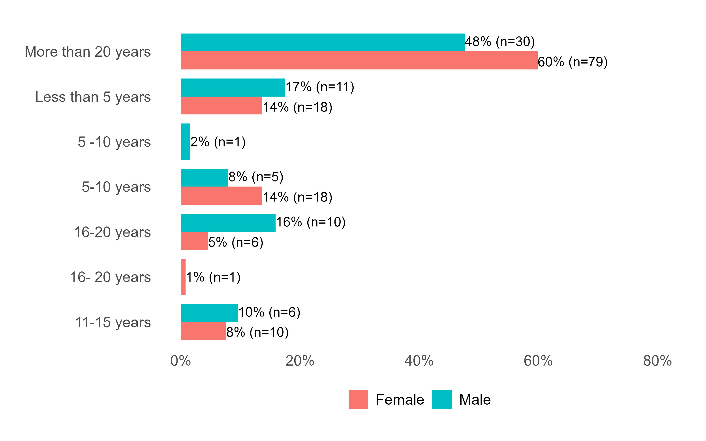
```


# Objective 2: To measure the level of awareness of the Baybayanons.

## Awareness

### Rice-based delicacies

- Staples like puto, bibingka, biko, moron, and budbod all have 85–92% “highly aware” responses.

- These delicacies are deeply ingrained in Baybay’s food identity, suggesting strong intergenerational transmission and everyday consumption.

- Items like lidgid (suman tumini) and suman latik show slightly lower “highly aware” scores (60–74%), indicating they may be less mainstream or more localized.

- Tourism implication: Rice-based delicacies are the strongest candidates for gastronomic branding, as they are widely recognized and culturally resonant.

```{r}
p_aware_rice <- 
    aware_rice_based_dta |> 
    ggplot(aes(pct, delicacy, fill = rate_lab)) +
    geom_col() +
    geom_text(aes(label = pct_lab), position = position_fill(vjust = 0.5), color = "white", fontface = "bold") +
    scale_fill_manual(values = c("#073b4c", "#118ab2", "#06d6a0", "#ffba66ff", "#e63946")) +
    scale_x_continuous(labels = percent_format()) +
    guides(fill = guide_legend(nrow = 1, reverse = TRUE)) +
    custom_theme +
    labs(
    title = str_wrap("Perceived level of awareness on rice-based delicacies.", 40),
    fill =  NULL,
    y = NULL,
    x = NULL
    )

ggsave(
    plot = p_aware_rice,
    filename = "plot/aware_rice.jpg",
    dpi = 400,
    unit = "in",
    width = 8,
    height = 6
)

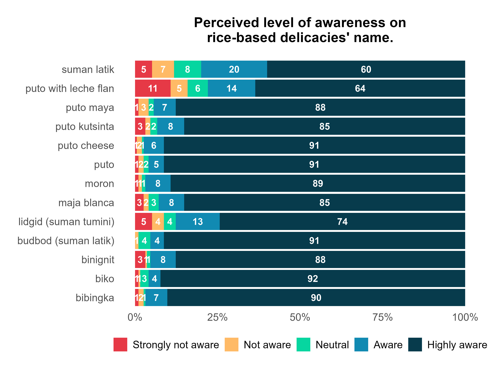

```


### Snacks and processed products

- Buko pie and buko tarts stand out with very high awareness (85% and 70% “highly aware”), reflecting their popularity as pasalubong items.

- Vacuum-fried jackfruit also performs well (51% “highly aware”), showing successful innovation acceptance.

- Products like peanut triangle (28% “strongly not aware”) and cassava brownies show weaker awareness, suggesting limited market penetration or novelty.

- While traditional-inspired snacks (buko pie) are well-known, newer processed products (cassava-based innovations) need stronger promotion and consumer education.

- Tourism implication: These products can diversify Baybay’s food portfolio, but require branding and awareness campaigns to reach the same cultural status as rice-based delicacies.


```{r}
## plotting awareness for snacks and processed foods
p_snack_processed <- 
    aware_snacks_process_dta |> 
    ggplot(aes(pct, delicacy, fill = rate_lab)) +
    geom_col() +
    geom_text(aes(label = pct_lab), position = position_fill(vjust = 0.5), color = "white", fontface = "bold") +
    scale_fill_manual(values = c("#073b4c", "#118ab2", "#06d6a0", "#ffba66ff", "#e63946")) +
    scale_x_continuous(labels = percent_format()) +
    guides(fill = guide_legend(nrow = 1, reverse = TRUE)) +
    custom_theme +
    labs(
    title = str_wrap("Perceived level of awareness on snacks and processed products.", 40),
    fill =  NULL,
    y = NULL,
    x = NULL
    )

ggsave(
    plot = p_snack_processed,
    filename = "plot/aware_snacks_processed.jpg",
    dpi = 400,
    unit = "in",
    width = 8,
    height = 6
)

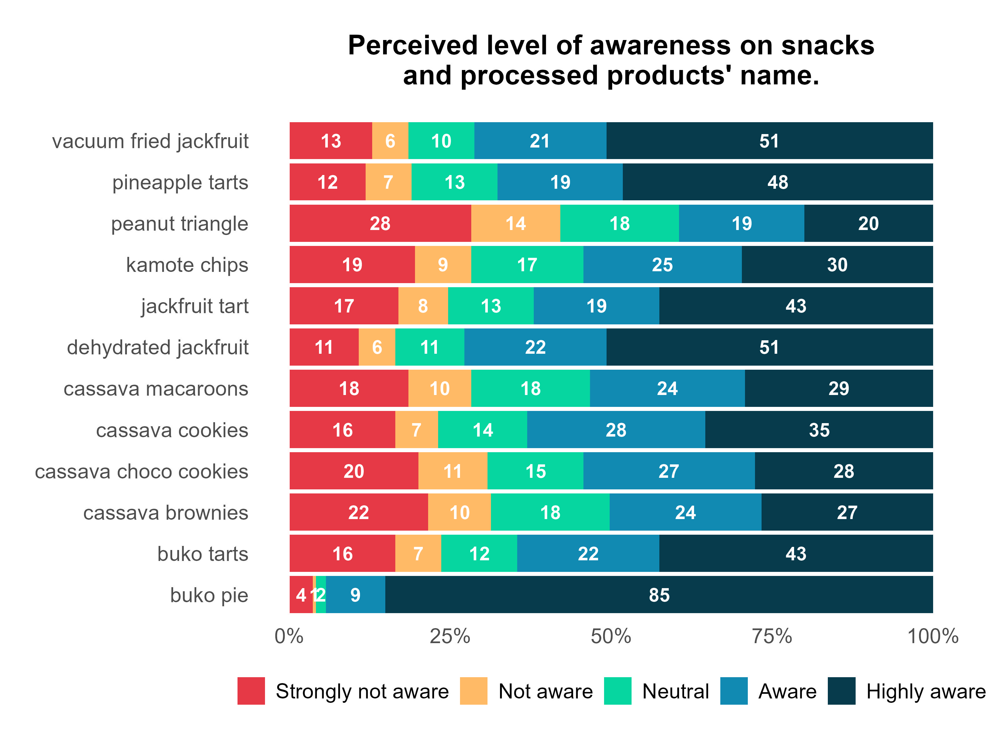
```


### Beverage, dairy and specialty products

- Sikwate (83% “highly aware”) and choco milk (89% “aware”) dominate, showing strong cultural and household presence.

- Pastillas de leche has decent recognition (56% “highly aware”), but still notable gaps compared to rice-based delicacies.

- Mak mango jam, macapuno strips/balls, kamote ice cream, and coco kisses all hover around 19–32% “highly aware,” with high percentages of “neutral” or “not aware.”

- Tourism implication: Heritage beverages are ready for tourism promotion, while specialty innovations need aggressive marketing, sampling, and storytelling to build familiarity.

```{r}
## plotting beverage, dairy and specialty products
p_aware_beverage_dairy <- 
    aware_beverage_dairy_dta |> 
    ggplot(aes(pct, delicacy, fill = rate_lab)) +
    geom_col() +
    geom_text(aes(label = pct_lab), position = position_fill(vjust = 0.5), color = "white", fontface = "bold") +
    scale_fill_manual(values = c("#073b4c", "#118ab2", "#06d6a0", "#ffba66ff", "#e63946")) +
    scale_x_continuous(labels = percent_format()) +
    guides(fill = guide_legend(nrow = 1, reverse = TRUE)) +
    custom_theme +
    labs(
    title = str_wrap("Perceived level of awareness on beverage, dairy, and specialty products.", 40),
    fill =  NULL,
    y = NULL,
    x = NULL
    )

ggsave(
    plot = p_aware_beverage_dairy,
    filename = "plot/aware_beverage_dairy.jpg",
    dpi = 400,
    unit = "in",
    width = 8,
    height = 5
)

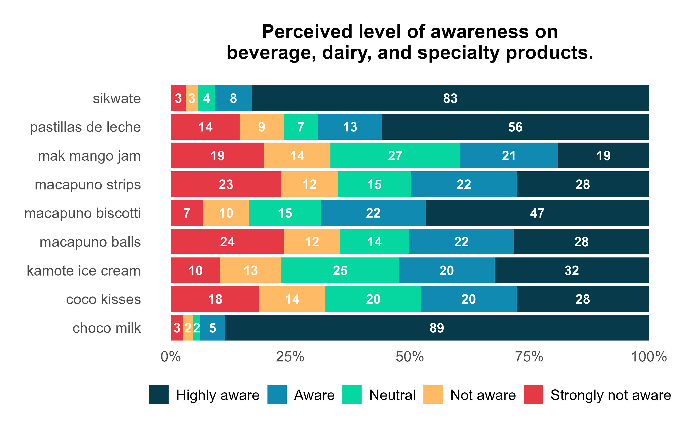
```


## Taste

### Rice-based delicacies

- Core delicacies (moron, biko, bibingka, puto, budbod, binignit) all have 88–92% “highly aware” ratings, showing strong cultural integration.

- Suman latik and lidgid (suman tumini) have lower “highly aware” scores (60–74%), suggesting they are less frequently consumed or more localized.

- Tourism implication: Taste awareness is even stronger than name recognition, confirming these delicacies as authentic anchors for gastronomic tourism.

```{r}
p_taste_rice <- 
    taste_rice_based_dta |> 
    ggplot(aes(pct, delicacy, fill = rate_lab)) +
    geom_col() +
    geom_text(aes(label = pct_lab), position = position_fill(vjust = 0.5), color = "white", fontface = "bold") +
    scale_fill_manual(values = c("#073b4c", "#118ab2", "#06d6a0", "#ffba66ff", "#e63946")) +
    scale_x_continuous(labels = percent_format()) +
    guides(fill = guide_legend(nrow = 1, reverse = TRUE)) +
    custom_theme +
    labs(
    title = str_wrap("Perceived level of awareness on rice-based delicacies' taste", 40),
    fill =  NULL,
    y = NULL,
    x = NULL
    )

ggsave(
    plot = p_taste_rice,
    filename = "plot/taste_rice.jpg",
    dpi = 400,
    unit = "in",
    width = 8,
    height = 6
)


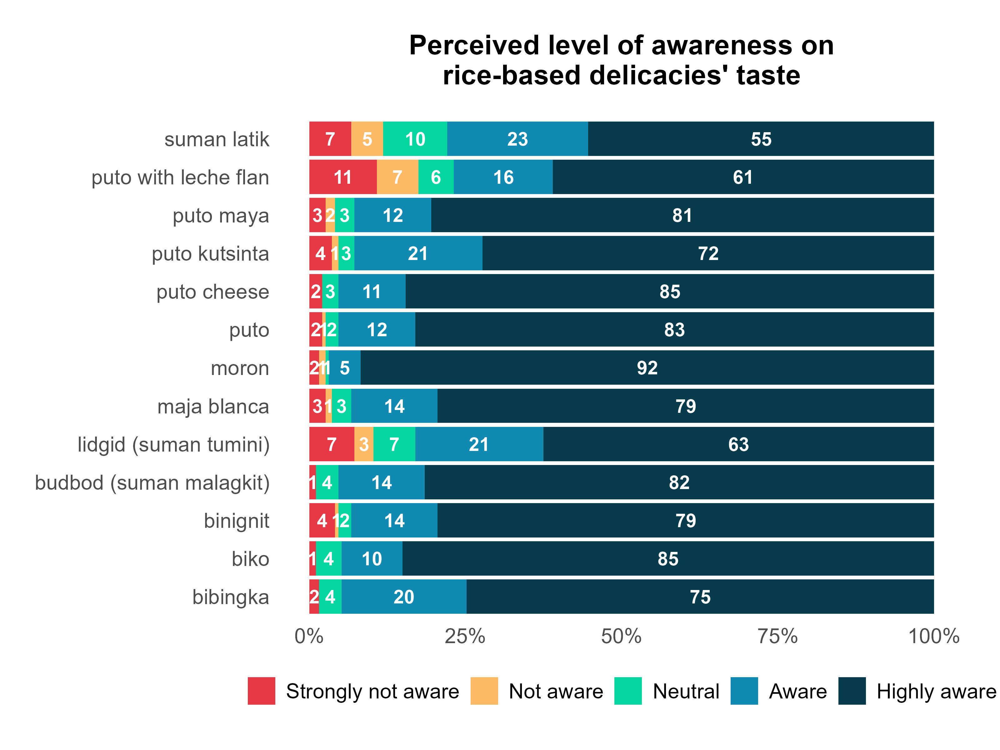

```


### Snacks and processed  products

- Buko pie and buko tarts again lead with high taste awareness, reinforcing their role as familiar, trusted products.

- Vacuum-fried jackfruit and kamote chips show decent taste familiarity, indicating successful introduction but not yet mainstream.

- Products like cassava brownies and peanut triangle remain niche, with high “not aware” or “neutral” responses.

- Tourism implication: Taste familiarity is uneven — traditional items are ready for promotion, while innovative ones need sampling campaigns to build consumer trust.

```{r}
p_taste_snacks_process<- 
    taste_snacks_process_data |> 
    ggplot(aes(pct, delicacy, fill = rate_lab)) +
    geom_col() +
    geom_text(aes(label = pct_lab), position = position_fill(vjust = 0.5), color = "white", fontface = "bold") +
    scale_fill_manual(values = c("#073b4c", "#118ab2", "#06d6a0", "#ffba66ff", "#e63946")) +
    scale_x_continuous(labels = percent_format()) +
    guides(fill = guide_legend(nrow = 1, reverse = TRUE)) +
    custom_theme +
    labs(
    title = str_wrap("Perceived level of awareness on snacks and processed products' taste", 40),
    fill =  NULL,
    y = NULL,
    x = NULL
    )

ggsave(
    plot = p_taste_rice,
    filename = "plot/taste_snacks_process.jpg",
    dpi = 400,
    unit = "in",
    width = 8,
    height = 6
)

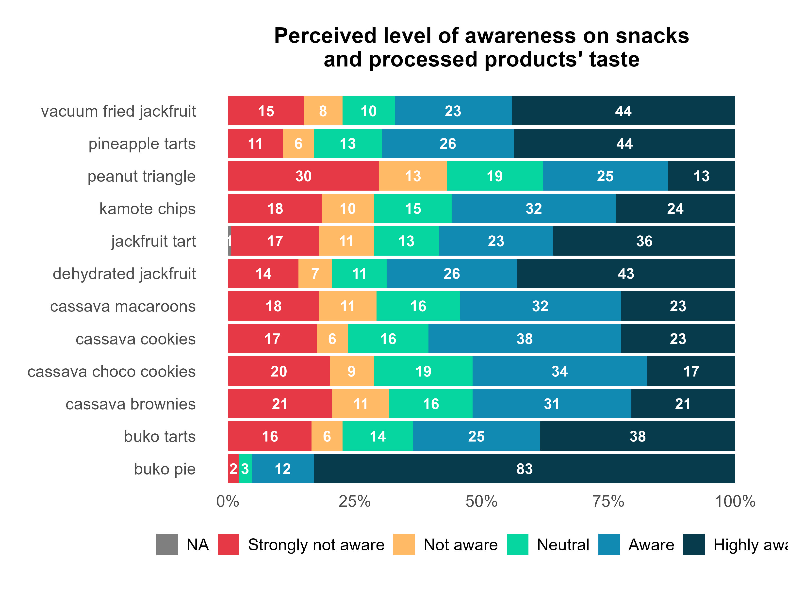
```

### Beverage, dairy and specialty products

- Choco milk (87% “highly aware”) and sikwate (83%) dominate, reflecting everyday consumption and cultural embeddedness.

- Pastillas de leche has 53% “highly aware,” showing decent recognition but still lower than rice-based staples.

- Mak mango jam, macapuno strips/balls, kamote ice cream, coco kisses all hover around 19–32% “highly aware,” with many respondents neutral or unaware.

- Tourism implication: Heritage beverages are strong tourism assets, while specialty innovations need aggressive promotion and experiential marketing (taste tests, festivals).

```{r}
p_taste_beverage_dairy <- 
    taste_beverage_dairy_dta |> 
    ggplot(aes(pct, delicacy, fill = rate_lab)) +
    geom_col() +
    geom_text(aes(label = pct_lab), position = position_fill(vjust = 0.5), color = "white", fontface = "bold") +
    scale_fill_manual(values = c("#073b4c", "#118ab2", "#06d6a0", "#ffba66ff", "#e63946")) +
    scale_x_continuous(labels = percent_format()) +
    guides(fill = guide_legend(nrow = 1, reverse = TRUE)) +
    custom_theme +
    labs(
    title = str_wrap("Perceived level of awareness on beverage, dairy, and specialty products' taste", 40),
    fill =  NULL,
    y = NULL,
    x = NULL
    )

ggsave(
    plot = p_taste_beverage_dairy,
    filename = "plot/taste_beverage_dairy.jpg",
    dpi = 400,
    unit = "in",
    width = 8,
    height = 5
)


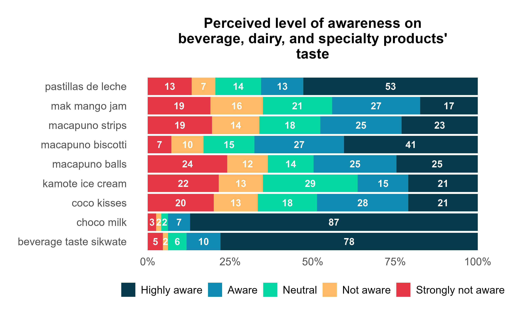
```


## Appearance

### Rice-based delicacies

- Core delicacies (puto, bibingka, biko, moron, budbod, binignit) all have 85–92% “highly aware,” showing that their visual identity is deeply embedded in community life.

- Suman latik (67% “highly aware”) and lidgid (suman tumini) (74%) are less visually familiar compared to mainstream delicacies, possibly due to localized consumption.

- Tourism implication: The strong visual familiarity of rice-based delicacies makes them highly marketable for food festivals, packaging, and promotional materials.


 ```{r}
 p_appearance_rice <- 
    appearance_rice_based_dta |> 
    ggplot(aes(pct, delicacy, fill = rate_lab)) +
    geom_col() +
    geom_text(aes(label = pct_lab), position = position_fill(vjust = 0.5), color = "white", fontface = "bold") +
    scale_fill_manual(values = c("#073b4c", "#118ab2", "#06d6a0", "#ffba66ff", "#e63946")) +
    scale_x_continuous(labels = percent_format()) +
    guides(fill = guide_legend(nrow = 1, reverse = TRUE)) +
    custom_theme +
    labs(
    title = str_wrap("Perceived level of awareness on rice-based products' appearance", 40),
    fill =  NULL,
    y = NULL,
    x = NULL
    )

ggsave(
    plot = p_appearance_rice,
    filename = "plot/appearance_rice.jpg",
    dpi = 400,
    unit = "in",
    width = 8,
    height = 6
)

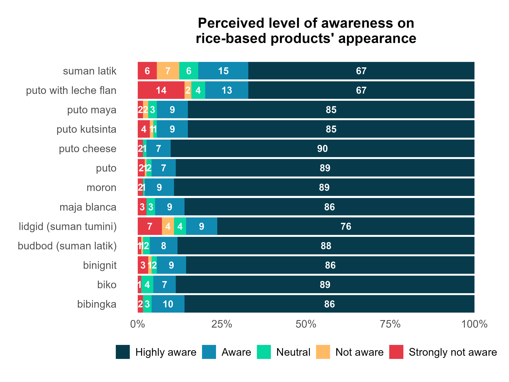
 ```

### Snacks and processed products

- Buko pie (86% “highly aware”) and buko tarts (70%) dominate, reflecting their established role in local and regional food culture.

- Vacuum-fried jackfruit (51% “highly aware”) and kamote chips (around 50%) show growing recognition, suggesting successful but still emerging visibility.

- Peanut triangle (30% “strongly not aware”) and cassava-based innovations (cookies, brownies) remain niche, with limited visual familiarity among residents.

- Tourism implication: Traditional snack items are visually iconic, while innovative products need stronger branding and exposure to become recognizable symbols of Baybay’s food identity.

```{r}
p_appearance_snacks_process <- 
    appearance_snacks_process_dta |> 
    ggplot(aes(pct, delicacy, fill = rate_lab)) +
    geom_col() +
    geom_text(aes(label = pct_lab), position = position_fill(vjust = 0.5), color = "white", fontface = "bold") +
    scale_fill_manual(values = c("#073b4c", "#118ab2", "#06d6a0", "#ffba66ff", "#e63946")) +
    scale_x_continuous(labels = percent_format()) +
    guides(fill = guide_legend(nrow = 1, reverse = TRUE)) +
    custom_theme +
    labs(
    title = str_wrap("Perceived level of awareness on snacks and processed products' appearance", 40),
    fill =  NULL,
    y = NULL,
    x = NULL
    )

ggsave(
    plot = p_appearance_snacks_process,
    filename = "plot/appearance_snacks_process.jpg",
    dpi = 400,
    unit = "in",
    width = 8,
    height = 6
)

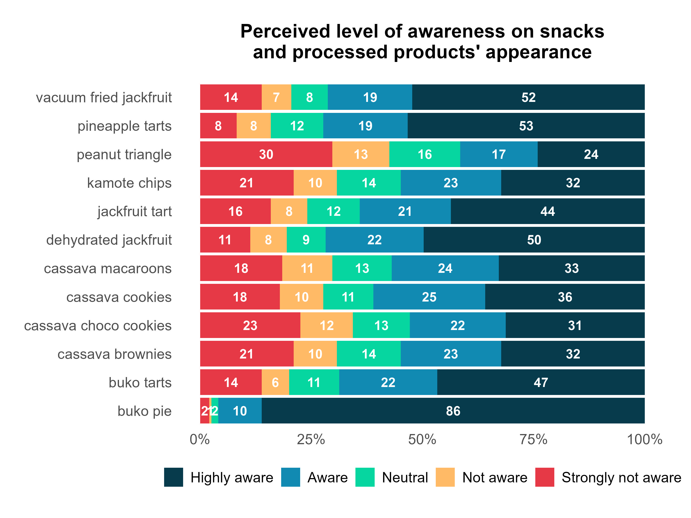
```


### Beverage, dairy and specialty products

- Sikwate (83% “highly aware”) and choco milk (83%) are visually familiar, reflecting everyday consumption and cultural embeddedness.

- Pastillas de leche (56% “highly aware”) shows decent recognition but still trails behind rice-based staples.

- Mak mango jam, macapuno strips/balls, kamote ice cream, coco kisses hover around 30–36% “highly aware,” with high percentages of “neutral” or “not aware.”

- Tourism implication: Heritage beverages are visually strong assets, while specialty innovations need packaging, storytelling, and exposure in fairs or pasalubong centers to build recognition.

```{r}
p_appearance_beverage_dairy <- 
    appearance_beverage_dairy_dta |> 
    ggplot(aes(pct, delicacy, fill = rate_lab)) +
    geom_col() +
    geom_text(aes(label = pct_lab), position = position_fill(vjust = 0.5), color = "white", fontface = "bold") +
    scale_fill_manual(values = c("#073b4c", "#118ab2", "#06d6a0", "#ffba66ff", "#e63946")) +
    scale_x_continuous(labels = percent_format()) +
    guides(fill = guide_legend(nrow = 1, reverse = TRUE)) +
    custom_theme +
    labs(
    title = str_wrap("Perceived level of awareness on beverage, dairy, and specialty products' appearance", 40),
    fill =  NULL,
    y = NULL,
    x = NULL
    )

ggsave(
    plot = p_appearance_beverage_dairy,
    filename = "plot/appearance_beverage_dairy.jpg",
    dpi = 400,
    unit = "in",
    width = 8,
    height = 5
)

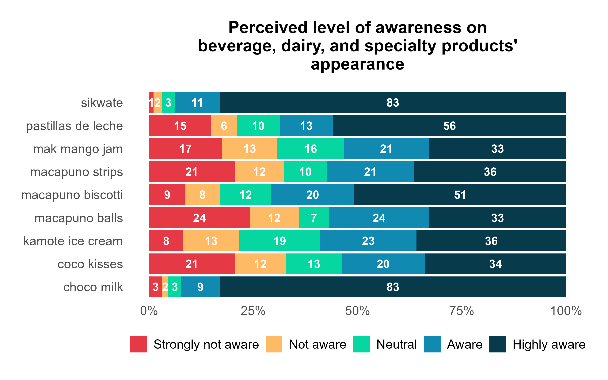
```


# Objective 3: To measure the resident's perception of local delicacies in terms of product marketability, cuisine prepservation.

## Product marketability

- 58% strongly agree that the unique flavors of Baybay’s local foods make them appealing to Filipino consumers.

- 54% strongly agree that local foods have distinctive characteristics and historical significance that make them marketable as tourism products.

- 41% strongly agree and 28% agree that there are sufficient local stores offering these products, showing confidence in availability.

- 58% strongly agree that the cultural history of local foods increases their appeal to tourists.

- Nearly half (47% strongly agree) see local delicacies as affordable for both locals and tourists.

- While 58% agree that recipes can be adapted to meet future demands, no respondents strongly agree — suggesting cautious optimism but not full confidence in innovation.

- 57% strongly agree that local food enhances the culinary experience of tourists, reinforcing its role as a tourism driver.


```{r}
p_fct_prod_marketability <- 
    plot_factor(factor_name = "Product marketability")

ggsave(
    plot = p_fct_prod_marketability,
    filename = "plot/fct_prod_marketability.jpeg",
    dpi = 300,
    height = 7,
    width = 9,
    unit = "in"
)

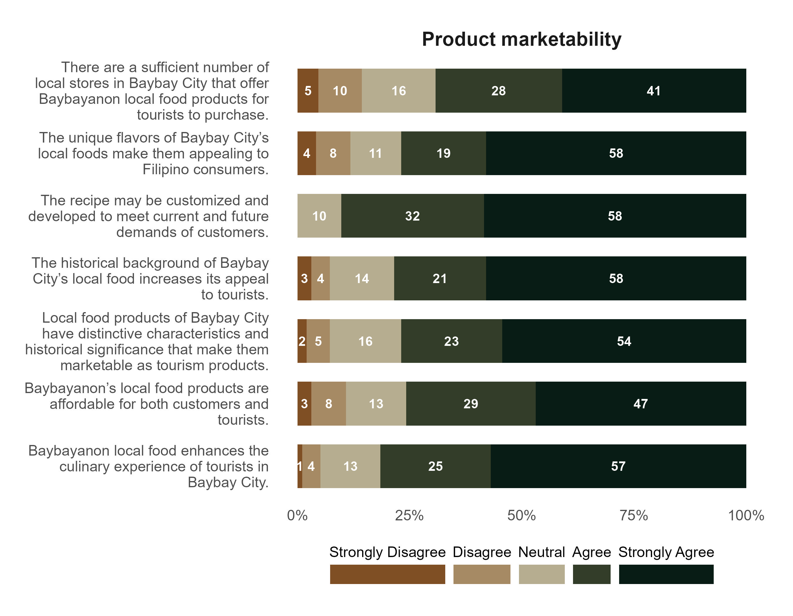

```

## Cuisine preservation

- 68% agree that teaching local food traditions in schools promotes awareness of Baybay’s cultural heritage.

- 68% agree that producing and selling local food contributes to preserving culinary culture, showing recognition of livelihood and heritage as interconnected.

- 66% agree that preserving traditional dishes helps sustain unique cooking practices.

- 65% agree that preserving cuisine strengthens Baybay’s cultural identity and historical connection.

- 61% agree that cuisine preservation safeguards cultural and historical heritage.

- 66% agree that passing down traditional ingredients and cooking methods is vital for preservation.

- 69% agree that local food contributes not only to preserving but also improving culinary heritage.

```{r}
p_fct_cuisine_conserv <- 
    plot_factor(factor_name = "Cuisine preservation")

ggsave(
    plot = p_fct_cuisine_conserv,
    filename = "plot/fct_cuisine_conserv.jpeg",
    dpi = 300,
    height = 7,
    width = 9,
    unit = "in"
)

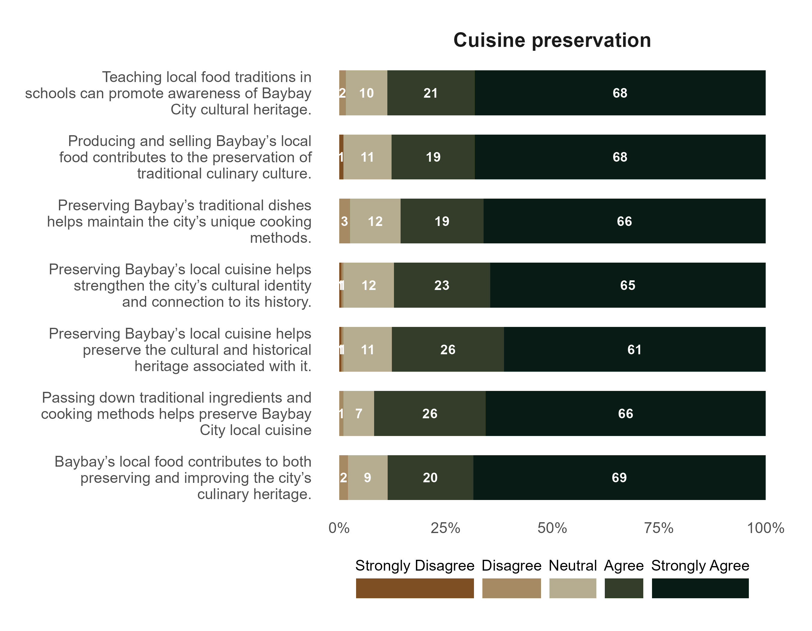

```

## Attitude toward local food

- 81% strongly agree that promoting Baybayanon dishes enhances local pride.

- 79% strongly agree that supporting local food helps attract more tourists, showing clear recognition of food as a tourism driver.

- 75% strongly agree they enjoy eating food prepared in traditional ways, reinforcing authenticity as a valued trait.

- 82% strongly agree that preserving local food is important for community identity, while 76% strongly agree it is valuable and worth preserving.

- Residents hold overwhelmingly positive attitudes toward local food, seeing it as a source of pride, identity, and tourism potential. This strong attitudinal base is a major enabler for gastronomic tourism.


```{r}
p_fct_attitude <- plot_factor(factor_name = "Attitude")

ggsave(
    plot = p_fct_attitude,
    filename = "plot/fct_attitude.jpeg",
    dpi = 300,
    height = 5,
    width = 9,
    unit = "in"
)

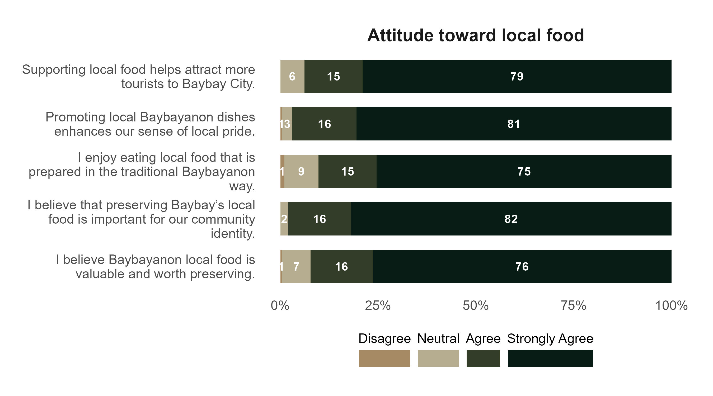
```

## Subjective norm

- Community and family influence:

- 58% strongly agree that people important to them value preservation of local foods.

- 55% strongly agree that family encourages support for local food.

- 51% strongly agree that local leaders expect community members to support cuisine revival.

- Only 43% strongly agree they feel peer pressure to engage in gastronomic tourism, with 26% neutral — suggesting peer influence is less decisive.

- 49% strongly agree the community expects them to promote local food practices.

```{r}
p_fct_subjective_norm <- 
    plot_factor(factor_name = "Subjective")

ggsave(
    plot = p_fct_subjective_norm,
    filename = "plot/fct_subjective_norm.jpeg",
    dpi = 300,
    height = 5,
    width = 9,
    unit = "in"
)

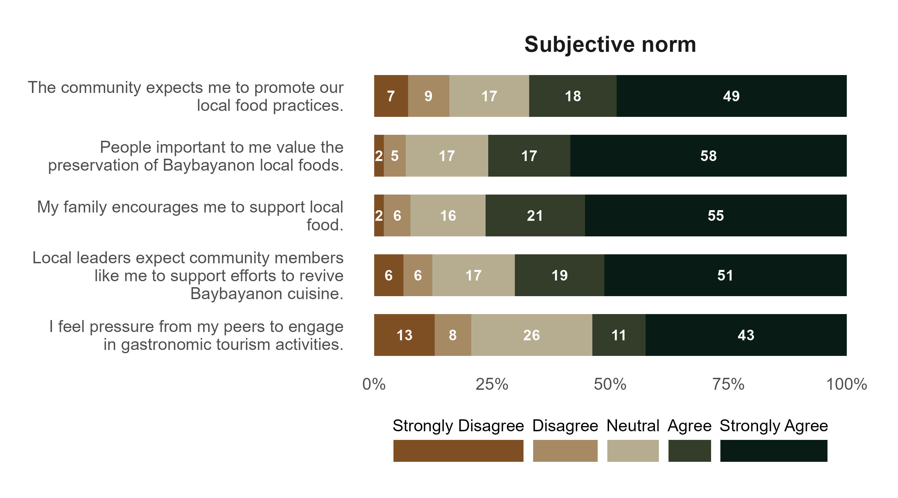

```

## Perceived behavioral control

- 44% strongly agree they have the necessary resources (time, money, transport) to support food-based tourism, though 22% remain neutral.

- 55% strongly agree they can distinguish authentic traditional food from modern variants, showing strong cultural literacy.

- 50% strongly agree they find it easy to join local food events, though 24% are neutral — suggesting accessibility could be improved.

- 63% strongly agree they feel capable of recommending local food to visitors, showing confidence in advocacy.

- Availability concerns: Only 32% strongly agree they can easily find local food whenever they want, with 12% disagreeing — pointing to gaps in consistent product availability.

```{r}
p_fct_behavioral_control <- 
    plot_factor(factor_name = "behavioral control")

ggsave(
    plot = p_fct_behavioral_control,
    filename = "plot/fct_behavioral_control.jpeg",
    dpi = 300,
    height = 5,
    width = 9,
    unit = "in"
)

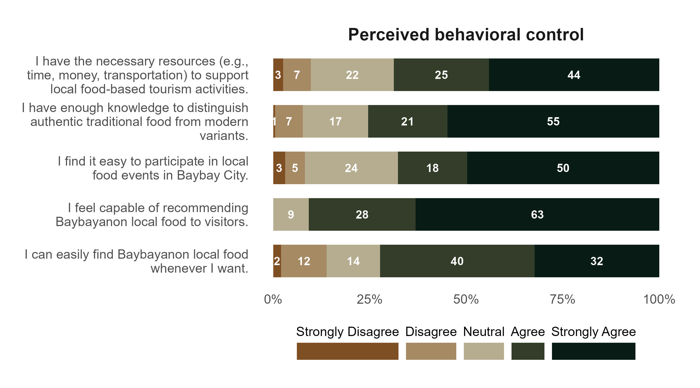

```


## Behavioral intention

- 70% strongly agree they will encourage others to appreciate local food culture.
- 62% strongly agree they intend to promote Baybayanon food to visitors.
- Commitment to preservation: 70% strongly agree they intend to support preservation of local food traditions.
- 69% strongly agree they are willing to learn how to cook traditional Baybayanon food.
- 59% strongly agree they plan to participate in local food festivals/events, though this item shows higher disagreement (22%) and neutrality (26%), suggesting logistical or resource barriers.

```{r}
p_fct_behavioral_intention <- 
    plot_factor(factor_name = "intention")

ggsave(
    plot = p_fct_behavioral_intention,
    filename = "plot/fct_behavioral_intention.jpeg",
    dpi = 300,
    height = 5,
    width = 9,
    unit = "in"
)

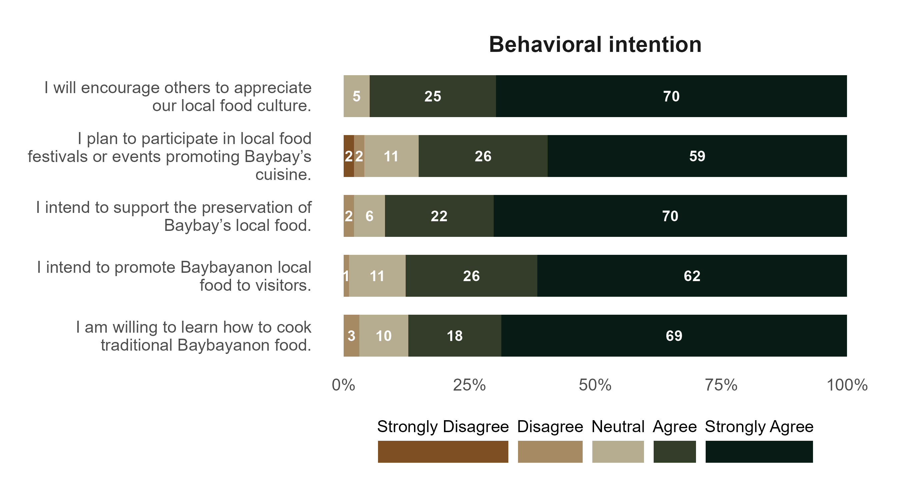

```


## Actual behavior

- High levels of agreement in earlier plots (attitude and perceived control) suggest residents actively consume and enjoy local food prepared traditionally.
- With 63% strongly agreeing they feel capable of recommending local food to visitors, actual behavior likely includes informal advocacy in social and family contexts.
- While intention is strong, actual participation may be lower due to resource and accessibility issues (time, transport, availability of events).
- Agreement that producing and selling local food contributes to preservation indicates residents actively buy local delicacies, reinforcing both heritage and livelihood.


```{r}
p_fct_actual_behavior <- 
    plot_factor(factor_name = "intention")

ggsave(
    plot = p_fct_actual_behavior,
    filename = "plot/fct_actual_behavior.jpeg",
    dpi = 300,
    height = 5,
    width = 9,
    unit = "in"
)

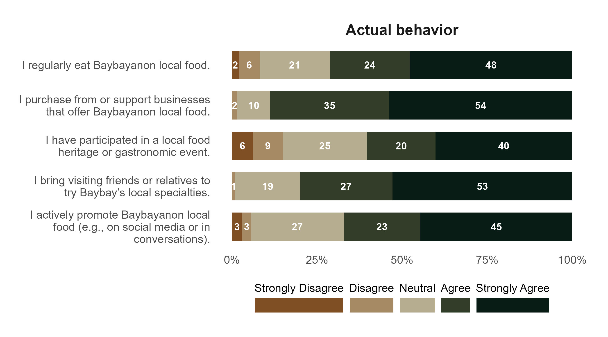

```


# Objective 4: To assess the residents' willingness to support towards gastronomic tourism.

## Proportion of resident willing to participate

- 66.84% (n=131) of residents are willing to participate in online campaigns promoting Baybay’s local foods.
- 66.84% (n=131) are willing to join cooking workshops for local food recipes. This shows strong interest in hands-on learning and intergenerational transfer of culinary knowledge.
- 66.33% (n=130) are willing to participate in food festivals promoting Baybay’s cuisine.
- 56.63% (n=111) are willing to join heritage tours featuring local food producers. While still majority support, this is lower compared to other activities, possibly due to logistical barriers (time, cost, accessibility).
- Only 1.53% (n=3) indicated no willingness to participate in any gastronomic tourism activity.

```{r}
p_activity_part <- 
    activity_part_dta |> 
    mutate(activity = str_wrap(activity, 30)) |> 
    mutate(activity = fct_reorder(activity, pct)) |> 
    ggplot(aes(pct, activity, fill = activity)) +
    geom_col(width = 0.7, show.legend = F) +
    geom_text(aes(label = pct_lab), hjust = -0.1) +
    scale_x_continuous(limits = c(0, 1), breaks = seq(0, 1, 0.20), labels = percent_format()) +
    scale_fill_manual(values = c("#e0e1dd", "#778da9", "#415a77", "#1b263b", "#0d1b2a")) +
    labs(
        title = str_wrap("Proportion of residents who are willing to participate on gastronomic tourism activities", 50),
        x = NULL,
        y = NULL
    ) +
    custom_theme


ggsave(
    plot = p_activity_part,
    filename = "plot/activity_participate.jpg",
    dpi = 400,
    unit = "in",
    width = 8,
    height = 5
)

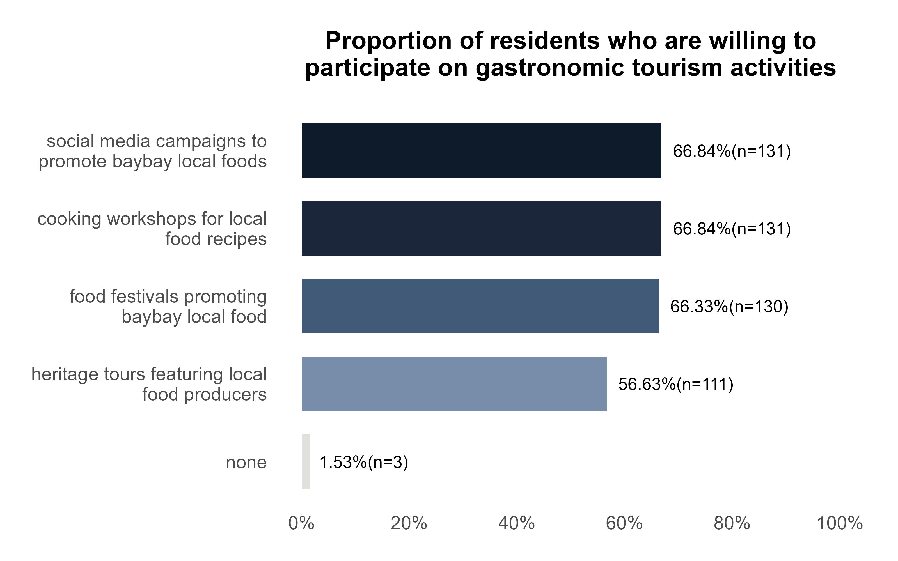
```


## Recommend Baybay local delicacies

- 80% (n=156) of residents said they would definitely recommend Baybay’s local food to tourists.
- 17.44% (n=34) said they would probably recommend it.
- Only 2.56% (n=5) were neutral, and none expressed outright refusal.

```{r}
p_reco_local_delicacy <- 
    reco_local_delicacy_dta |> 
    mutate(recommend = fct_reorder(recommend, pct)) |> 
    ggplot(aes(pct, recommend, fill = recommend)) +
    geom_col(width = 0.7, show.legend = F) +
    geom_text(aes(label = pct_lab), hjust = -0.1) +
    scale_x_continuous(limits = c(0, 1), breaks = seq(0, 1, 0.20), labels = percent_format()) +
    scale_fill_manual(values = c( "#415a77", "#1b263b", "#0d1b2a")) +
    labs(
        title = str_wrap("Would you like to recommend Baybay's local food to tourists?", 50),
        x = NULL,
        y = NULL
    ) +
    custom_theme

ggsave(
    plot = p_reco_local_delicacy,
    filename = "plot/reco_local_delicacy.jpg",
    dpi = 400,
    unit = "in",
    width = 8,
    height = 5
)

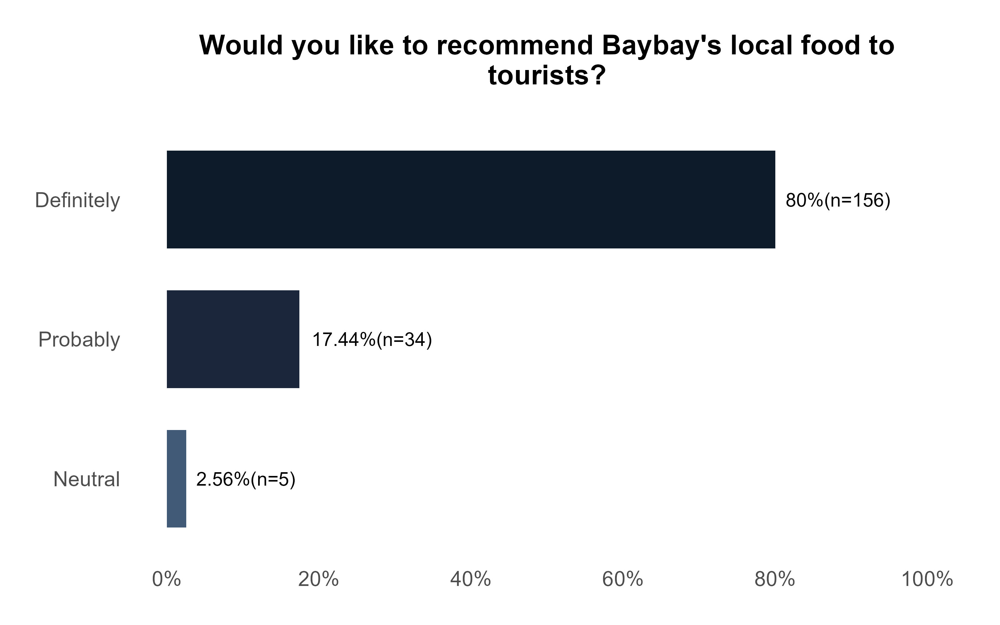
```


# PLS-SEM

## Measurement and structural model

- **Attitude → Behavioral Intention**

    - Estimate: 0.365, significant (T = 4.296, CI [0.208, 0.542])
    - Interpretation: Residents’ positive attitudes toward local food (pride, enjoyment, identity) strongly and significantly increase their intention to support gastronomic tourism. This confirms that cultural pride and appreciation are major drivers of willingness to act.

- **Subjective Norm → Behavioral Intention**
    - Estimate: -0.056, not significant (T = -0.396, CI [-0.337, 0.215])
    - Interpretation: Social expectations (community, family, peers, leaders) do not significantly influence residents’ behavioral intention. In fact, the negative coefficient suggests that external pressure may slightly reduce intention, though the effect is statistically insignificant. This means residents’ willingness is more internally motivated (attitude and control) than externally pressured.


- **Perceived Behavioral Control → Behavioral Intention**
    - Estimate: 0.348, significant (T = 2.478, CI [0.071, 0.618])
    - Interpretation: Confidence in resources, knowledge, and ability to participate significantly increases intention. Residents who feel capable (e.g., can recommend food, distinguish authentic dishes, or access events) are more likely to intend to support gastronomic tourism.


- **Behavioral Intention → Actual Behavior**
    - Estimate: 0.495, highly significant (T = 8.452, CI [0.385, 0.613])
    - Interpretation: Behavioral intention strongly predicts actual behavior. Residents who intend to promote, preserve, and participate in food-related activities are very likely to follow through in practice. This validates the Theory of Planned Behavior in the Baybay context.

```{r}
# Define constructs and their indicators
measurement_model <- constructs(
  composite("Subjective Norm", multi_items("sn", 1:4)),
  composite("Perceived Behavioral Control", multi_items("pbc", 1:3)),
  composite("Attitude", multi_items("at", c(2, 3, 5))),
  composite("Behavioral Intention", multi_items("bi", c(1, 3, 5))),
  composite("Actual Behavior", multi_items("ab", 3:5))
)

## define structural model
structural_model <- relationships(
  paths(from = c("Attitude", "Subjective Norm", "Perceived Behavioral Control"),
        to   = "Behavioral Intention"),
  paths(from = "Behavioral Intention", to = "Actual Behavior")
)


## estimate model
pls_model <- estimate_pls(
  data = likert_items_clean, 
  measurement_model = measurement_model,
  structural_model = structural_model
)


summ_pls_model <- summary(pls_model)


## bootstrap model
boot_pls_model <- 
  bootstrap_model(
  seminr_model = pls_model,
  nboot = 5000
)

## plot structural model
plot(boot_pls_model)
```


```{r}
## summary table
summ_boot_pls_model <- summary(boot_pls_model)

DT::datatable(summ_boot_pls_model$bootstrapped_paths |> round(3))
```


## Reliability and validity

```{r}
## Reliability measurment 
summ_pls_model$reliability
```


```{r}
summ_pls_model$validity$fl_criteria
```