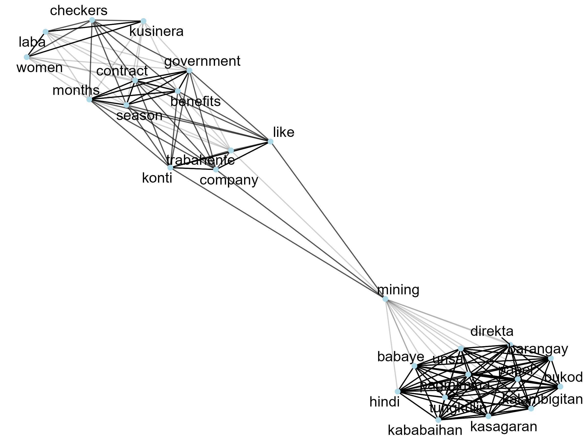
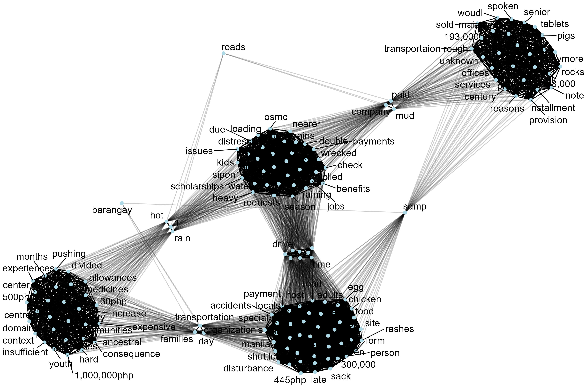
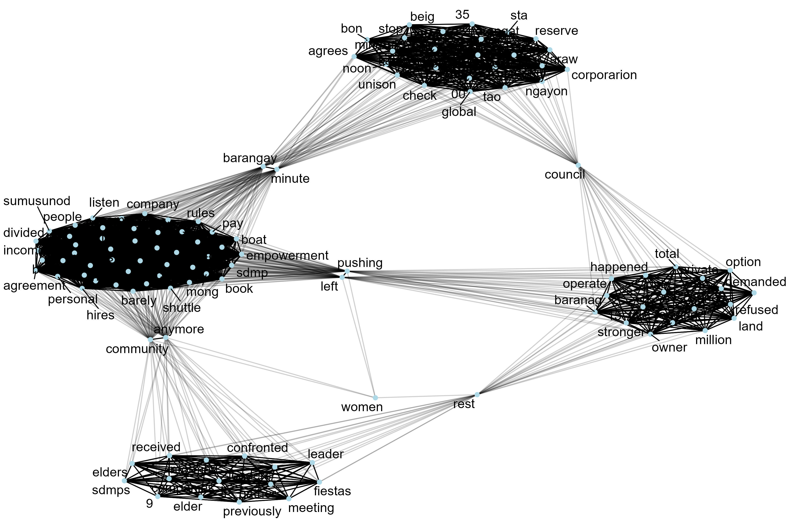
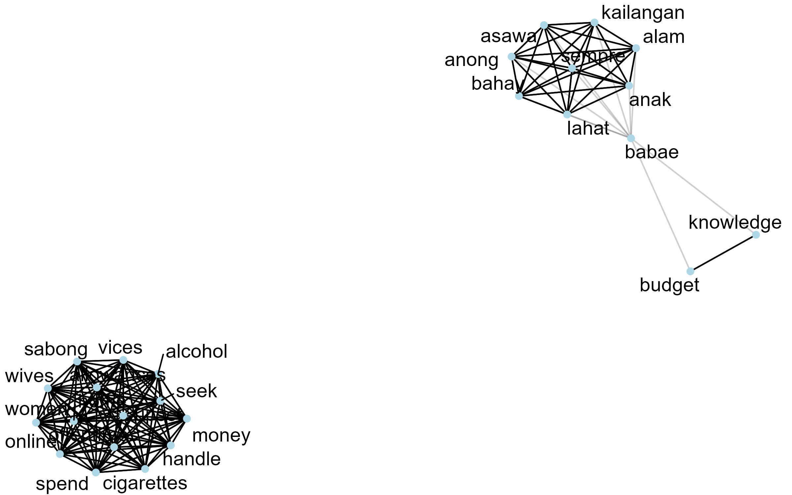
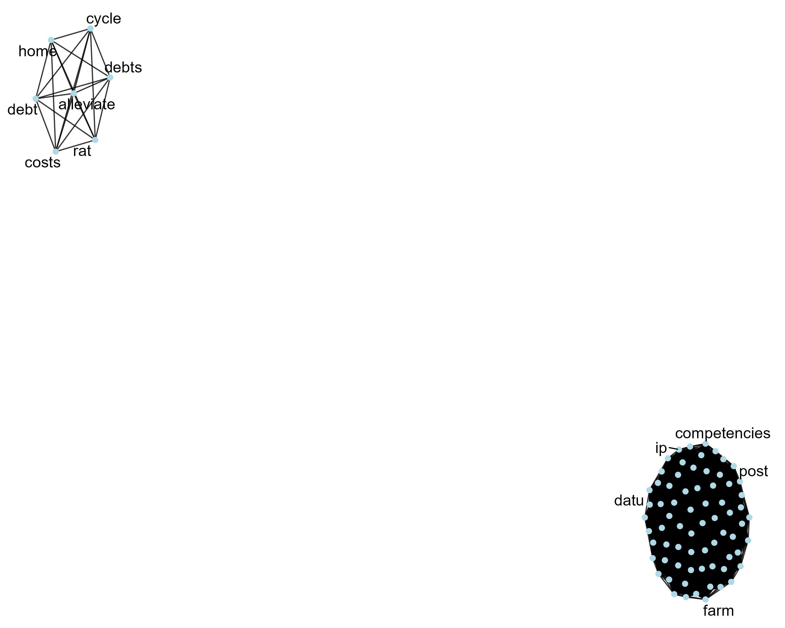

```{r}
#| echo: false
#| message: false
#| warning: false

# set working directory
setwd(here::here("mining-fgd-analysis"))

# libraries
library(tidyverse)
library(readxl)
library(janitor)
library(scales)
library(tidytext)
library(ggwordcloud)
library(widyr)
library(ggraph)
library(tidygraph)
library(kableExtra)

# data management source
source("data-management.R")
```

# Attachments

::: callout-note
Copies of the Figures presented in this report are available using the links below. All the files can be accessed in the Google drive folder.
:::

<ol>

<li><a href="https://drive.google.com/drive/folders/1cXbqvVzzEUuQRa3xRFILTlQoPdb7R-rd?usp=sharing" target="_blank" style="text-decoration: none">Plots</a></li>

<li><a href="https://drive.google.com/drive/folders/1Y2Qe1BuxqPUQ-cjeH4P3meKTW9dpj-ly?usp=sharing" target="_blank" style="text-decoration: none">Google Drive</a></li>

</ol>

# Theme 1:  Mapping gendered power relations over mineral resources

#### What roles do women play in the barangay aside in relation to mining—directly or indirectly? {.unnumbered}

```{r}
#| eval: false

set.seed(20263)
ggwordcloud(q1_fgd$word, q1_fgd$n, scale = c(4, 0.8))

ggsave(
  filename = "plot/theme1_q1_wordcloud.jpeg",
  units = "in",
  width = 6,
  height = 4,
  dpi = 300
)

```

```{r}
#| echo: false
knitr::include_graphics("plot/theme1_q1_wordcloud.jpeg")
```


```{r}
#| eval: false

set.seed(20263)

q1_word_corr_fgd |> 
  filter(correlation > .3) %>%
     as_tbl_graph() %>%
     ggraph(layout = "fr") +
     geom_edge_link(aes(edge_alpha = correlation), show.legend = FALSE) +
     geom_node_point(color = "lightblue", size = 2) +
     geom_node_text(aes(label = name), repel = TRUE, size = 5) +
    theme_void()

ggsave(
  filename = "plot/theme1_q1_network.jpeg",
  units = "in",
  width = 8,
  height = 6,
  dpi = 300
)


```

```{r}
#| echo: false

```


#### What are the biggest challenges women face due to mining operations?  Are there differences in how younger and older women experience these challenges? {.unnumbered}

```{r}
#| eval: false

set.seed(20263)
ggwordcloud(q2_fgd$word, q2_fgd$n, scale = c(6, 0.8))
ggsave(
  filename = "plot/theme1_q2_wordcloud.jpeg",
  units = "in",
  width = 8,
  height = 4,
  dpi = 300
)


```

```{r}
#| echo: false
knitr::include_graphics("plot/theme1_q2_wordcloud.jpeg")
```


```{r}
#| eval: false

set.seed(20263)

q2_word_corr_fgd |> 
  filter(correlation > .5) %>%
     as_tbl_graph() %>%
     ggraph(layout = "fr") +
     geom_edge_link(aes(edge_alpha = correlation), show.legend = FALSE) +
     geom_node_point(color = "lightblue", size = 2) +
     geom_node_text(aes(label = name), repel = TRUE, size = 5) +
     theme_void()

ggsave(
  filename = "plot/theme1_q2_network.jpeg",
  units = "in",
  width = 12,
  height = 8,
  dpi = 300
)


```

```{r}
#| echo: false

```


#### Who in the community makes decisions about the location, operation, and closure of the nickel mine? How are men and women represented in those decision-making bodies? (Observe the lack of gender‑balanced participation in SDMP design)? {.unnumbered}

```{r}
#| eval: false

set.seed(20263)
ggwordcloud(q3_fgd$word, q3_fgd$n, scale = c(5, 0.6))
ggsave(
  filename = "plot/theme1_q3_wordcloud.jpeg",
  units = "in",
  width = 8,
  height = 4,
  dpi = 300
)


```

```{r}
#| echo: false
knitr::include_graphics("plot/theme1_q3_wordcloud.jpeg")
```


```{r}
#| eval: false

set.seed(20263)

q3_word_corr_fgd |> 
  filter(correlation > .4) %>%
     as_tbl_graph() %>%
     ggraph(layout = "fr") +
     geom_edge_link(aes(edge_alpha = correlation), show.legend = FALSE) +
     geom_node_point(color = "lightblue", size = 2) +
     geom_node_text(aes(label = name), repel = TRUE, size = 5) +
     theme_void()

ggsave(
  filename = "plot/theme1_q3_network.jpeg",
  units = "in",
  width = 12,
  height = 8,
  dpi = 300
)


```

```{r}
#| echo: false

```


#### Which household members control the revenues, royalties, or other benefits generated by the mine? Do women have formal or informal rights to these resources? (Observe gender‑division of labour and limited benefit sharing) {.unnumbered}

```{r}
#| eval: false

set.seed(20263)
ggwordcloud(q4_fgd$word, q4_fgd$n, scale = c(5, 0.6))
ggsave(
  filename = "plot/theme1_q4_wordcloud.jpeg",
  units = "in",
  width = 8,
  height = 4,
  dpi = 300
)


```

```{r}
#| echo: false

knitr::include_graphics("plot/theme1_q4_wordcloud.jpeg")
```


```{r}
#| eval: false

set.seed(20263)

q4_word_corr_fgd |> 
  filter(correlation > .1) %>%
     as_tbl_graph() %>%
     ggraph(layout = "fr") +
     geom_edge_link(aes(edge_alpha = correlation), show.legend = FALSE) +
     geom_node_point(color = "lightblue", size = 2) +
     geom_node_text(aes(label = name), repel = TRUE, size = 5) +
     theme_void()

ggsave(
  filename = "plot/theme1_q4_network.jpeg",
  units = "in",
  width = 8,
  height = 5,
  dpi = 300
)


```

```{r}
#| echo: false

```


#### Do women want to work in mining companies? If yes, What rules, customary practices, or company policies affect women’s ability to work in the mine (e.g.,  technical‑job restrictions)? (Observe cultural taboos on women in tunnels) {.unnumbered}


```{r}
#| eval: false

set.seed(20263)
ggwordcloud(q5_fgd$word, q5_fgd$n, scale = c(4, 0.8))
ggsave(
  filename = "plot/theme1_q5_wordcloud.jpeg",
  units = "in",
  width = 8,
  height = 4,
  dpi = 300
)


``` 
```{r}
#| echo: false
knitr::include_graphics("plot/theme1_q5_wordcloud.jpeg")
```


```{r}
#| eval: false

set.seed(20263)

q5_word_corr_fgd |> 
  filter(correlation > .4) %>%
     as_tbl_graph() %>%
     ggraph(layout = "fr") +
     geom_edge_link(aes(edge_alpha = correlation), show.legend = FALSE) +
     geom_node_point(color = "lightblue", size = 2) +
     geom_node_text(aes(label = name), repel = TRUE, size = 5) +
     theme_void()

ggsave(
  filename = "plot/theme1_q5_network.jpeg",
  units = "in",
  width = 10,
  height = 8,
  dpi = 300
)


```

```{r}
#| echo: false


```
