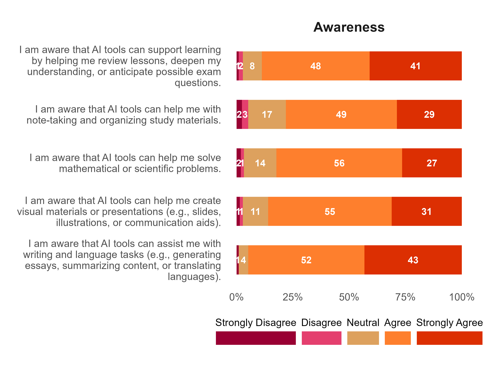
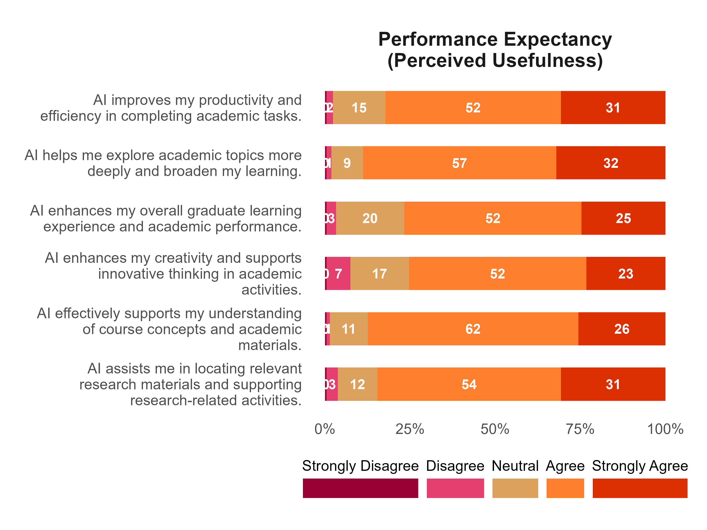
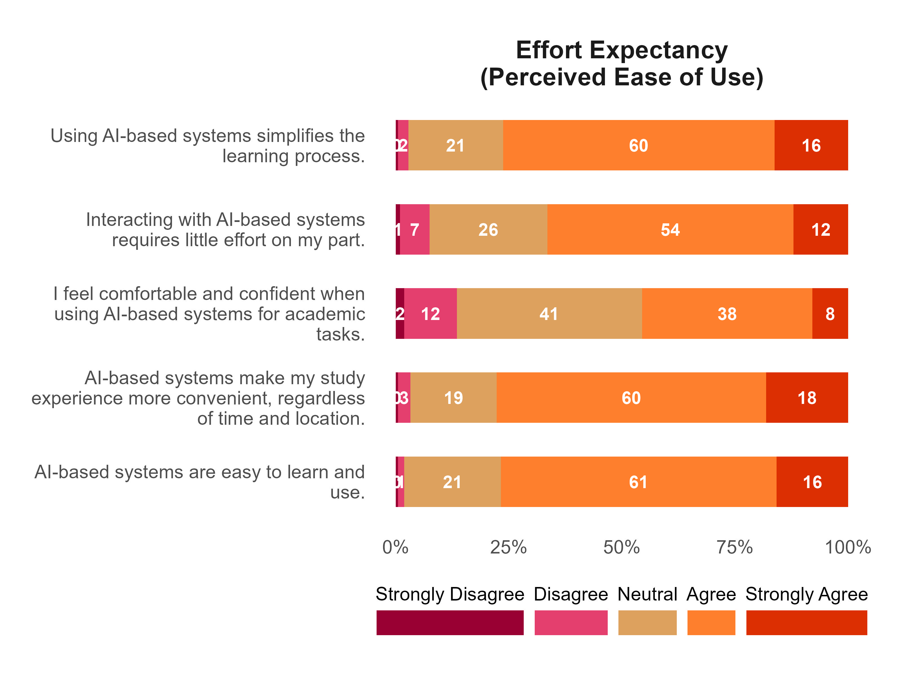
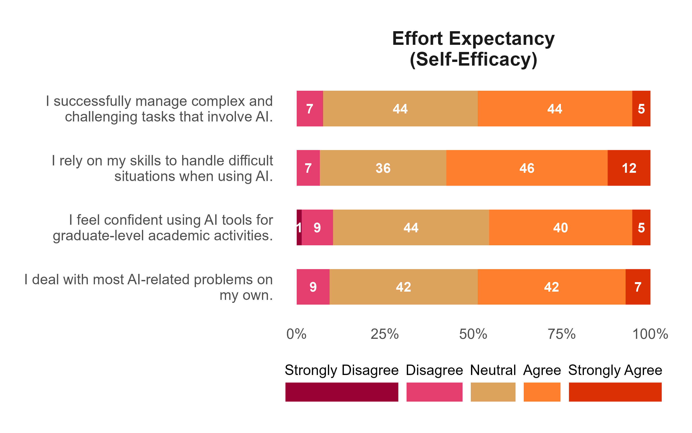
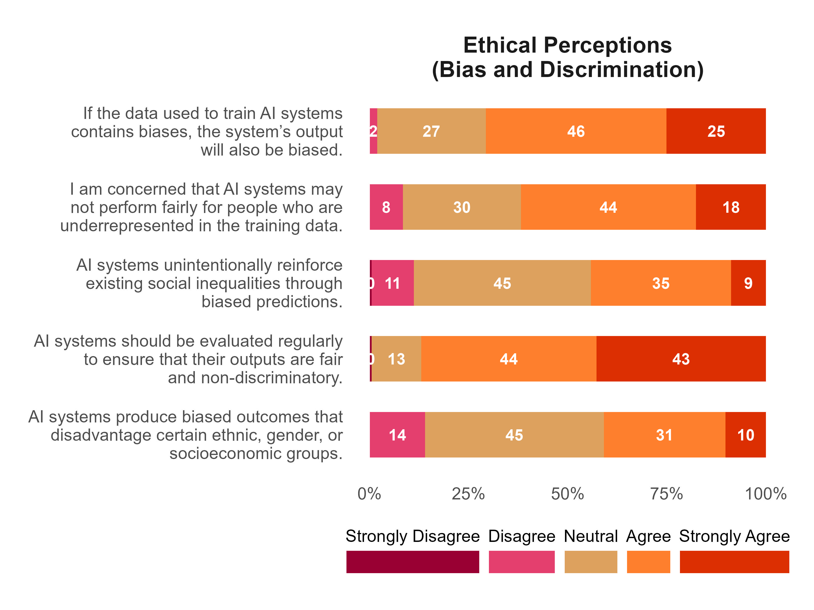
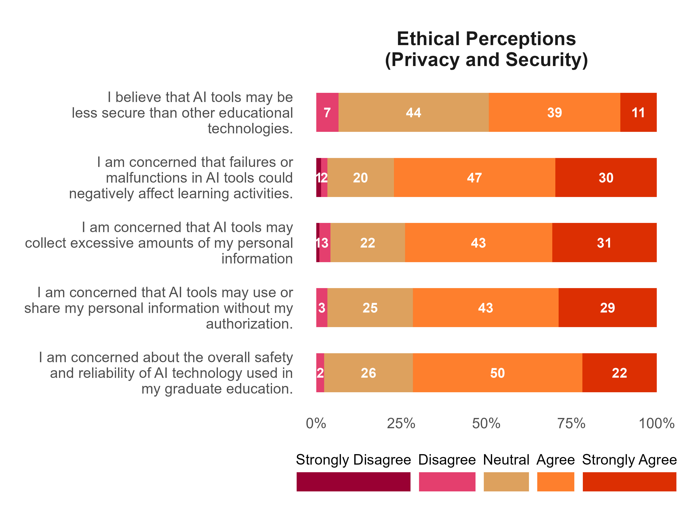
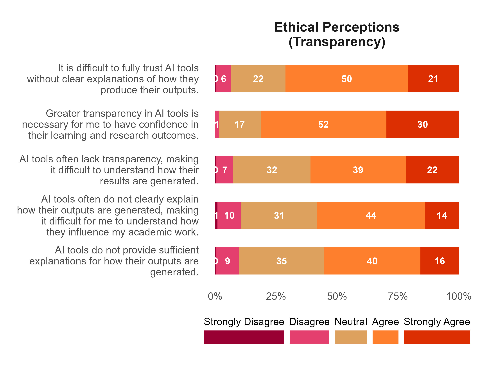
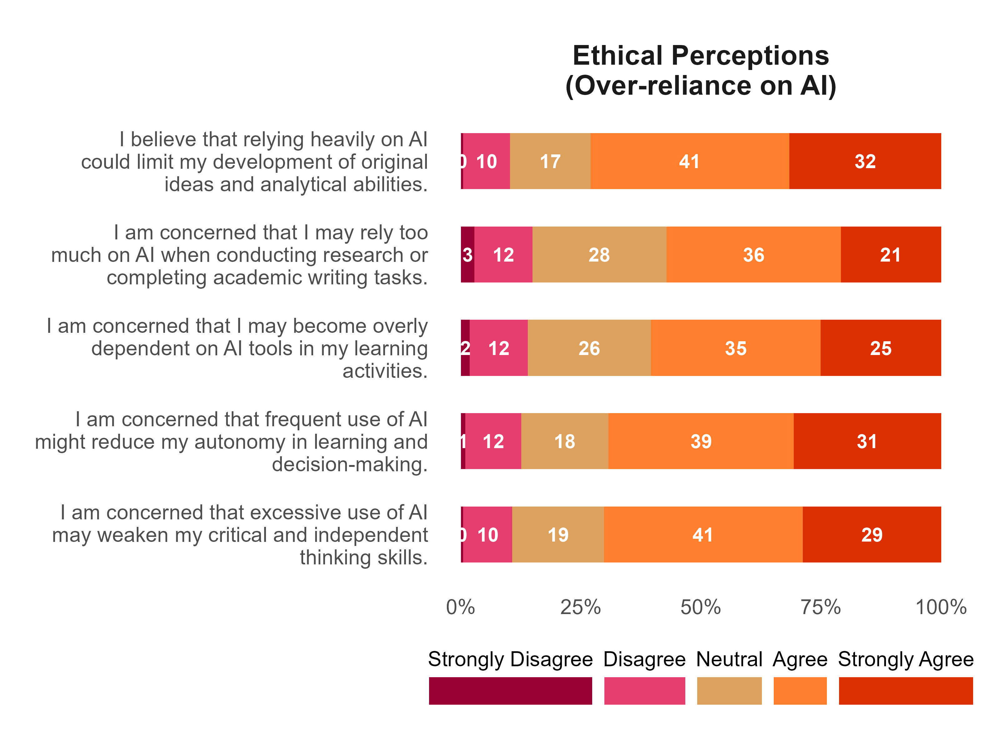
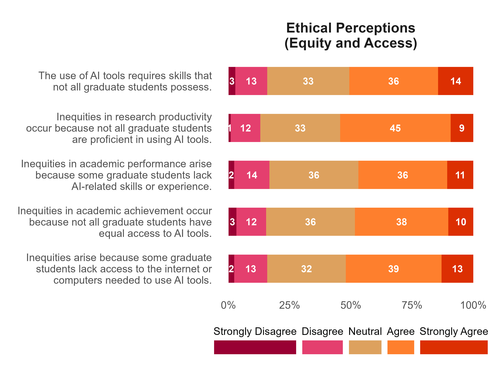

```{r}
#| echo: false
#| message: false
#| warning: false
# set working directory
setwd(here::here("rentaro-ai-effects-academic"))

# libraries
library(tidyverse)
library(readxl)
library(janitor)
library(scales)
library(EFAtools)
library(psych)
library(seminr)
library(gtsummary)
library(kableExtra)
library(correlation)
library(reshape2)


# data management source
source("data-management.R")
```

# Attachments

::: callout-note
Copies of the Figures presented in this report are available using the links below. All the files can be accessed in the Google drive folder.
:::

<ol>

<li><a href="" target="_blank" style="text-decoration: none">Plots</a></li>

<li><a href="" target="_blank" style="text-decoration: none">Google Drive</a></li>

</ol>


# Objective 1: Describe the socio-demographic characteristics of the respondents.


```{r}
## descriptive
ai_ms_dta |>
  select(age:ai_tools_used) |>
  select(
    -c(
      weekly_allowance,
      working_experience,
      residence,
      major,
      degree,
      gadget_own,
      gadget_own_type,
      internet_source,
      internet_provider,
      internet_monthly_budget,
      ai_info_source,
      ai_training,
      ai_tools_used
    )
  ) |>
  tbl_summary(
    statistic = list(all_categorical() ~ "{n} ({p}%)"),
    missing = "no",
    label = list(
      age ~ "Age",
      sex ~ "Gender",
      program ~ "Program",
      year_level ~ "Year Level",
      grad_years ~ "Years in Graduate School",
      employment_status ~ "Employment Status",
      internet_availability ~ "Internet
      Availability",
      ai_familiarity ~ "Familiarity with AI",
      ai_use_freq ~ "Frequency of AI Use"
    )
  ) |>
  bold_labels() %>%
  as_kable_extra(linesep = "") %>%
  kable_minimal() %>%
  kable_styling(
    full_width = F,
    fixed_thead = T,
    bootstrap_options = c("striped", "hover", "condensed", "responsive")
  )
```


# Objective 2: Determine the level of awareness, perception and AI utilization among graduate students.

### Level of awareness {.unnumbered}

```{r}
p_ai_awareness <- plot_factor("Awareness", stwidth = 50)

## ggsave
ggsave(
  plot = p_ai_awareness,
  filename = "plot/ai_awareness.jpeg",
  width = 8,
  height = 6,
  dpi = 400,
  unit = "in"
)

## display plot

```

<<<<<<< HEAD
=======
# Objective 2: Describe the levels of performance expectancy, effort expectancy, and ethical risk perception as component of overall AI perception.

### Peformance expectancy: Perceived usefulness {.unnumbered}

```{r}
p_performance_expectancy <-
  plot_factor("Performance Expectancy")

## save plot
ggsave(
  plot = p_performance_expectancy,
  filename = "plot/performance_expectancy.jpeg",
  width = 8,
  height = 6,
  dpi = 400,
  unit = "in"
)

## display plot

```
>>>>>>> da16d87e1d3ea14898c230010b1327a79447c28b

### Effort expectancy: Perceived ease of use {.unnumbered}

```{r}
p_effort_expectancy <-
  plot_factor("Effort Expectancy\n(Perceived Ease of Use)")

## save plot
ggsave(
  plot = p_effort_expectancy,
  filename = "plot/effort_expectancy_peou.jpeg",
  width = 8,
  height = 6,
  dpi = 400,
  unit = "in"
)

## display plot

```

### Effort expectancy: Self-efficacy {.unnumbered}

```{r}
p_effort_expectancy_se <-
  plot_factor("Effort Expectancy\n(Self-Efficacy)")

## save plot
ggsave(
  plot = p_effort_expectancy_se,
  filename = "plot/effort_expectancy_se.jpeg",
  width = 8,
  height = 5,
  dpi = 400,
  unit = "in"
)

## display plot

```

### Ethical perceptions: Bias and discrimination {.unnumbered}

```{r}
p_ethical_risk_bias <-
  plot_factor("Ethical Perceptions\n(Bias and Discrimination)")

## save plot
ggsave(
  plot = p_ethical_risk_bias,
  filename = "plot/ethical_risk_bias.jpeg",
  width = 8,
  height = 6,
  dpi = 400,
  unit = "in"
)

## display plot

```

### Ethical perceptions: Privacy and security {.unnumbered}

```{r}
p_ethical_risk_privacy <-
  plot_factor("Ethical Perceptions\n(Privacy and Security)")

## save plot
ggsave(
  plot = p_ethical_risk_privacy,
  filename = "plot/ethical_risk_privacy.jpeg",
  width = 8,
  height = 6,
  dpi = 400,
  unit = "in"
)

## display plot

```

### Ethical perceptions: Transparency {.unnumbered}

```{r}
p_ethical_risk_transparency <-
  plot_factor("Ethical Perceptions\n(Transparency)")

## save plot
ggsave(
  plot = p_ethical_risk_transparency,
  filename = "plot/ethical_risk_transparency.jpeg",
  width = 8,
  height = 6,
  dpi = 400,
  unit = "in"
)

## display plot

```

### Ethical perceptions: Over-reliance on AI {.unnumbered}

```{r}
p_ethical_risk_overreliance <-
  plot_factor("Ethical Perceptions\n(Over-reliance on AI)")

## save plot
ggsave(
  plot = p_ethical_risk_overreliance,
  filename = "plot/ethical_risk_overreliance.jpeg",
  width = 8,
  height = 6,
  dpi = 400,
  unit = "in"
)

## display plot

```

### Ethical perceptions: Equity and access {.unnumbered}

```{r}
p_ethical_risk_equity <-
  plot_factor("Ethical Perceptions\n(Equity and Access)")

## save plot
ggsave(
  plot = p_ethical_risk_equity,
  filename = "plot/ethical_risk_equity.jpeg",
  width = 8,
  height = 6,
  dpi = 400,
  unit = "in"
)

## display plot

```

<<<<<<< HEAD
### Peformance expectancy: Perceived usefulness {.unnumbered}
=======
# Objective 4: Assess the extent of graduate students' AI usage behavior in their academic activities.

# Objective 5: Examine the influence of awareness of AI tools on overall AI perception.

# Objective 6: Determin the effects of overall AI perception on AI usage behvior.

# Objective 7: Examine whether socio-demographic characteristics are associated with awareness of AI perception, and AI usage behvior.

# Objective 8: Describe characteristics of respondents towards AI.
>>>>>>> da16d87e1d3ea14898c230010b1327a79447c28b

```{r}
p_performance_expectancy <-
  plot_factor("Performance Expectancy")

## save plot
ggsave(
  plot = p_performance_expectancy,
  filename = "plot/performance_expectancy.jpeg",
  width = 8,
  height = 6,
  dpi = 400,
  unit = "in"
)

## display plot

```


# Analyze the relationship of socio-demographic variables with AI awareness, perception and utilization.

- parallel analysis
- efa extraction
- measurement model
- structural model
- bootstrapped estimates
- 

## Factor Analysis

### Parallel analysis

```{r}
## parallel analysis for lower order constructs
## expected factor: 3

block1 <- sem_ai_ms_dta |> select(a1:a5, pe1:pe6, ai_use1:ai_use4)

fa.parallel(block1, fm = "ml", fa = "fa")
```


```{r}
## parallel analysis for higher order construct effort expectancy

## expected factor: 2
block2 <- sem_ai_ms_dta |> select(ee_peu1:ee_peu5, ee_se1:ee_se4)

fa.parallel(block2, fm = "ml", fa = "fa")
```


```{r}
## parallel analysis for higher order construct ethical perceptions

## expected factor: 5
block3 <- sem_ai_ms_dta |>
  select(
    ee_bd1:ee_bd5,
    ee_ps1:ee_ps5,
    ee_t1:ee_t5,
    ee_oe1:ee_oe5,
    ee_ea1:ee_ea5
  )

fa.parallel(block3, fm = "ml", fa = "fa")
```


### Factor extraction

```{r}
fa_block1 <- fa(block1, nfactors = 3, fm = "ml", rotate = "oblimin")

print(fa_block1$loadings, cutoff = 0.3, sort = TRUE)
```


```{r}
fa_block2 <- fa(block2, nfactors = 2, fm = "ml", rotate = "oblimin")

print(fa_block2$loadings, cutoff = 0.3, sort = TRUE)
```


```{r}
fa_block3 <- fa(block3, nfactors = 4, fm = "ml", rotate = "oblimin")
print(fa_block3$loadings, cutoff = 0.3, sort = TRUE)
```


## PLS-SEM

### Measurement model

### Structural model


### Bootstrapped estimates


# Provide inputs for policy-makers and administration on the use of AI in graduate studies.


