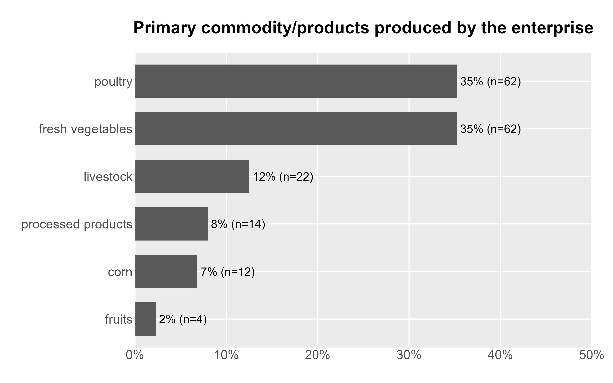
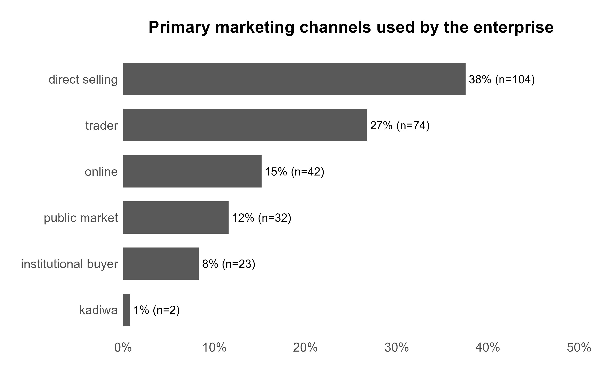
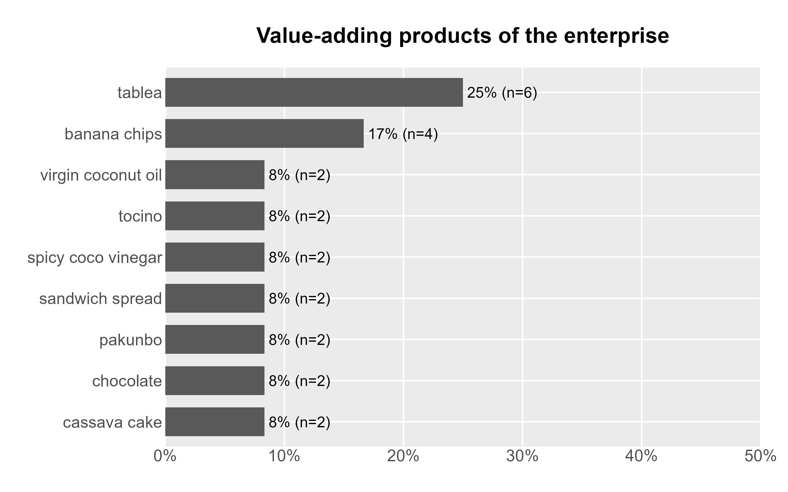
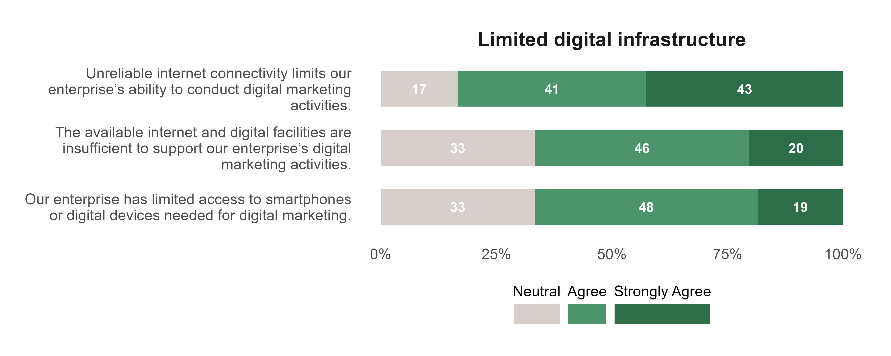
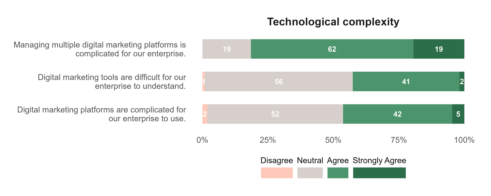
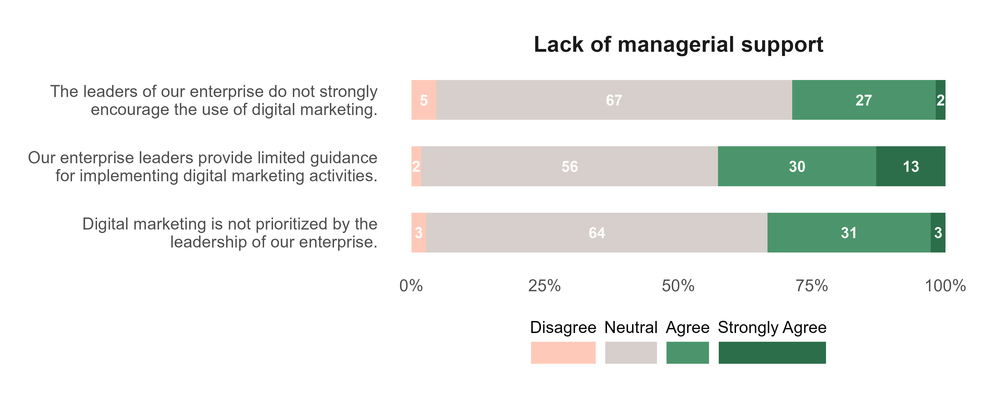
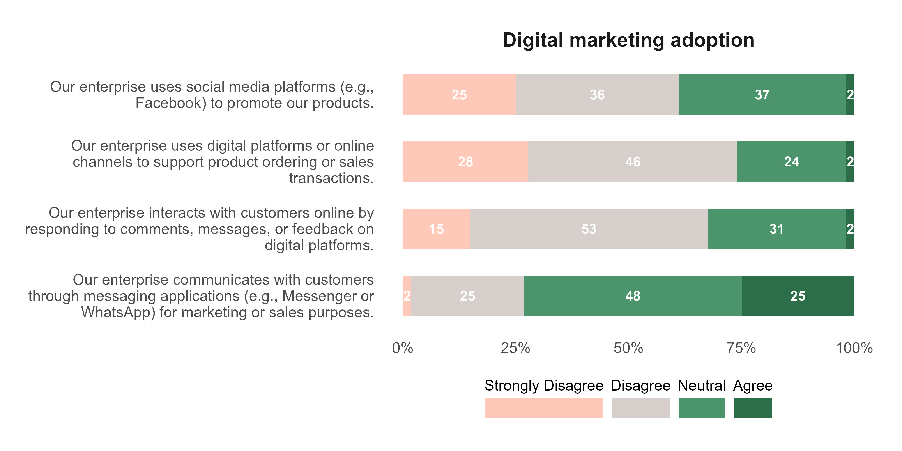

```{r}
#| echo: false
#| message: false
#| warning: false
# set working directory
setwd(here::here("saad-digital-marketing"))

# libraries
library(tidyverse)
library(readxl)
library(janitor)
library(scales)
library(EFAtools)
library(psych)
library(seminr)
library(gtsummary)
library(kableExtra)
library(correlation)
library(reshape2)
library(tidyr)

# data management source
source("data-management.R")
```

# Attachments

::: callout-note
Copies of the Figures presented in this report are available using the links below. All the files can be accessed in the Google drive folder.
:::

<ol>

<li><a href="https://drive.google.com/drive/folders/19CCug3KhxbFnaAqMjwSfKMinFN9ZMHWd?usp=sharing" target="_blank" style="text-decoration: none">Plots</a></li>

<li><a href="https://drive.google.com/drive/folders/11C7ZeBVGgxZ_KQs1v6cQBP6qDIi4_toc?usp=sharing" target="_blank" style="text-decoration: none">Google Drive</a></li>

</ol>

# Objective 1: Describe the organizational, socio-economic, and digital characteristics of DASAAD Phase 2 community-based enterprises in Eastern Visayas.

### Sociodemographic variables {.unnumbered}

```{r}
df |>
  select(role:attended_training) |>
  select(
    -market,
    -commodity,
    -value_adding_processed_products_specify,
    -organization_name
  ) |>
  tbl_summary(
    statistic = list(all_categorical() ~ "{p}% (n = {n})"),
    type = list(everything() ~ "categorical"),
    missing = "no",
    ,
    label = list(
      role = "Roles",
      age_range ~ "Age",
      sex ~ "Sex",
      education ~ "Education",
      years_managing = "Years managing",
      years_established = "Years established",
      membership_size = "Membership size",
      farm_size = "Farm size",
      income_level = "Income level",
      has_device = "Device availability",
      internet_type = "Internet size",
      attended_training = "Attended training"
    )
  ) |>
  bold_labels() %>%
  as_kable_extra(linesep = "") %>%
  kable_minimal() %>%
  kable_styling(
    full_width = F,
    fixed_thead = T,
    bootstrap_options = c("striped", "hover", "condensed", "responsive")
  )
```

### Commodity {.unnumbered}

```{r}
p_commodity <-
  commodity_dta |>
  count(commodity) |>
  mutate(
    pct = n / sum(n),
    pct_lab = str_c(" ", round(pct * 100, 0), "% (n=", n, ")")
  ) |>
  mutate(commodity = fct_reorder(commodity, pct)) |>
  ggplot(aes(pct, commodity)) +
  geom_col(width = 0.7) +
  geom_text(aes(label = pct_lab), hjust = 0) +
  scale_x_continuous(
    labels = percent_format(),
    limits = c(0, 0.5),
    expand = c(0, 0)
  ) +
  labs(
    title = "Primary commodity/products produced by the enterprise",
    x = NULL,
    y = NULL
  ) +
  custom_theme

## saving plot
ggsave(
  plot = p_commodity,
  filename = "plot/commodity.jpeg",
  width = 8,
  height = 5,
  dpi = 400,
  unit = "in"
)

## display plot

```

### Market {.unnumbered}

```{r}
p_market <-
  market_dta |>
  mutate(
    pct = n / sum(n),
    pct_lab = str_c(" ", round(pct * 100, 0), "% (n=", n, ")")
  ) |>
  mutate(market = fct_reorder(market, pct)) |>
  ggplot(aes(pct, market)) +
  geom_col(width = 0.7) +
  geom_text(aes(label = pct_lab), hjust = 0) +
  scale_x_continuous(
    labels = percent_format(),
    limits = c(0, 0.5),
    expand = c(0, 0)
  ) +
  labs(
    title = "Primary marketing channels used by the enterprise",
    x = NULL,
    y = NULL
  ) +
  custom_theme

## saving plot
ggsave(
  plot = p_market,
  filename = "plot/market.jpeg",
  width = 8,
  height = 5,
  dpi = 400,
  unit = "in"
)

## display plot

```

### Value-adding {.unnumbered}

```{r}
p_value_adding <-
  value_adding_spec_dta |>
  count(value_adding_spec) |>
  mutate(
    pct = n / sum(n),
    pct_lab = str_c(" ", round(pct * 100, 0), "% (n=", n, ")")
  ) |>
  mutate(value_adding_spec = fct_reorder(value_adding_spec, pct)) |>
  ggplot(aes(pct, value_adding_spec)) +
  geom_col(width = 0.7) +
  geom_text(aes(label = pct_lab), hjust = 0) +
  scale_x_continuous(
    labels = percent_format(),
    limits = c(0, 0.5),
    expand = c(0, 0)
  ) +
  labs(
    title = "Value-adding products of the enterprise",
    x = NULL,
    y = NULL
  ) +
  custom_theme

## saving plot
ggsave(
  plot = p_value_adding,
  filename = "plot/value_adding.jpeg",
  width = 8,
  height = 5,
  dpi = 400,
  unit = "in"
)

## display plot

```

# Objective 2: Assess the level of digital marketing adoption among DA-SAAD Phase 2 community-based enterprises in Eastern Visayas.

## Tecnological barriers

### Limited digital infrastructure {.unnumbered}

```{r}
p_limited_digital_infra <- plot_factor(factor_name = "Limited digital infra")

## saving plot
ggsave(
  plot = p_limited_digital_infra,
  filename = "plot/fct_limited_digital_infra.jpeg",
  width = 10,
  height = 4,
  dpi = 400,
  unit = "in"
)

## display plot

```

### Technological complexity {.unnumbered}

```{r}
p_technological_complexity <- plot_factor(
  factor_name = "Technological complexity"
)

## saving plot
ggsave(
  plot = p_technological_complexity,
  filename = "plot/fct_technological_complexity.jpeg",
  width = 10,
  height = 4,
  dpi = 400,
  unit = "in"
)

## display plot

```

## Organizational barriers

### Limited digital skills {.unnumbered}

```{r}
p_limited_digi_skill <- plot_factor(factor_name = "Limited digital skills")

## saving plot
ggsave(
  plot = p_limited_digi_skill,
  filename = "plot/fct_limited_digi_skill.jpeg",
  width = 10,
  height = 4,
  dpi = 400,
  unit = "in"
)

## display plot

```

### Lack of managerial support {.unnumbered}

```{r}
p_lack_managerial_support <- plot_factor(
  factor_name = "Lack of managerial support"
)

## saving plot
ggsave(
  plot = p_lack_managerial_support,
  filename = "plot/fct_lack_managerial_support.jpeg",
  width = 10,
  height = 4,
  dpi = 400,
  unit = "in"
)

## display plot

```

## Environmental barriers

### Limited government support {.unnumbered}

```{r}
p_limited_gov_suppoprt <- plot_factor(
  factor_name = "Limited government support"
)

## saving plot
ggsave(
  plot = p_limited_gov_suppoprt,
  filename = "plot/fct_limited_gov_suppoprt.jpeg",
  width = 10,
  height = 4,
  dpi = 400,
  unit = "in"
)

## display plot

```

## Digital marketing adoption

```{r}
p_digital_marketing_adoptino <- plot_factor(
  factor_name = "Digital marketing adoption"
)

## saving plot
ggsave(
  plot = p_digital_marketing_adoptino,
  filename = "plot/fct_digital_marketing_adoptino.jpeg",
  width = 10,
  height = 5,
  dpi = 400,
  unit = "in"
)

## display plot

```

# Objective 3-5: Assess the technological, organizational, and environmental barriers affecting digital marketing adoption among DA-SAAD Phase 2 community-based enterprises in Eastern Visayas.

## Exploratory Factor Analysis

### Parallel analysis {.unnumbered}
```{r}
fct_lkrt_dta <- 
  df |> 
  select(tb1:dma19)

fct_lkrt_dta |> glimpse()

fa.parallel(fct_lkrt_dta, fa = "fa")

efa_extract <- fa(
  r = fct_lkrt_dta,
  nfactors = 6,
  rotat = "varimax",
  fm = "ml"
)

print(efa_extract$loadings, cutoff = 0.3, sort = TRUE)
```


### Factor extraction {.unnumbered}


## PLS-SEM

### Boostrapped PLS-SEM {.unnumbered}

```{r}
# Load seminr
library(seminr)

# defining measurment model
measurement_model <- constructs(
  composite("Limited digital infrastructure",
            multi_items("tb", 1:3)),
  
  composite("Technological complexity",
            multi_items("tb", 4:6)),
  
  composite("Limited digital skills",
            multi_items("ob", 7:9)),
  
  composite("Lack managerial support",
            multi_items("ob", 10:12)),
  
  composite("Limited government support",
            multi_items("eb", 13:15)),
  
  composite("Digital marketing adoption",
            multi_items("dma", 16:19))
)

# defining structural model
structural_model <- relationships(
  paths(from = c("Limited digital infrastructure",
                 "Technological complexity",
                 "Limited digital skills",
                 "Lack managerial support",
                 "Limited government support"),
        to   = "Digital marketing adoption")
)

# estimate model
pls_model <- estimate_pls(
  data = fct_lkrt_dta,
  measurement_model = measurement_model,
  structural_model  = structural_model
)

# run bootstrapped model
boot_pls <- bootstrap_model(
  seminr_model = pls_model,
  nboot = 5000,   # number of bootstrap samples
  cores = 4       # use multiple cores for speed
)


plot(boot_pls)
```

```{r}
## summary table
summ_boot_pls_model <- summary(boot_pls)

DT::datatable(summ_boot_pls_model$bootstrapped_paths |> round(3))
```


### Reliability test {.unnumbered}

```{r}
DT::datatable(round(summ_pls_model$reliability, 3))
```


### Validity test {.unnumbered}


```{r}
## summary of pls model
summ_pls_model <- summary(pls_model)

DT::datatable(round(summ_pls_model$validity$fl_criteria, 3))
```