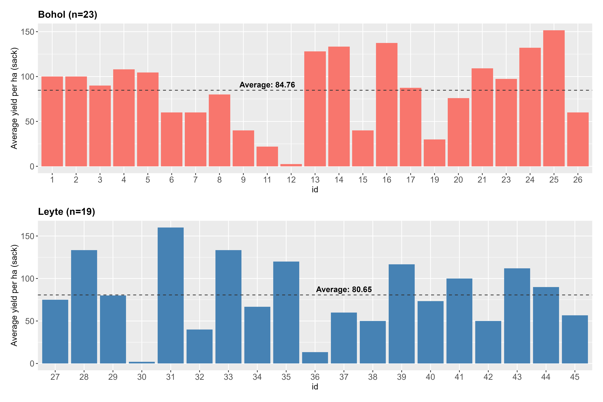

```{r}
#| echo: false
#| message: false
#| warning: false
# set working directory
setwd(here::here("scrp-baseline"))

# libraries
library(tidyverse)
library(readxl)
library(janitor)
library(scales)
library(EFAtools)
library(gtsummary)
library(kableExtra)
library(tidyr)
library(tidytext)
library(patchwork)

# data management source
source("data-management.R")
```

# Attachments

::: callout-note
Copies of the Figures presented in this report are available using the links below. All the files can be accessed in the Google drive folder.
:::

<ol>

<li><a href="https://drive.google.com/drive/folders/1I2PFRfb5vYPw0jx2PcIQYMpe1DO943EU?usp=sharing" target="_blank" style="text-decoration: none">Plots</a></li>

<li><a href="https://drive.google.com/drive/folders/1cyLa0hL07qb-IDCc-xvLGZaxpfWk_dtS?usp=sharing" target="_blank" style="text-decoration: none">Google Drive</a></li>

</ol>

## Desriptive

```{r}
df |>
  select(location, age:tenurial_stat) |>
  tbl_summary(
    by = location,
    type = list(hh_size ~ "continuous"),
    missing = "no",
    label = list(
      age ~ "Age",
      gender ~ "Gender",
      civil_status ~ "Civil status",
      education_attainment ~ "Educational attainment",
      hh_size = "Household size",
      hh_head ~ "Household head",
      farm_size_ha = "Farm size (ha)",
      years_in_rice_farming = "Farming years",
      tenurial_stat = "Tenurial status"
    )
  ) |>
  bold_labels() %>%
  as_kable_extra(linesep = "") %>%
  kable_minimal() %>%
  kable_styling(
    full_width = F,
    fixed_thead = T,
    bootstrap_options = c("striped", "hover", "condensed", "responsive")
  )
```

## Production

```{r}
df |> glimpse()
```

```{r}
df |>
  mutate(
    yield_cropping_ha = average_yield_per_cropping_sack / farm_size_ha,
    revenue_cropping_ha = yield_cropping_ha *
      how_many_kgs_per_sack *
      how_much_if_sold_per_kilo
  ) |>
  View()

select(yield_cropping)
mutate(revenue_ha = (annual_revenue / 2) / farm_size_ha) |>
  mutate(avg_revenue_ha = mean(revenue_ha, na.rm = TRUE)) |>
  filter(!is.na(location)) |>
  ggplot(aes(y = avg_revenue_ha, x = location)) +
  geom_col() +
  scale_y_continuous(labels = label_dollar())
```

```{r}
# Plot for Bohol
p_bohol <- df_harvest |>
  filter(location == "Bohol") |>
  ggplot(aes(x = id, y = avg_yield_ha, fill = location)) +
  geom_col(show.legend = FALSE) +
  geom_hline(
    data = df_mean_bohol,
    aes(yintercept = mean_group_havest),
    linetype = "dashed",
    color = "gray20"
  ) +
  geom_text(
    data = df_mean_bohol,
    aes(
      x = 10,
      y = mean_group_havest,
      label = str_c("Average: ", round(mean_group_havest, 2))
    ),
    inherit.aes = FALSE,
    vjust = -0.5,
    color = "black",
    fontface = "bold",
    size = 4
  ) +
  labs(
    y = "Average yield per ha (sack)",
    title = str_c("Bohol (n=", n_bohol, ")")
  ) +
  theme_1

# Plot for Leyte
p_leyte <- df_harvest |>
  filter(location == "Leyte") |>
  ggplot(aes(x = id, y = avg_yield_ha, fill = location)) +
  geom_col(show.legend = FALSE, fill = "steelblue") +
  geom_hline(
    data = df_mean_leyte,
    aes(yintercept = mean_group_havest),
    linetype = "dashed",
    color = "gray20"
  ) +
  geom_text(
    data = df_mean_leyte,
    aes(
      x = 11,
      y = mean_group_havest,
      label = str_c("Average: ", round(mean_group_havest, 2))
    ),
    inherit.aes = FALSE,
    vjust = -0.5,
    color = "black",
    fontface = "bold",
    size = 4
  ) +
  labs(
    y = "Average yield per ha (sack)",
    title = str_c("Leyte (n=", n_leyte, ")")
  ) +
  theme_1

# Combine with patchwork
p_yield <- p_bohol / p_leyte

# saving plot
ggsave(
  plot = p_yield,
  filename = "plot/average_yield.jpeg",
  width = 12,
  height = 8,
  dpi = 400,
  unit = "in"
)


## display plot

```

```{r}
## Plot for Leyte with CRA knowledge
p_leyte_yes_cra <-
  df_harvest |>
  filter(location == "Leyte") |>
  filter(cra_knowledge == 1) |>
  ggplot(aes(x = id, y = avg_yield_ha)) +
  geom_col(show.legend = FALSE, fill = "steelblue") +
  geom_hline(
    data = df_mean_leyte_2 |> filter(cra_knowledge == 1),
    aes(yintercept = avg_yield_ha),
    linetype = "dashed",
    color = "gray20"
  ) +
  geom_text(
    data = df_mean_leyte_2 |> filter(cra_knowledge == 1),
    aes(
      x = 6,
      y = avg_yield_ha,
      label = str_c("Average: ", round(avg_yield_ha, 2))
    ),
    inherit.aes = FALSE,
    vjust = -0.5,
    color = "black",
    fontface = "bold",
    size = 4
  ) +
  facet_wrap(~cra_knowledge) +
  labs(
    y = "Average yield per ha (sack)",
    title = str_c("Leyte (n=", n_with_cra_leyte, "): with CRA knowledge")
  ) +
  theme_1


p_leyte_no_cra <-
  df_harvest |>
  filter(location == "Leyte") |>
  filter(cra_knowledge == 0) |>
  ggplot(aes(x = id, y = avg_yield_ha)) +
  geom_col(width = 0.5, show.legend = FALSE, fill = "steelblue") +
  geom_hline(
    data = df_mean_leyte_2 |> filter(cra_knowledge == 0),
    aes(yintercept = avg_yield_ha),
    linetype = "dashed",
    color = "gray20"
  ) +
  geom_text(
    data = df_mean_leyte_2 |> filter(cra_knowledge == 0),
    aes(
      x = 6,
      y = avg_yield_ha,
      label = str_c("Average: ", round(avg_yield_ha, 2))
    ),
    inherit.aes = FALSE,
    vjust = -0.5,
    color = "black",
    fontface = "bold",
    size = 4
  ) +
  facet_wrap(~cra_knowledge) +
  labs(
    y = "Average yield per ha (sack)",
    title = str_c(
      "Leyte (n=",
      n_no_cra_leyte,
      "): without CRA knowledge"
    )
  ) +
  theme_1

## Leyte with and without CRA knkoweledge
p_leyte_cra <- p_leyte_yes_cra / p_leyte_no_cra
```


```{r}
# plot for Bohol with CRA knowledge
p_bohol_yes_cra <-
  df_harvest |>
  filter(location == "Bohol") |>
  filter(cra_knowledge == 1) |>
  ggplot(aes(x = id, y = avg_yield_ha)) +
  geom_col(width = 0.5, show.legend = FALSE, fill = "steelblue") +
  scale_y_continuous(limits = c(0, 200)) +
  geom_hline(
    data = df_mean_bohol_2 |> filter(cra_knowledge == 1),
    aes(yintercept = avg_yield_ha),
    linetype = "dashed",
    color = "gray20"
  ) +
  geom_text(
    data = df_mean_bohol_2 |> filter(cra_knowledge == 1),
    aes(
      x = 4,
      y = avg_yield_ha,
      label = str_c("Average: ", round(avg_yield_ha, 2))
    ),
    inherit.aes = FALSE,
    vjust = -0.5,
    color = "black",
    fontface = "bold",
    size = 4
  ) +
  labs(
    y = "Average yield per ha (sack)",
    title = str_c("Bohol (n=", n_with_cra_bohol, "): with CRA knowledge")
  ) +
  theme_1


p_bohol_no_cra <-
  df_harvest |>
  filter(location == "Bohol") |>
  filter(cra_knowledge == 0) |>
  ggplot(aes(x = id, y = avg_yield_ha)) +
  geom_col(width = 0.8, show.legend = FALSE, fill = "steelblue") +
  scale_y_continuous(limits = c(0, 200)) +
  geom_hline(
    data = df_mean_bohol_2 |> filter(cra_knowledge == 0),
    aes(yintercept = avg_yield_ha),
    linetype = "dashed",
    color = "gray20"
  ) +
  geom_text(
    data = df_mean_bohol_2 |> filter(cra_knowledge == 0),
    aes(
      x = 4,
      y = avg_yield_ha,
      label = str_c("Average: ", round(avg_yield_ha, 2))
    ),
    inherit.aes = FALSE,
    vjust = -0.5,
    color = "black",
    fontface = "bold",
    size = 4
  ) +
  labs(
    y = "Average yield per ha (sack)",
    title = str_c(
      "Bohol (n=",
      n_no_cra_bohol,
      "): without CRA knowledge"
    )
  ) +
  theme_1

## Bohol with and without CRA knkoweledge
p_bohol_cra <- p_bohol_yes_cra / p_bohol_no_cra
```