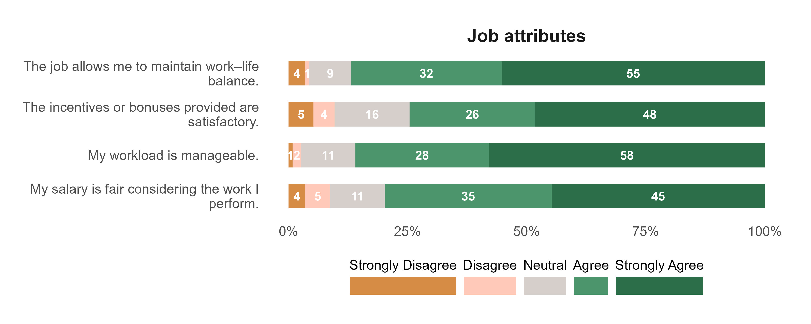

```{r}
#| echo: false
#| message: false
#| warning: false
# set working directory
setwd(here::here("teacher-turnover-intention"))

# libraries
library(tidyverse)
library(readxl)
library(janitor)
library(scales)
library(EFAtools)
library(psych)
library(seminr)
library(gtsummary)
library(kableExtra)
library(correlation)
library(reshape2)


# data management source
source("data-management.R")
```

# Attachments

::: callout-note
Copies of the Figures presented in this report are available using the links below. All the files can be accessed in the Google drive folder.
:::

<ol>

<li><a href="https://drive.google.com/drive/folders/19CCug3KhxbFnaAqMjwSfKMinFN9ZMHWd?usp=sharing" target="_blank" style="text-decoration: none">Plots</a></li>

<li><a href="https://drive.google.com/drive/folders/11C7ZeBVGgxZ_KQs1v6cQBP6qDIi4_toc?usp=sharing" target="_blank" style="text-decoration: none">Google Drive</a></li>

</ol>

# Objective 1: Describe the demographic and professional characteristics of online ESL teachers.

## Sociodemographic factors


## Factors

### Job attributes {.unnumbered}

```{r}
p_job_att <- plot_factor("Job attributes")

## saving plot
ggsave(
  plot = p_job_att,
  filename = "plot/fct_job_atttributes.jpeg",
  width = 10,
  height = 4,
  dpi = 400,
  unit = "in"
)

## display plot

```


### Job satisfaction {.unnumbered}

```{r}
p_job_satisfaction <- plot_factor("Job satisfaction")

## saving plot
ggsave(
  plot = p_job_satisfaction,
  filename = "plot/fct_job_satisfaction.jpeg",
  width = 10,
  height = 5,
  dpi = 400,
  unit = "in"
)

## display plot
knitr::include_graphics("plot/fct_job_satisfaction.jpeg")
```


### Teacher attributes {.unnumbered}

```{r}
p_teacher_att <- plot_factor("Teacher attributes")

## saving plot
ggsave(
  plot = p_teacher_att,
  filename = "plot/fct_teacher_att.jpeg",
  width = 10,
  height = 6,
  dpi = 400,
  unit = "in"
)

## display plot
knitr::include_graphics("plot/fct_teacher_att.jpeg")
```

### Turnover intention {.unnumbered}

```{r}
p_turnover_intention <- plot_factor("Turnover intention")

## saving plot
ggsave(
  plot = p_turnover_intention,
  filename = "plot/fct_turnover_intention.jpeg",
  width = 10,
  height = 5,
  dpi = 400,
  unit = "in"
)

## display plot
knitr::include_graphics("plot/fct_turnover_intention.jpeg")
```


### Workplace perception {.unnumbered}

```{r}
p_workplace_perception <- plot_factor("Workplace perception")

## saving plot
ggsave(
  plot = p_workplace_perception,
  filename = "plot/fct_workplace_perception.jpeg",
  width = 10,
  height = 6,
  dpi = 400,
  unit = "in"
)

## display plot
knitr::include_graphics("plot/fct_workplace_perception.jpeg")
```


# Objective 2: Determine the level of job attributes and workplace perceptions.

# Objective 3:Analyze the effect of job attributes on job satisfaction

# Objective 4:Analyze the effect of workplace perceptions on job satisfaction. 

# Objective 5: Determine the effect of job satisfaction on turnover intention. 


## Exploratory factor anaysis

```{r}
df |> glimpse()

efa_lkrt_dta <- df |>
  select(ta1:ti4) |>
  select(-ja1, -ja2, -js3)


fa.parallel(efa_lkrt_dta, fa = "fa")

efa_extract <- fa(
  efa_lkrt_dta,
  nfactors = 5,
  rotate = "varimax",
  fm = "ml"
)

print(efa_extract$loadings, cutoff = 0.3, sort = TRUE)
```