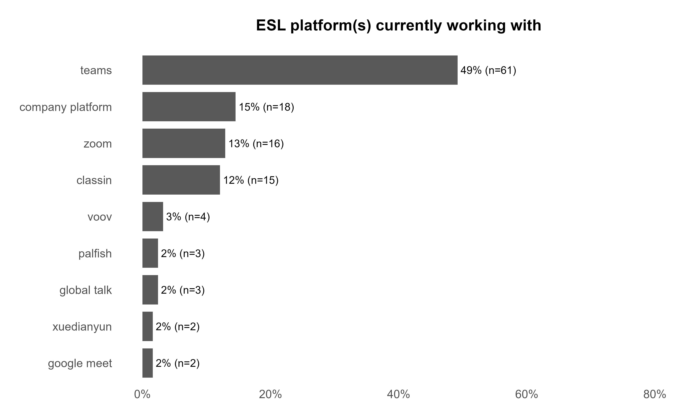
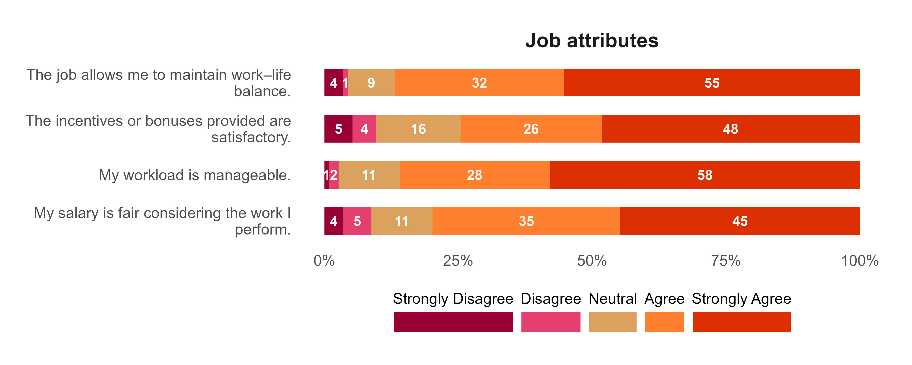
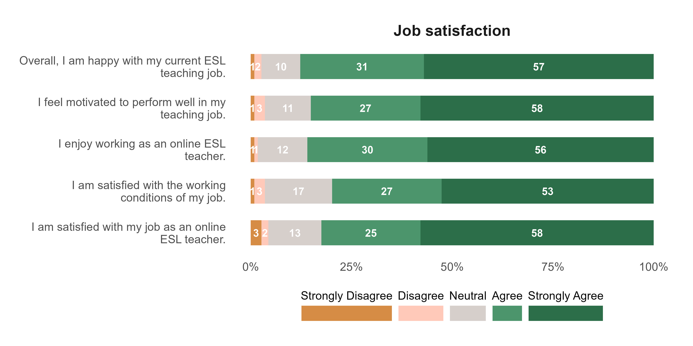
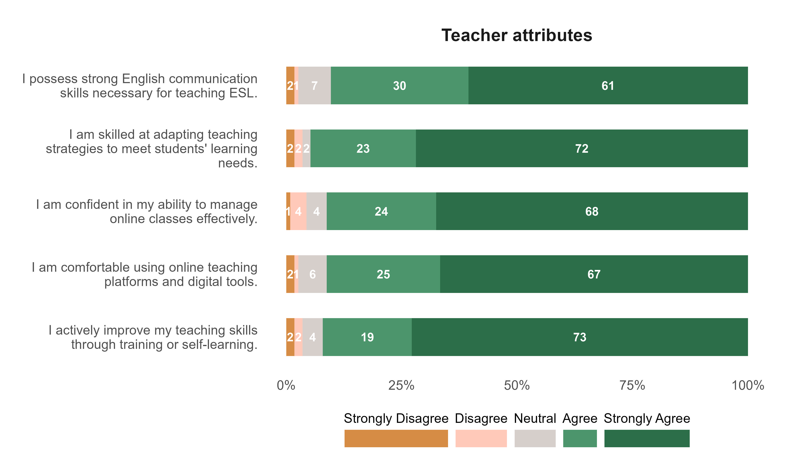
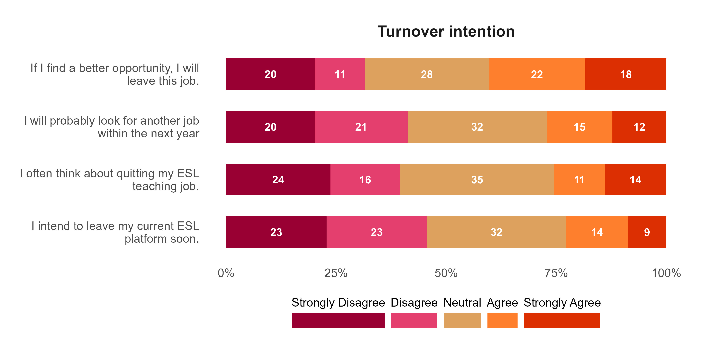
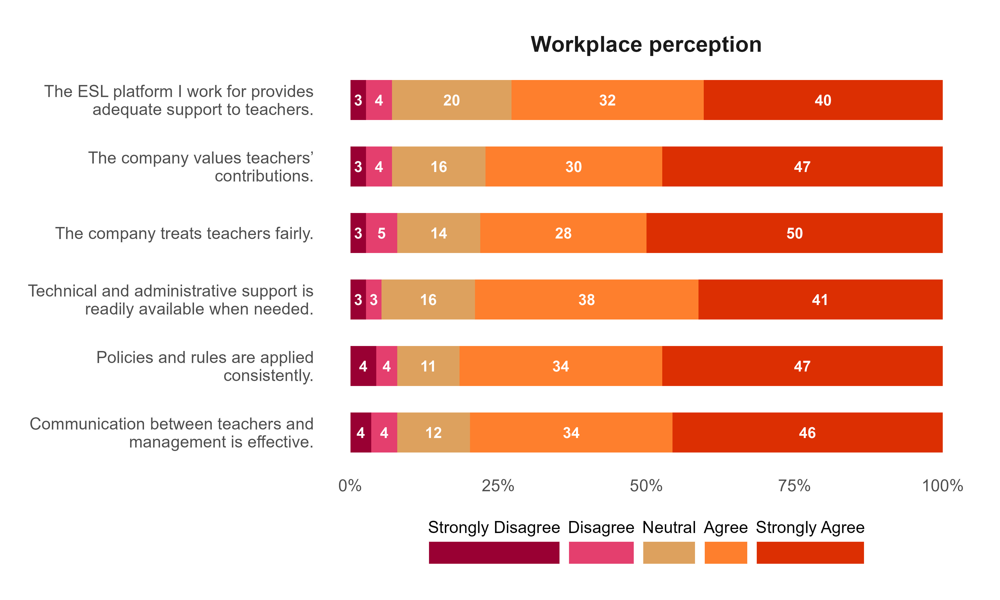

```{r}
#| echo: false
#| message: false
#| warning: false
# set working directory
setwd(here::here("teacher-turnover-intention"))

# libraries
library(tidyverse)
library(readxl)
library(janitor)
library(scales)
library(EFAtools)
library(psych)
library(seminr)
library(gtsummary)
library(kableExtra)
library(correlation)
library(reshape2)


# data management source
source("data-management.R")
```

# Attachments

::: callout-note
Copies of the Figures presented in this report are available using the links below. All the files can be accessed in the Google drive folder.
:::

<ol>

<li><a href="https://drive.google.com/drive/folders/1QpKO-L63-OApbS1q2vuW1yk0IfxyaCkg?usp=sharing" target="_blank" style="text-decoration: none">Plots</a></li>

<li><a href="https://drive.google.com/drive/folders/1qc0ihzGoBRpQuSniDERwiBwWu6EqOA1g?usp=sharing" target="_blank" style="text-decoration: none">Google Drive</a></li>

</ol>

# Objective 1: Describe the demographic and professional characteristics of online ESL teachers.

## Sociodemographic factors


::: {.callout-caution}
## Interpretation

- **Age**: Median age is 29 years (IQR: 26–32), the result indicates a relatively young workforce among respondents, mostly in their late 20s to early 30s, suggesting early-career professionals are associated with jobs related to online ESL.

- **Gender**: The ESL teaching workforce is female-dominated. The gender distribution which may influence workplace dynamics, perceptions of job satisfaction, and turnover intentions.

- **Employment status**: Only 2 respondents (1.8%) reported mixed status. Overall, the employement status distribution shows a balanced split between full-time and part-time teachers.

- **Weekly Teaching Hours**: Median teaching hours is 37 (IQR: 20–40), this suggests that many teachers are working near full-time hours, even among part-timers.

- **Years of Experience**: In terms of years of experience, the median exeperience is 2 (IQR: 1–3.5). The result shows a relatively new workforce, with limited long-term tenure.

- **Monthly Income**: The median monthly income among respondent is ₱17,000 (IQR: ₱12,000–₱25,000). This income range appears to be modest compared to professional teaching roles, which may influence job satisfaction and turnover intentions.
:::


```{r}
## descriptive
df |> 
  select(age:income_value) |> 
  select(-esl_platform) |> 
  tbl_summary(
    statistic = list(all_categorical() ~ "{n} ({p}%)"),
    missing = "no",
    label = list(
      age ~ "Age",
      gender ~ "Gender",
      employment_status ~ "Employment status",
      weekly_teaching_hours ~ "Weekly teaching hours",
      highest_educational_attainment = "Educational attainment",
      experience_years = "Years of experience",
      income_value ~ "Monthly income")
  ) |>
  bold_labels() %>%
  as_kable_extra(linesep = "") %>%
  kable_minimal() %>%
  kable_styling(
    full_width = F,
    fixed_thead = T,
    bootstrap_options = c("striped", "hover", "condensed", "responsive")
  )
```


::: {.callout-caution}
## Interpretation

- Teams dominates the ESL teaching platform. 

- However, the variety of platforms may suggest that teachers often adapt to employer requirements rather than choosing platforms among ESL teachers.
:::


```{r}
p_esl_platform <- 
  df_els_platform |> 
  count(esl_platform, sort = TRUE) |> 
  filter(n > 1) |> 
  mutate(pct = n / sum(n)) |> 
  mutate(pct_lab = str_c(" ", round(pct * 100, 0), "%", " (n=", n, ")")) |> 
  mutate(esl_platform = fct_reorder(esl_platform, pct)) |> 
  ggplot(aes(pct, esl_platform)) + 
  geom_col(width = 0.8) +
  geom_text(aes(label = pct_lab), hjust = 0) +
  scale_x_continuous(limits = c(0, 0.8), labels = percent_format()) +
  labs(
    x = NULL,
    y = NULL,
    title = "ESL platform(s) currently working with"
  ) +
  custom_theme

## saving plot
ggsave(
  plot = p_esl_platform,
  filename = "plot/esl_platform.jpeg",
  width = 10,
  height = 6,
  unit = "in",
  dpi = 400
)

## display plot

```


# Objective 2: Determine the level of job attributes and workplace perceptions.

## Factors

### Job attributes {.unnumbered}

::: {.callout-caution}
## Interpretation

- Most teachers perceive their salary as fair, with nearly 80% agreeing or strongly agreeing that their compensation matches the work they perform. However, about one in ten respondents expressed dissatisfaction, and a small group remained neutral.

- The majority of teachers find their workload manageable, with 86% agreeing or strongly agreeing and only a very small fraction expressing disagreement. This indicates that workload is a strong positive aspect of the job, contributing to overall satisfaction.

- Satisfaction with incentives and bonuses is positive but less strong compared to workload and work–life balance. About three-fourths of respondents agreed or strongly agreed that incentives are satisfactory, while 16% remained neutral and nearly 10% expressed dissatisfaction.

- Satisfaction with incentives and bonuses is positive but less strong compared to workload and work–life balance. About three-fourths of respondents agreed or strongly agreed that incentives are satisfactory, while 16% remained neutral and nearly 10% expressed dissatisfaction.
:::


```{r}
p_job_att <- plot_factor("Job attributes")

## saving plot
ggsave(
  plot = p_job_att,
  filename = "plot/fct_job_attributes.jpeg",
  width = 10,
  height = 4,
  dpi = 400,
  unit = "in"
)

## display plot

```


### Job satisfaction {.unnumbered}

::: {.callout-caution}
## Interpretation

- A large majority of teachers are satisfied with their job as online ESL instructors, with 58% strongly agreeing and 25% agreeing. Only 5% expressed dissatisfaction, while 13% remained neutral. This indicates that overall job satisfaction is high, though a small group of teachers may feel less positive about their roles.

- Enjoyment of teaching is also high, with 56% strongly agreeing and 30% agreeing that they enjoy working as online ESL teachers. About 12% were neutral, and only 2% expressed disagreement.

- Satisfaction with working conditions is slightly lower compared to other indicators, with 53% strongly agreeing and 27% agreeing. Neutral responses (17%) and disagreement (4%) are more pronounced here. 

- Overall happiness is very strong, with 57% strongly agreeing and 31% agreeing that they are happy with their current ESL teaching job. Only 3% expressed dissatisfaction, while 10% were neutral.
:::


```{r}
p_job_satisfaction <- plot_factor("Job satisfaction")

## saving plot
ggsave(
  plot = p_job_satisfaction,
  filename = "plot/fct_job_satisfaction.jpeg",
  width = 10,
  height = 5,
  dpi = 400,
  unit = "in"
)

## display plot

```


### Teacher attributes {.unnumbered}

::: {.callout-caution}
## Interpretation

- A strong majority of teachers report possessing strong English communication skills, with 61% strongly agreeing and 30% agreeing. Only 3% expressed disagreement, while 7% remained neutral.

- Confidence in managing online classes is also high, with 68% strongly agreeing and 24% agreeing. Neutral responses accounted for 4%, while 4% expressed disagreement. This suggests that most teachers feel capable of handling the demands of online instruction, though a small minority may require additional support or training to strengthen classroom management skills.

- Teachers overwhelmingly report being skilled at adapting teaching strategies to meet student needs, with 72% strongly agreeing and 23% agreeing. Only 6% expressed disagreement or neutrality. 

- Comfort with online teaching platforms and digital tools is another area of strength, with 67% strongly agreeing and 25% agreeing. Neutral responses were minimal (6%), and only 3% disagreed. This indicates that teachers are generally confident in using technology.

- Comfort with online teaching platforms and digital tools is another area of strength, with 67% strongly agreeing and 25% agreeing. Neutral responses were minimal (6%), and only 3% disagreed. The result implies that teachers are generally confident in using technology.
:::


```{r}
p_teacher_att <- plot_factor("Teacher attributes")

## saving plot
ggsave(
  plot = p_teacher_att,
  filename = "plot/fct_teacher_att.jpeg",
  width = 10,
  height = 6,
  dpi = 400,
  unit = "in"
)

## display plot

```

### Turnover intention {.unnumbered}

::: {.callout-caution}
## Interpretation

- In terms of thinking about quitting, responses are mixed, with 24% strongly disagreeing and 16% disagreeing, while 35% remain neutral. At the same time, 25% agree or strongly agree that they often think about quitting. The result suggests that while a significant portion of teachers are not actively considering leaving, a notable minority do entertain such thoughts, and the large neutral group indicates uncertainty about their long-term commitment.

- Intentions to seek another job are relatively balanced, with 20% strongly disagreeing and 21% disagreeing, while 27% remain neutral. About 27% agree or strongly agree that they will look for another job within the next year.

- Regarding the decision to leave their current ESL platform, responses are evenly distributed, with 23% strongly disagreeing and 23% disagreeing, while 32% are neutral. Meanwhile, 23% agree or strongly agree that they intend to leave their current platform soon. This balance highlights a divided sentiment. While nearly half reject immediate departure, a quarter are already leaning toward leaving, and a third remain undecided.

- Whereas, leaving if a better opportunity arises, the result shows conditional turnover intention, with 20% strongly disagreeing and 11% disagreeing, but 40% agreeing or strongly agreeing that they would leave if a better opportunity came along. About 28% remain neutral. 

:::


```{r}
p_turnover_intention <- plot_factor("Turnover intention")

## saving plot
ggsave(
  plot = p_turnover_intention,
  filename = "plot/fct_turnover_intention.jpeg",
  width = 10,
  height = 5,
  dpi = 400,
  unit = "in"
)

## display plot

```


### Workplace perception {.unnumbered}

::: {.callout-caution}
## Interpretation

- Teachers generally feel supported by their ESL platforms, with 40% strongly agreeing and 32% agreeing that adequate support is provided. About 20% remained neutral, while 7% expressed disagreement.

- Teachers generally feel supported by their ESL platforms, with 40% strongly agreeing and 32% agreeing that adequate support is provided. About 20% remained neutral, while 7% expressed disagreement.

- Nearly half of respondents (47%) strongly agree and 30% agree that their contributions are valued, while 16% are neutral and 7% disagree. This indicates that recognition and appreciation are widely felt, reinforcing teacher morale. 

- Fair treatment is the most positively rated perception, with 50% strongly agreeing and 28% agreeing. About 14% were neutral, and 8% disagreed. This shows that fairness is a core strength of the workplace, though a small minority may feel inequities exist, which could undermine trust if not addressed.

- Teachers report strong satisfaction with technical and administrative support, with 41% strongly agreeing and 38% agreeing. Neutral responses (16%) and disagreement (6%) indicate that while most teachers feel well-supported, some may encounter challenges in accessing timely assistance, suggesting room for improvement in support systems.

- Consistency in applying policies and rules is positively perceived, with 47% strongly agreeing and 34% agreeing. About 11% were neutral, and 8% disagreed. 
:::


```{r}
p_workplace_perception <- plot_factor("Workplace perception")

## saving plot
ggsave(
  plot = p_workplace_perception,
  filename = "plot/fct_workplace_perception.jpeg",
  width = 10,
  height = 6,
  dpi = 400,
  unit = "in"
)

## display plot

```


# Objective 3-5:Analyze the effect of job attributes and workplace perception on job satisfaction. Determine the effect of job satisfaction on turnover intention. 


## Exploratory factor anaysis

Before running Partial Least Squares Structural Equation Modeling (PLS-SEM), it is important to know which survey items (i.e., questions items) belong to which latent constructs (i.e., factors). PLS-SEM assumes that the measurement model or the way items form factors is already well-defined. If we assign items incorrectly, the SEM results may be misleading.

Exploratory Factor Analysis (EFA) is the step that clarifies this structure. It examines how items naturally group together based on correlations, revealing the underlying factors. In other words, EFA helps us discover the “building blocks” of the model by showing which items should serve as indicators for each construct.

A scree plot with parallel analysis (Figure below) is a tool used in Exploratory Factor Analysis (EFA) to check if how many possible factors we can extract. The result shows that there are potential 3-4 factors that can be extracted instead of five factors as expected.

```{r}
fa.parallel(df |> select(ta1:ti4), fa = "fa")

```


::: {.callout-warning}
## Note

Using the EFA, result shows that items from Job attributes and Workplace perceptions loaded strongly on the same factor. This means that, statistically, respondents did not distinguish between these two categories, it appears that these factors are part of a single underlying dimension or construct.
:::


```{r}
fct_lkrt_dta <- df |>
  select(ta1:ti4) |>
  select(-ja2, -js4)

efa_extract <- fa(
  fct_lkrt_dta,
  nfactors = 4,
  rotate = "varimax",
  fm = "ml"
)

print(efa_extract$loadings, cutoff = 0.51, sort = TRUE)
```


## PLS-SEM

### Bootstrapped estimates  {.unnumbered}
```{r}
## defining measurement model
measurement_model <- constructs(
  composite("Teacher attributes", multi_items("ta", 1:5), weights = mode_A),
  composite("Job attributes and\n workplace perception", multi_items(c(rep("ja", 3), rep("wp", 6)), c(1, 3, 4, 1:6), weights = mode_A)),
  composite("Job satisfaction", multi_items("js", c(1:3, 5)), weights = mode_A),
  composite("Turnover intention", multi_items("ti", 1:4), weights = mode_A)
)

## defining the structural model
structural_model <- relationships(
  paths(from = "Teacher attributes", to = c("Job satisfaction", "Turnover intention")),
  paths(from = "Job attributes and\n workplace perception", to = c("Job satisfaction", "Turnover intention")),
  paths(from = "Job satisfaction", to = "Turnover intention")
)


## estimating the model
pls_model <- estimate_pls(
  data = fct_lkrt_dta,
  measurement_model = measurement_model,
  structural_model  = structural_model
)

## saving summaries of the model
summ_pls_model <- summary(pls_model)


## bootstrapping PLS-SEM model
boot_pls <- bootstrap_model(
  seminr_model = pls_model,
  nboot = 5000,
  cores = 4,
  seed = 202604
)

## plotting the bootstrapped model
plot(boot_pls)

```


### Direct effects {.unnumbered}

::: {.callout-caution}
## Teacher attributes → Job satisfaction (β = 0.322, p = 0.001)
This path is positive and significant. Teachers who report stronger skills, confidence, and adaptability tend to have higher job satisfaction. The effect size is moderate, and the confidence interval [0.118, 0.526] confirms robustness of the estimates. The result shows teacher qualities directly enhance satisfaction with their work.
:::


::: {.callout-caution}
## Teacher attributes → Turnover intention (β = 0.238, p = 0.048)
This path is positive and significant, though weaker. Interestingly, stronger teacher attributes are associated with a higher likelihood of turnover intention. More capable teachers feel confident in their skills and may be more willing to explore better opportunities elsewhere. The effect is modest but statistically meaningful.
:::


::: {.callout-caution}
## Job workplace → Job satisfaction (β = 0.553, p < 0.001)
This is the strongest positive effect in the model. Supportive job conditions (salary fairness, workload balance, workplace policies) strongly increase job satisfaction. The confidence interval [0.372, 0.745] shows this is a stable and substantial effect. Workplace factors are therefore the most critical drivers of satisfaction.
:::


::: {.callout-caution}
## Job workplace → Turnover intention (β = 0.146, p = 0.214)
This path is positive but not significant. Workplace conditions do not directly predict turnover intention once job satisfaction is accounted for. In other words, workplace perceptions influence turnover mainly indirectly through job satisfaction, rather than directly.
:::


::: {.callout-caution}
## Job satisfaction → Turnover intention (β = -0.537, p < 0.001)
This path is negative and highly significant. Higher job satisfaction strongly reduces turnover intention. The effect size is large, and the confidence interval [-0.747, -0.327] confirms stability. Satisfied teachers are much less likely to plan leaving.
:::


```{r}
## summary table
summ_boot_pls_model <- summary(boot_pls)

DT::datatable(summ_boot_pls_model$bootstrapped_paths |> round(3))
```


### Indirect effects {.unnumbered}

::: {.callout-caution}
## Indirect effects: Teacher attributes → Turnover intention (via Job satisfaction)

- Estimate = -0.173, p = 0.001
- This path is negative and significant, meaning teacher attributes reduce turnover intention indirectly through their positive effect on job satisfaction. In other words, while teacher attributes had a small direct positive effect on turnover intention (suggesting mobility among skilled teachers), their indirect effect through job satisfaction is negative. This shows that job satisfaction acts as a protective mediator, offsetting the direct tendency of skilled teachers to consider leaving.
:::


::: {.callout-caution}
## Indirect effects: Job workplace → Turnover intention (via Job satisfaction)

- Estimate = -0.297, p < 0.001
- This path is negative and highly significant, indicating that better workplace conditions strongly reduce turnover intention through their positive impact on job satisfaction. The indirect effect is larger than the direct effect (which was non-significant), confirming that workplace perceptions influence turnover primarily through job satisfaction rather than directly.


:::

```{r}
DT::datatable(round(summ_boot_pls_model$bootstrapped_total_indirect_paths, 3))
```


### Reliability test {.unnumbered}

::: {.callout-caution}
## Intepretations

- **Teacher attributes**
  - All values exceed the thresholds (α, rhoA, rhoC > 0.7; AVE > 0.5).
  - The teacher attributes construct shows excellent internal consistency and convergent validity. The items consistently measure the same underlying dimension (skills, confidence, adaptability, etc.), and the high AVE indicates they capture substantial variance.

- **Job attributes and workplace perception**
  - All reliability indicators are very strong, with AVE well above 0.5.
  - This merged construct demonstrates very high reliability and validity. The items (salary fairness, workload, workplace support, fairness, communication, etc.) clearly form a cohesive factor, confirming the EFA finding that job attributes and workplace perceptions belong together.

- **Job satisfaction**
  - All values exceed thresholds, with AVE close to 0.8.
  - Job satisfaction is measured with strong reliability and validity. The items (overall happiness, motivation, enjoyment, satisfaction with conditions) consistently reflect the construct, capturing a large proportion of variance.

- **Turnover intention**
  - All indicators are excellent, with AVE the highest among constructs.
  - Turnover intention is measured with exceptional reliability and convergent validity. The items (thinking of quitting, looking for another job, leaving soon, leaving if better opportunity arises) strongly capture the construct, with minimal measurement error.
:::

```{r}
DT::datatable(round(summ_pls_model$reliability, 3))
```


### Validity test {.unnumbered}

The Fornell–Larcker test checks discriminant validity—whether constructs are truly distinct from one another.

Rule: The square root of AVE (shown on the diagonal) should be greater than the correlations between that construct and any other construct (off-diagonal).

If this condition is met, it means each construct shares more variance with its own indicators than with other constructs, confirming discriminant validity.


::: {.callout-caution}
## Interpretation

- **Teacher attributes (√AVE = 0.890)**
  -  Teacher attributes are distinct, since 0.890 > all correlations. They are related to job satisfaction (moderate correlation) but remain a separate construct.

- **Job attributes & workplace perception (√AVE = 0.837)**
  - This construct is distinct, since 0.837 > all correlations. It is strongly related to job satisfaction (0.721), which makes sense theoretically, but still maintains discriminant validity.

- **Job satisfaction (√AVE = 0.887)**
  - Job satisfaction is distinct, since 0.887 > all correlations. It has strong positive links with teacher attributes and workplace conditions, and a moderate negative link with turnover intention, consistent with theory.

- **Turnover intention (√AVE = 0.915)**
  - Turnover intention is clearly distinct, since 0.915 > all correlations. Its strongest relationship is the negative correlation with job satisfaction, which aligns with the SEM results.
:::

```{r}
DT::datatable(round(summ_pls_model$validity$fl_criteria, 3))
```